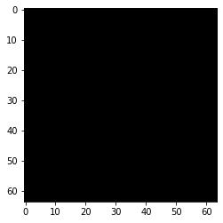
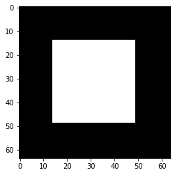
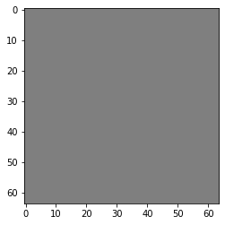
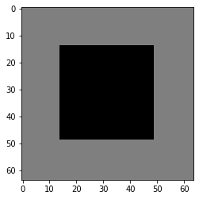
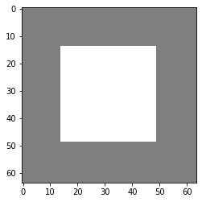

Wasserstein distance estimation on toy example
----------------------------------------------

|Open In Colab|

In this notebook we will see how to estimate the wasserstein distance
with a Neural net by using the Kantorovich-Rubinestein dual
representation.

Wasserstein distance
~~~~~~~~~~~~~~~~~~~~

The wasserstein distance measure the distance between two probability
distribution. Wikipedia article gives a more intuitive definition of it:

   Intuitively, if each distribution is viewed as a unit amount of
   “dirt” piled on M, the metric is the minimum “cost” of turning one
   pile into the other, which is assumed to be the amount of dirt that
   needs to be moved times the mean distance it has to be moved. Because
   of this analogy, the metric is known in computer science as the earth
   mover’s distance.

Mathematically it is defined as:

.. math::

   W_1(\mu,\nu) = \inf_{\pi \in \Pi(\mu,\nu)}\underset{x,z \sim \pi}{\mathbb{E}}\parallel \textbf{x}-\textbf{z} \parallel

where :math:`\Pi(\mu,\nu)` is the set of all probability measures on
:math:`\Omega\times \Omega` with marginals :math:`\mu` and :math:`\nu`.
In most case this equation is not tractable.

KR dual formulation
~~~~~~~~~~~~~~~~~~~

In our setup, the KR dual formulation is stated as following:

.. math::  W_1(\mu, \nu) = \sup_{f \in Lip_1(\Omega)} \underset{\textbf{x} \sim \mu}{\mathbb{E}} \left[f(\textbf{x} )\right] -\underset{\textbf{x}  \sim \nu}{\mathbb{E}} \left[f(\textbf{x} )\right] 

This state the problem as an optimization problem over the 1-lipschitz
functions. Therefore k-Lipschitz networks allows us to solve this
maximization problem.

[1] C. Anil, J. Lucas, et R. Grosse, « Sorting out Lipschitz function
approximation », arXiv:1811.05381 [cs, stat], nov. 2018.

We will illustrate this on a synthetic image dataset where :math:`W_1`
is known.

.. |Open In Colab| image:: https://colab.research.google.com/assets/colab-badge.svg
   :target: https://colab.research.google.com/github/deel-ai/deel-lip/blob/master/doc/notebooks/demo1.ipynb

.. code:: ipython3

    # pip install deel-lip -qqq

.. code:: ipython3

    from datetime import datetime
    import os
    import numpy as np
    import math
    
    import matplotlib.pyplot as plt 
    
    from tensorflow.keras import backend as K
    from tensorflow.keras.layers import Input, Flatten, ReLU
    from tensorflow.keras.optimizers import Adam
    from tensorflow.keras.models import load_model
    
    from deel.lip.layers import SpectralConv2D, SpectralDense, FrobeniusDense
    from deel.lip.activations import MaxMin, GroupSort, FullSort
    from deel.lip.losses import KR, negative_KR
    from deel.lip.model import Model

.. parsed-literal::

    Matplotlib created a temporary config/cache directory at /tmp/matplotlib-h7qxyqem because the default path (/home/thibaut.boissin/.config/matplotlib) is not a writable directory; it is highly recommended to set the MPLCONFIGDIR environment variable to a writable directory, in particular to speed up the import of Matplotlib and to better support multiprocessing.
    2021-09-09 15:17:00.728758: I tensorflow/stream_executor/platform/default/dso_loader.cc:49] Successfully opened dynamic library libcudart.so.11.0

Parameters input images
~~~~~~~~~~~~~~~~~~~~~~~

The synthetic dataset will be composed image with black or white squares
allowing us to check if the computed wasserstein distance is correct.
One distribution will be the set of black images, while the other will
be the set of images with a square on it. these two distribution are
diracs, and the wasserstein distance can be analyticaly computed:

In the case to the two diracs the wasserstein distance is then the L1
distance between the two images.

.. code:: ipython3

    img_size = 64 
    frac_value = 0.3  # proportion of the center square

Generate images
~~~~~~~~~~~~~~~

.. code:: ipython3

    def generate_toy_images(shape,frac=0,v=1):
        """
        function that generate a single image.
        
        Args:
            shape: shape of the output image
            frac: proportion of the center square
            value: value assigned to the center square
        """
        img = np.zeros(shape)
        if frac==0:
            return img
        frac=frac**0.5
        #print(frac)
        l=int(shape[0]*frac)
        ldec=(shape[0]-l)//2
        #print(l)
        w=int(shape[1]*frac)
        wdec=(shape[1]-w)//2
        img[ldec:ldec+l,wdec:wdec+w,:]=v
        return img
    
    
    def binary_generator(batch_size,shape,frac=0):
        """
        generate a batch with half of black images, hald of images with a white square.
        """
        batch_x = np.zeros(((batch_size,)+(shape)), dtype=np.float16)
        batch_y=np.zeros((batch_size,1), dtype=np.float16)
        batch_x[batch_size//2:,]=generate_toy_images(shape,frac=frac,v=1)
        batch_y[batch_size//2:]=1
        while True:
            yield  batch_x, batch_y
    
    
    def ternary_generator(batch_size,shape,frac=0):
        """
        Same as binary generator, but images can have a white square of value 1, or value -1
        """
        batch_x = np.zeros(((batch_size,)+(shape)), dtype=np.float16)
        batch_y=np.zeros((batch_size,1), dtype=np.float16)
        batch_x[3*batch_size//4:,]=generate_toy_images(shape,frac=frac,v=1)
        batch_x[batch_size//2:3*batch_size//4,]=generate_toy_images(shape,frac=frac,v=-1)
        batch_y[batch_size//2:]=1
        #indexes_shuffle = np.arange(batch_size)
        while True:
            #np.random.shuffle(indexes_shuffle)
            #yield  batch_x[indexes_shuffle,], batch_y[indexes_shuffle,]
            yield  batch_x, batch_y

.. code:: ipython3

    def display_img(img):
        """
        Display an image
        """
        if img.shape[-1] == 1:
            img = np.tile(img,(3,))
        fig, ax = plt.subplots()
        
        imgplot = ax.imshow((img*255).astype(np.uint))
        

Now let’s take a look at the generated batches

for binary generator
^^^^^^^^^^^^^^^^^^^^

.. code:: ipython3

    test=binary_generator(2,(img_size,img_size,1),frac=frac_value)
    imgs, y=next(test)
    
    display_img(imgs[0])
    display_img(imgs[1])
    print("Norm L2 "+str(np.linalg.norm(imgs[1])))
    print("Norm L2(count pixels) "+str(math.sqrt(np.size(imgs[1][imgs[1]==1]))))

.. parsed-literal::

    Norm L2 35.0
    Norm L2(count pixels) 35.0

for ternary generator
^^^^^^^^^^^^^^^^^^^^^

.. code:: ipython3

    test=ternary_generator(4,(img_size,img_size,1),frac=frac_value)
    imgs, y=next(test)
    
    for i in range(4):
        display_img(0.5*(imgs[i]+1.0)) # we ensure that there is no negative value wehn displaying images
    
    print("Norm L2(imgs[2]-imgs[0])"+str(np.linalg.norm(imgs[2]-imgs[0])))
    print("Norm L2(imgs[2]) "+str(np.linalg.norm(imgs[2])))
    print("Norm L2(count pixels) "+str(math.sqrt(np.size(imgs[2][imgs[2]==-1]))))

.. parsed-literal::

    Norm L2(imgs[2]-imgs[0])35.0
    Norm L2(imgs[2]) 35.0
    Norm L2(count pixels) 35.0

.. image:: demo1_files/demo1_11_1.png

Expe parameters
~~~~~~~~~~~~~~~

Now we know the wasserstein distance between the black image and the
images with a square on it. For both binary generator and ternary
generator this distance is 35.

We will then compute this distance using a neural network.

.. code:: ipython3

    batch_size=64
    epochs=5
    steps_per_epoch=6400

.. code:: ipython3

    generator = ternary_generator   #binary_generator, ternary_generator
    activation = FullSort #ReLU, MaxMin, GroupSort

Build lipschitz Model
~~~~~~~~~~~~~~~~~~~~~

.. code:: ipython3

    K.clear_session()
    ## please note that the previous helper function has the same behavior as the following code:
    inputs = Input((img_size, img_size, 1))
    x = Flatten()(inputs)
    x = SpectralDense(128, activation=FullSort())(x)
    x = SpectralDense(64, activation=FullSort())(x)
    x = SpectralDense(32, activation=FullSort())(x)
    y = FrobeniusDense(1, activation=None)(x)
    wass = Model(inputs=inputs, outputs=y)
    wass.summary()

.. parsed-literal::

    2021-09-09 15:17:03.691345: I tensorflow/compiler/jit/xla_cpu_device.cc:41] Not creating XLA devices, tf_xla_enable_xla_devices not set
    2021-09-09 15:17:03.691835: I tensorflow/stream_executor/platform/default/dso_loader.cc:49] Successfully opened dynamic library libcuda.so.1
    2021-09-09 15:17:03.722747: I tensorflow/stream_executor/cuda/cuda_gpu_executor.cc:941] successful NUMA node read from SysFS had negative value (-1), but there must be at least one NUMA node, so returning NUMA node zero
    2021-09-09 15:17:03.722992: I tensorflow/core/common_runtime/gpu/gpu_device.cc:1720] Found device 0 with properties: 
    pciBusID: 0000:01:00.0 name: GeForce RTX 2070 SUPER computeCapability: 7.5
    coreClock: 1.785GHz coreCount: 40 deviceMemorySize: 7.79GiB deviceMemoryBandwidth: 417.29GiB/s
    2021-09-09 15:17:03.723005: I tensorflow/stream_executor/platform/default/dso_loader.cc:49] Successfully opened dynamic library libcudart.so.11.0
    2021-09-09 15:17:03.724189: I tensorflow/stream_executor/platform/default/dso_loader.cc:49] Successfully opened dynamic library libcublas.so.11
    2021-09-09 15:17:03.724212: I tensorflow/stream_executor/platform/default/dso_loader.cc:49] Successfully opened dynamic library libcublasLt.so.11
    2021-09-09 15:17:03.724739: I tensorflow/stream_executor/platform/default/dso_loader.cc:49] Successfully opened dynamic library libcufft.so.10
    2021-09-09 15:17:03.724858: I tensorflow/stream_executor/platform/default/dso_loader.cc:49] Successfully opened dynamic library libcurand.so.10
    2021-09-09 15:17:03.726107: I tensorflow/stream_executor/platform/default/dso_loader.cc:49] Successfully opened dynamic library libcusolver.so.10
    2021-09-09 15:17:03.726405: I tensorflow/stream_executor/platform/default/dso_loader.cc:49] Successfully opened dynamic library libcusparse.so.11
    2021-09-09 15:17:03.726469: I tensorflow/stream_executor/platform/default/dso_loader.cc:49] Successfully opened dynamic library libcudnn.so.8
    2021-09-09 15:17:03.726518: I tensorflow/stream_executor/cuda/cuda_gpu_executor.cc:941] successful NUMA node read from SysFS had negative value (-1), but there must be at least one NUMA node, so returning NUMA node zero
    2021-09-09 15:17:03.726767: I tensorflow/stream_executor/cuda/cuda_gpu_executor.cc:941] successful NUMA node read from SysFS had negative value (-1), but there must be at least one NUMA node, so returning NUMA node zero
    2021-09-09 15:17:03.726981: I tensorflow/core/common_runtime/gpu/gpu_device.cc:1862] Adding visible gpu devices: 0
    2021-09-09 15:17:03.727930: I tensorflow/compiler/jit/xla_gpu_device.cc:99] Not creating XLA devices, tf_xla_enable_xla_devices not set
    2021-09-09 15:17:03.728036: I tensorflow/stream_executor/cuda/cuda_gpu_executor.cc:941] successful NUMA node read from SysFS had negative value (-1), but there must be at least one NUMA node, so returning NUMA node zero
    2021-09-09 15:17:03.728275: I tensorflow/core/common_runtime/gpu/gpu_device.cc:1720] Found device 0 with properties: 
    pciBusID: 0000:01:00.0 name: GeForce RTX 2070 SUPER computeCapability: 7.5
    coreClock: 1.785GHz coreCount: 40 deviceMemorySize: 7.79GiB deviceMemoryBandwidth: 417.29GiB/s
    2021-09-09 15:17:03.728287: I tensorflow/stream_executor/platform/default/dso_loader.cc:49] Successfully opened dynamic library libcudart.so.11.0
    2021-09-09 15:17:03.728296: I tensorflow/stream_executor/platform/default/dso_loader.cc:49] Successfully opened dynamic library libcublas.so.11
    2021-09-09 15:17:03.728303: I tensorflow/stream_executor/platform/default/dso_loader.cc:49] Successfully opened dynamic library libcublasLt.so.11
    2021-09-09 15:17:03.728310: I tensorflow/stream_executor/platform/default/dso_loader.cc:49] Successfully opened dynamic library libcufft.so.10
    2021-09-09 15:17:03.728316: I tensorflow/stream_executor/platform/default/dso_loader.cc:49] Successfully opened dynamic library libcurand.so.10
    2021-09-09 15:17:03.728323: I tensorflow/stream_executor/platform/default/dso_loader.cc:49] Successfully opened dynamic library libcusolver.so.10
    2021-09-09 15:17:03.728330: I tensorflow/stream_executor/platform/default/dso_loader.cc:49] Successfully opened dynamic library libcusparse.so.11
    2021-09-09 15:17:03.728337: I tensorflow/stream_executor/platform/default/dso_loader.cc:49] Successfully opened dynamic library libcudnn.so.8
    2021-09-09 15:17:03.728368: I tensorflow/stream_executor/cuda/cuda_gpu_executor.cc:941] successful NUMA node read from SysFS had negative value (-1), but there must be at least one NUMA node, so returning NUMA node zero
    2021-09-09 15:17:03.728600: I tensorflow/stream_executor/cuda/cuda_gpu_executor.cc:941] successful NUMA node read from SysFS had negative value (-1), but there must be at least one NUMA node, so returning NUMA node zero
    2021-09-09 15:17:03.728863: I tensorflow/core/common_runtime/gpu/gpu_device.cc:1862] Adding visible gpu devices: 0
    2021-09-09 15:17:03.728881: I tensorflow/stream_executor/platform/default/dso_loader.cc:49] Successfully opened dynamic library libcudart.so.11.0
    2021-09-09 15:17:04.181471: I tensorflow/core/common_runtime/gpu/gpu_device.cc:1261] Device interconnect StreamExecutor with strength 1 edge matrix:
    2021-09-09 15:17:04.181495: I tensorflow/core/common_runtime/gpu/gpu_device.cc:1267]      0 
    2021-09-09 15:17:04.181500: I tensorflow/core/common_runtime/gpu/gpu_device.cc:1280] 0:   N 
    2021-09-09 15:17:04.181623: I tensorflow/stream_executor/cuda/cuda_gpu_executor.cc:941] successful NUMA node read from SysFS had negative value (-1), but there must be at least one NUMA node, so returning NUMA node zero
    2021-09-09 15:17:04.181870: I tensorflow/stream_executor/cuda/cuda_gpu_executor.cc:941] successful NUMA node read from SysFS had negative value (-1), but there must be at least one NUMA node, so returning NUMA node zero
    2021-09-09 15:17:04.182089: I tensorflow/stream_executor/cuda/cuda_gpu_executor.cc:941] successful NUMA node read from SysFS had negative value (-1), but there must be at least one NUMA node, so returning NUMA node zero
    2021-09-09 15:17:04.182296: I tensorflow/core/common_runtime/gpu/gpu_device.cc:1406] Created TensorFlow device (/job:localhost/replica:0/task:0/device:GPU:0 with 7250 MB memory) -> physical GPU (device: 0, name: GeForce RTX 2070 SUPER, pci bus id: 0000:01:00.0, compute capability: 7.5)
    2021-09-09 15:17:04.254542: I tensorflow/stream_executor/platform/default/dso_loader.cc:49] Successfully opened dynamic library libcublas.so.11
    2021-09-09 15:17:04.477163: I tensorflow/stream_executor/platform/default/dso_loader.cc:49] Successfully opened dynamic library libcublasLt.so.11

.. parsed-literal::

    Model: "model"
    _________________________________________________________________
    Layer (type)                 Output Shape              Param #   
    =================================================================
    input_1 (InputLayer)         [(None, 64, 64, 1)]       0         
    _________________________________________________________________
    flatten (Flatten)            (None, 4096)              0         
    _________________________________________________________________
    spectral_dense (SpectralDens (None, 128)               1048833   
    _________________________________________________________________
    spectral_dense_1 (SpectralDe (None, 64)                16513     
    _________________________________________________________________
    spectral_dense_2 (SpectralDe (None, 32)                4161      
    _________________________________________________________________
    frobenius_dense (FrobeniusDe (None, 1)                 65        
    =================================================================
    Total params: 1,069,572
    Trainable params: 534,785
    Non-trainable params: 534,787
    _________________________________________________________________

.. code:: ipython3

    optimizer = Adam(lr=0.01)

.. code:: ipython3

    wass.compile(loss=negative_KR, optimizer=optimizer, metrics=[KR])  

Learn on toy dataset
~~~~~~~~~~~~~~~~~~~~

.. code:: ipython3

    wass.fit_generator( generator(batch_size,(img_size,img_size,1),frac=frac_value),
                    steps_per_epoch=steps_per_epoch// batch_size,
                    epochs=epochs,verbose=1)

.. parsed-literal::

    Epoch 1/5

.. parsed-literal::

    /home/thibaut.boissin/envs/deel-lip_github/lib/python3.7/site-packages/tensorflow/python/keras/engine/training.py:1844: UserWarning: `Model.fit_generator` is deprecated and will be removed in a future version. Please use `Model.fit`, which supports generators.
      warnings.warn('`Model.fit_generator` is deprecated and '
    2021-09-09 15:17:05.226488: I tensorflow/compiler/mlir/mlir_graph_optimization_pass.cc:116] None of the MLIR optimization passes are enabled (registered 2)
    2021-09-09 15:17:05.245029: I tensorflow/core/platform/profile_utils/cpu_utils.cc:112] CPU Frequency: 3600000000 Hz

.. parsed-literal::

    100/100 [==============================] - 7s 55ms/step - loss: -18.5261 - KR: 18.5261
    Epoch 2/5
    100/100 [==============================] - 6s 55ms/step - loss: -34.9910 - KR: 34.9910
    Epoch 3/5
    100/100 [==============================] - 6s 55ms/step - loss: -34.9917 - KR: 34.9917
    Epoch 4/5
    100/100 [==============================] - 6s 55ms/step - loss: -34.9924 - KR: 34.9924
    Epoch 5/5
    100/100 [==============================] - 6s 56ms/step - loss: -34.9927 - KR: 34.9927

.. parsed-literal::

    <tensorflow.python.keras.callbacks.History at 0x7effc2395b10>

As we can see the loss converge to the value 35 which is the wasserstein
distance between the two distributions (square and non-square).
