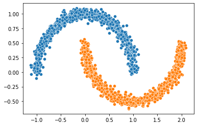
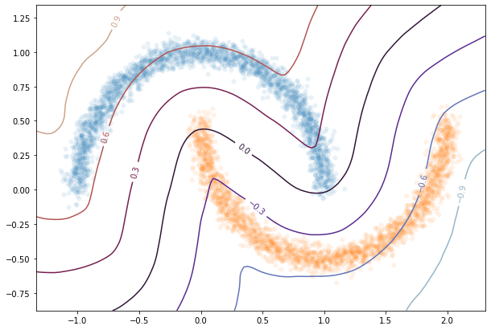

HKR Classifier on toy dataset
-----------------------------

|Open In Colab|

In this demo notebook we will show how to build a robust classifier
based on the regularized version of the Kantorovitch-Rubinstein duality.
We will perform this on the ``two moons`` synthetic dataset.

.. |Open In Colab| image:: https://colab.research.google.com/assets/colab-badge.svg
   :target: https://colab.research.google.com/github/deel-ai/deel-lip/blob/master/doc/notebooks/demo2.ipynb

.. code:: ipython3

    # pip install deel-lip -qqq

.. code:: ipython3

    import numpy as np
    from sklearn.datasets import make_moons, make_circles  # the synthetic dataset
    import matplotlib.pyplot as plt 
    import seaborn as sns
    
    
    # in order to build our classifier we will use element from tensorflow along with
    # layers from deel-lip
    import tensorflow as tf
    from tensorflow.keras import backend as K
    from tensorflow.keras.layers import ReLU, Input
    from tensorflow.keras.optimizers import Adam
    from tensorflow.keras.metrics import binary_accuracy
    
    from deel.lip.model import Model  # use of deel.lip is not mandatory but offers the vanilla_export feature
    from deel.lip.layers import SpectralConv2D, SpectralDense, FrobeniusDense
    from deel.lip.activations import MaxMin, GroupSort, FullSort, GroupSort2
    from deel.lip.losses import HKR, KR, HingeMargin  # custom losses for HKR robust classif

.. parsed-literal::

    Matplotlib created a temporary config/cache directory at /tmp/matplotlib-c82knbft because the default path (/home/thibaut.boissin/.config/matplotlib) is not a writable directory; it is highly recommended to set the MPLCONFIGDIR environment variable to a writable directory, in particular to speed up the import of Matplotlib and to better support multiprocessing.
    2021-09-09 15:21:03.094632: I tensorflow/stream_executor/platform/default/dso_loader.cc:49] Successfully opened dynamic library libcudart.so.11.0

Parameters
~~~~~~~~~~

Let’s first construct our two moons dataset

.. code:: ipython3

    circle_or_moons = 1  # 0 for circle , 1 for moons
    n_samples=5000  # number of sample in the dataset
    noise=0.05  # amount of noise to add in the data. Tested with 0.14 for circles 0.05 for two moons
    factor=0.4  # scale factor between the inner and the outer circle

.. code:: ipython3

    if circle_or_moons == 0:
        X,Y=make_circles(n_samples=n_samples,noise=noise,factor=factor)
    else:
        X,Y=make_moons(n_samples=n_samples,noise=noise)
    
    # When working with the HKR-classifier, using labels {-1, 1} instead of {0, 1} is advised.
    # This will be explained further on 
    Y[Y==1]=-1
    Y[Y==0]=1

.. code:: ipython3

    X1=X[Y==1]
    X2=X[Y==-1]
    sns.scatterplot(X1[:1000,0],X1[:1000,1])
    sns.scatterplot(X2[:1000,0],X2[:1000,1])

.. parsed-literal::

    /home/thibaut.boissin/envs/deel-lip_github/lib/python3.7/site-packages/seaborn/_decorators.py:43: FutureWarning: Pass the following variables as keyword args: x, y. From version 0.12, the only valid positional argument will be `data`, and passing other arguments without an explicit keyword will result in an error or misinterpretation.
      FutureWarning
    /home/thibaut.boissin/envs/deel-lip_github/lib/python3.7/site-packages/seaborn/_decorators.py:43: FutureWarning: Pass the following variables as keyword args: x, y. From version 0.12, the only valid positional argument will be `data`, and passing other arguments without an explicit keyword will result in an error or misinterpretation.
      FutureWarning

.. parsed-literal::

    <AxesSubplot:>

Relation with optimal transport
~~~~~~~~~~~~~~~~~~~~~~~~~~~~~~~

In this setup we can solve the optimal transport problem between the
distribution of ``X[Y==1]`` and ``X[Y==-1]``. This usually require to
match each element of the first distribution with an element of the
second distribution such that this minimize a global cost. In our setup
this cost is the $ l_1 $ distance, which will allow us to make use of
the KR dual formulation. The overall cost is then the :math:`W_1`
distance.

Wasserstein distance
^^^^^^^^^^^^^^^^^^^^

The wasserstein distance measure the distance between two probability
distribution. Wikipedia article gives a more intuitive definition of it:

   Intuitively, if each distribution is viewed as a unit amount of
   “dirt” piled on {:raw-latex:`\displaystyle `M}M, the metric is the
   minimum “cost” of turning one pile into the other, which is assumed
   to be the amount of dirt that needs to be moved times the mean
   distance it has to be moved. Because of this analogy, the metric is
   known in computer science as the earth mover’s distance.

Mathematically it is defined as:

.. math::

   W_1(\mu,\nu) = \inf_{\pi \in \Pi(\mu,\nu)}\underset{x,z \sim \pi}{\mathbb{E}}\parallel \textbf{x}-\textbf{z} \parallel

where :math:`\Pi(\mu,\nu)` is the set of all probability measures on
:math:`\Omega\times \Omega` with marginals :math:`\mu` and :math:`\nu`.
In most case this equation is not tractable.

However the :math:`W_1` distance is known to be untractable in general.

KR dual formulation
^^^^^^^^^^^^^^^^^^^

In our setup, the KR dual formulation is stated as following:

.. math::  W_1(\mu, \nu) = \sup_{f \in Lip_1(\Omega)} \underset{\textbf{x} \sim \mu}{\mathbb{E}} \left[f(\textbf{x} )\right] -\underset{\textbf{x}  \sim \nu}{\mathbb{E}} \left[f(\textbf{x} )\right] 

This state the problem as an optimization problem over the 1-lipschitz
functions. Therefore k-Lipschitz networks allows us to solve this
maximization problem.

Hinge-KR classification
^^^^^^^^^^^^^^^^^^^^^^^

When dealing with :math:`W_1` one may note that many functions maximize
the maximization problem described above. Also we want this function to
be meaningfull in terms of classification. To do so, we want f to be
centered in 0, which can be done without altering the inital problem. By
doing so we can use the obtained function for binary classification, by
looking at the sign of :math:`f`.

In order to enforce this, we will add a Hinge term to the loss. It has
been shown that this new problem is still a optimal transport problem
and that this problem admit a meaningfull optimal solution.

HKR-Classifier
~~~~~~~~~~~~~~

Now we will show how to build a binary classifier based on the
regularized version of the KR dual problem.

In order to ensure the 1-Lipschitz constraint ``deel-lip`` uses spectral
normalization. These layers also can also use Bjork orthonormalization
to ensure that the gradient of the layer is 1 almost everywhere.
Experiment shows that the optimal solution lie in this sub-class of
functions.

.. code:: ipython3

    batch_size=256
    steps_per_epoch=40480
    epoch=10
    hidden_layers_size = [256,128,64]  # stucture of the network
    activation = FullSort  # other lipschitz activation are ReLU, MaxMin, GroupSort2, GroupSort
    min_margin= 0.29  # minimum margin to enforce between the values of f for each class

.. code:: ipython3

    # build data generator
    def otp_generator(batch_size, X, Y):
        Y_ix = np.array([i for i in range(Y.shape[0])])
        Y0_ix = Y_ix[Y == 1]
        Y1_ix = Y_ix[Y == -1]
        half = Y.shape[0] // 2
        while True:
            batch_x = np.zeros(((batch_size,) + (X[0].shape)), dtype=np.float32)
            batch_y = np.zeros((batch_size, 1), dtype=np.float32)
            ind = np.random.choice(Y0_ix, size=batch_size // 2, replace=False)
            batch_x[:batch_size // 2, ] = X[ind]
            batch_y[:batch_size // 2, 0] = Y[ind]
            ind = np.random.choice(Y1_ix, size=batch_size // 2, replace=False)
            batch_x[batch_size // 2:, ] = X[ind]
            batch_y[batch_size // 2:, 0] = Y[ind]
    
            yield batch_x, batch_y
    gen=otp_generator(batch_size,X,Y)

Build lipschitz Model
~~~~~~~~~~~~~~~~~~~~~

Let’s build our model now.

.. code:: ipython3

    K.clear_session()
    # please note that calling the previous helper function has the exact
    # same effect as the following code:
    inputs = Input((2,))
    x = SpectralDense(256, activation=activation())(inputs)
    x = SpectralDense(128, activation=activation())(x)
    x = SpectralDense(64, activation=activation())(x)
    y = FrobeniusDense(1, activation=None)(x)
    wass = Model(inputs=inputs, outputs=y)
    wass.summary()

.. parsed-literal::

    2021-09-09 15:21:05.592903: I tensorflow/compiler/jit/xla_cpu_device.cc:41] Not creating XLA devices, tf_xla_enable_xla_devices not set
    2021-09-09 15:21:05.593407: I tensorflow/stream_executor/platform/default/dso_loader.cc:49] Successfully opened dynamic library libcuda.so.1
    2021-09-09 15:21:05.629010: I tensorflow/stream_executor/cuda/cuda_gpu_executor.cc:941] successful NUMA node read from SysFS had negative value (-1), but there must be at least one NUMA node, so returning NUMA node zero
    2021-09-09 15:21:05.629298: I tensorflow/core/common_runtime/gpu/gpu_device.cc:1720] Found device 0 with properties: 
    pciBusID: 0000:01:00.0 name: GeForce RTX 2070 SUPER computeCapability: 7.5
    coreClock: 1.785GHz coreCount: 40 deviceMemorySize: 7.79GiB deviceMemoryBandwidth: 417.29GiB/s
    2021-09-09 15:21:05.629319: I tensorflow/stream_executor/platform/default/dso_loader.cc:49] Successfully opened dynamic library libcudart.so.11.0
    2021-09-09 15:21:05.630677: I tensorflow/stream_executor/platform/default/dso_loader.cc:49] Successfully opened dynamic library libcublas.so.11
    2021-09-09 15:21:05.630711: I tensorflow/stream_executor/platform/default/dso_loader.cc:49] Successfully opened dynamic library libcublasLt.so.11
    2021-09-09 15:21:05.631342: I tensorflow/stream_executor/platform/default/dso_loader.cc:49] Successfully opened dynamic library libcufft.so.10
    2021-09-09 15:21:05.631489: I tensorflow/stream_executor/platform/default/dso_loader.cc:49] Successfully opened dynamic library libcurand.so.10
    2021-09-09 15:21:05.632988: I tensorflow/stream_executor/platform/default/dso_loader.cc:49] Successfully opened dynamic library libcusolver.so.10
    2021-09-09 15:21:05.633357: I tensorflow/stream_executor/platform/default/dso_loader.cc:49] Successfully opened dynamic library libcusparse.so.11
    2021-09-09 15:21:05.633442: I tensorflow/stream_executor/platform/default/dso_loader.cc:49] Successfully opened dynamic library libcudnn.so.8
    2021-09-09 15:21:05.633509: I tensorflow/stream_executor/cuda/cuda_gpu_executor.cc:941] successful NUMA node read from SysFS had negative value (-1), but there must be at least one NUMA node, so returning NUMA node zero
    2021-09-09 15:21:05.633815: I tensorflow/stream_executor/cuda/cuda_gpu_executor.cc:941] successful NUMA node read from SysFS had negative value (-1), but there must be at least one NUMA node, so returning NUMA node zero
    2021-09-09 15:21:05.634071: I tensorflow/core/common_runtime/gpu/gpu_device.cc:1862] Adding visible gpu devices: 0
    2021-09-09 15:21:05.634541: I tensorflow/compiler/jit/xla_gpu_device.cc:99] Not creating XLA devices, tf_xla_enable_xla_devices not set
    2021-09-09 15:21:05.634607: I tensorflow/stream_executor/cuda/cuda_gpu_executor.cc:941] successful NUMA node read from SysFS had negative value (-1), but there must be at least one NUMA node, so returning NUMA node zero
    2021-09-09 15:21:05.634868: I tensorflow/core/common_runtime/gpu/gpu_device.cc:1720] Found device 0 with properties: 
    pciBusID: 0000:01:00.0 name: GeForce RTX 2070 SUPER computeCapability: 7.5
    coreClock: 1.785GHz coreCount: 40 deviceMemorySize: 7.79GiB deviceMemoryBandwidth: 417.29GiB/s
    2021-09-09 15:21:05.634886: I tensorflow/stream_executor/platform/default/dso_loader.cc:49] Successfully opened dynamic library libcudart.so.11.0
    2021-09-09 15:21:05.634899: I tensorflow/stream_executor/platform/default/dso_loader.cc:49] Successfully opened dynamic library libcublas.so.11
    2021-09-09 15:21:05.634911: I tensorflow/stream_executor/platform/default/dso_loader.cc:49] Successfully opened dynamic library libcublasLt.so.11
    2021-09-09 15:21:05.634923: I tensorflow/stream_executor/platform/default/dso_loader.cc:49] Successfully opened dynamic library libcufft.so.10
    2021-09-09 15:21:05.634935: I tensorflow/stream_executor/platform/default/dso_loader.cc:49] Successfully opened dynamic library libcurand.so.10
    2021-09-09 15:21:05.634946: I tensorflow/stream_executor/platform/default/dso_loader.cc:49] Successfully opened dynamic library libcusolver.so.10
    2021-09-09 15:21:05.634958: I tensorflow/stream_executor/platform/default/dso_loader.cc:49] Successfully opened dynamic library libcusparse.so.11
    2021-09-09 15:21:05.634970: I tensorflow/stream_executor/platform/default/dso_loader.cc:49] Successfully opened dynamic library libcudnn.so.8
    2021-09-09 15:21:05.635012: I tensorflow/stream_executor/cuda/cuda_gpu_executor.cc:941] successful NUMA node read from SysFS had negative value (-1), but there must be at least one NUMA node, so returning NUMA node zero
    2021-09-09 15:21:05.635294: I tensorflow/stream_executor/cuda/cuda_gpu_executor.cc:941] successful NUMA node read from SysFS had negative value (-1), but there must be at least one NUMA node, so returning NUMA node zero
    2021-09-09 15:21:05.635541: I tensorflow/core/common_runtime/gpu/gpu_device.cc:1862] Adding visible gpu devices: 0
    2021-09-09 15:21:05.635567: I tensorflow/stream_executor/platform/default/dso_loader.cc:49] Successfully opened dynamic library libcudart.so.11.0
    2021-09-09 15:21:06.083387: I tensorflow/core/common_runtime/gpu/gpu_device.cc:1261] Device interconnect StreamExecutor with strength 1 edge matrix:
    2021-09-09 15:21:06.083409: I tensorflow/core/common_runtime/gpu/gpu_device.cc:1267]      0 
    2021-09-09 15:21:06.083413: I tensorflow/core/common_runtime/gpu/gpu_device.cc:1280] 0:   N 
    2021-09-09 15:21:06.083563: I tensorflow/stream_executor/cuda/cuda_gpu_executor.cc:941] successful NUMA node read from SysFS had negative value (-1), but there must be at least one NUMA node, so returning NUMA node zero
    2021-09-09 15:21:06.083826: I tensorflow/stream_executor/cuda/cuda_gpu_executor.cc:941] successful NUMA node read from SysFS had negative value (-1), but there must be at least one NUMA node, so returning NUMA node zero
    2021-09-09 15:21:06.084051: I tensorflow/stream_executor/cuda/cuda_gpu_executor.cc:941] successful NUMA node read from SysFS had negative value (-1), but there must be at least one NUMA node, so returning NUMA node zero
    2021-09-09 15:21:06.084258: I tensorflow/core/common_runtime/gpu/gpu_device.cc:1406] Created TensorFlow device (/job:localhost/replica:0/task:0/device:GPU:0 with 7250 MB memory) -> physical GPU (device: 0, name: GeForce RTX 2070 SUPER, pci bus id: 0000:01:00.0, compute capability: 7.5)
    2021-09-09 15:21:06.139070: I tensorflow/stream_executor/platform/default/dso_loader.cc:49] Successfully opened dynamic library libcublas.so.11
    2021-09-09 15:21:06.358769: I tensorflow/stream_executor/platform/default/dso_loader.cc:49] Successfully opened dynamic library libcublasLt.so.11

.. parsed-literal::

    Model: "model"
    _________________________________________________________________
    Layer (type)                 Output Shape              Param #   
    =================================================================
    input_1 (InputLayer)         [(None, 2)]               0         
    _________________________________________________________________
    spectral_dense (SpectralDens (None, 256)               1537      
    _________________________________________________________________
    spectral_dense_1 (SpectralDe (None, 128)               65793     
    _________________________________________________________________
    spectral_dense_2 (SpectralDe (None, 64)                16513     
    _________________________________________________________________
    frobenius_dense (FrobeniusDe (None, 1)                 129       
    =================================================================
    Total params: 83,972
    Trainable params: 41,985
    Non-trainable params: 41,987
    _________________________________________________________________

As we can see the network has a gradient equal to 1 almost everywhere as
all the layers respect this property.

It is good to note that the last layer is a ``FrobeniusDense`` this is
because, when we have a single output, it become equivalent to normalize
the frobenius norm and the spectral norm (as we only have a single
singular value)

.. code:: ipython3

    optimizer = Adam(lr=0.01)

.. code:: ipython3

    # as the output of our classifier is in the real range [-1, 1], binary accuracy must be redefined
    def HKR_binary_accuracy(y_true, y_pred):
        S_true= tf.dtypes.cast(tf.greater_equal(y_true[:,0], 0),dtype=tf.float32)
        S_pred= tf.dtypes.cast(tf.greater_equal(y_pred[:,0], 0),dtype=tf.float32)
        return binary_accuracy(S_true,S_pred)

.. code:: ipython3

    wass.compile(
        loss=HKR(alpha=10,min_margin=min_margin),  # HKR stands for the hinge regularized KR loss
        metrics=[
            KR,  # shows the KR term of the loss
            HingeMargin(min_margin=min_margin),  # shows the hinge term of the loss
            HKR_binary_accuracy  # shows the classification accuracy
        ],
        optimizer=optimizer
    )

Learn classification on toy dataset
~~~~~~~~~~~~~~~~~~~~~~~~~~~~~~~~~~~

Now we are ready to learn the classification task on the two moons
dataset.

.. code:: ipython3

    wass.fit_generator(
        gen,
        steps_per_epoch=steps_per_epoch // batch_size, 
        epochs=epoch,
        verbose=1
    )

.. parsed-literal::

    Epoch 1/10

.. parsed-literal::

    /home/thibaut.boissin/envs/deel-lip_github/lib/python3.7/site-packages/tensorflow/python/keras/engine/training.py:1844: UserWarning: `Model.fit_generator` is deprecated and will be removed in a future version. Please use `Model.fit`, which supports generators.
      warnings.warn('`Model.fit_generator` is deprecated and '
    2021-09-09 15:21:07.073205: I tensorflow/compiler/mlir/mlir_graph_optimization_pass.cc:116] None of the MLIR optimization passes are enabled (registered 2)
    2021-09-09 15:21:07.093028: I tensorflow/core/platform/profile_utils/cpu_utils.cc:112] CPU Frequency: 3600000000 Hz

.. parsed-literal::

    158/158 [==============================] - 5s 21ms/step - loss: 1.0033 - KR: 0.4601 - HingeMargin: 0.1463 - HKR_binary_accuracy: 0.7531
    Epoch 2/10
    158/158 [==============================] - 3s 16ms/step - loss: -0.7646 - KR: 0.9671 - HingeMargin: 0.0202 - HKR_binary_accuracy: 0.9818
    Epoch 3/10
    158/158 [==============================] - 3s 21ms/step - loss: -0.7977 - KR: 0.9698 - HingeMargin: 0.0172 - HKR_binary_accuracy: 0.9893
    Epoch 4/10
    158/158 [==============================] - 3s 21ms/step - loss: -0.8042 - KR: 0.9812 - HingeMargin: 0.0177 - HKR_binary_accuracy: 0.9869
    Epoch 5/10
    158/158 [==============================] - 3s 16ms/step - loss: -0.8153 - KR: 0.9902 - HingeMargin: 0.0175 - HKR_binary_accuracy: 0.9868
    Epoch 6/10
    158/158 [==============================] - 4s 22ms/step - loss: -0.8270 - KR: 0.9814 - HingeMargin: 0.0154 - HKR_binary_accuracy: 0.9912
    Epoch 7/10
    158/158 [==============================] - 2s 14ms/step - loss: -0.8198 - KR: 0.9705 - HingeMargin: 0.0151 - HKR_binary_accuracy: 0.9921
    Epoch 8/10
    158/158 [==============================] - 4s 25ms/step - loss: -0.8167 - KR: 0.9856 - HingeMargin: 0.0169 - HKR_binary_accuracy: 0.9892
    Epoch 9/10
    158/158 [==============================] - 2s 13ms/step - loss: -0.8282 - KR: 0.9892 - HingeMargin: 0.0161 - HKR_binary_accuracy: 0.9903
    Epoch 10/10
    158/158 [==============================] - 4s 23ms/step - loss: -0.8300 - KR: 0.9812 - HingeMargin: 0.0151 - HKR_binary_accuracy: 0.9919

.. parsed-literal::

    <tensorflow.python.keras.callbacks.History at 0x7f6abc5b45d0>

Plot output countour line
~~~~~~~~~~~~~~~~~~~~~~~~~

As we can see the classifier get a pretty good accuracy. Let’s now take
a look at the learnt function. As we are in the 2D space, we can draw a
countour plot to visualize f.

.. code:: ipython3

    import matplotlib.pyplot as plt
    from mpl_toolkits.mplot3d import Axes3D
    from matplotlib import cm
    from matplotlib.ticker import LinearLocator, FormatStrFormatter
    batch_size=1024
    
    x = np.linspace(X[:,0].min()-0.2, X[:,0].max()+0.2, 120)
    y = np.linspace(X[:,1].min()-0.2, X[:,1].max()+0.2,120)
    xx, yy = np.meshgrid(x, y, sparse=False)
    X_pred=np.stack((xx.ravel(),yy.ravel()),axis=1)

.. code:: ipython3

    # make predictions of f
    pred=wass.predict(X_pred)
    
    Y_pred=pred
    Y_pred=Y_pred.reshape(x.shape[0],y.shape[0])

.. code:: ipython3

    #plot the results
    fig = plt.figure(figsize=(10,7))
    ax1 = fig.add_subplot(111)
    
    sns.scatterplot(X[Y==1,0],X[Y==1,1],alpha=0.1,ax=ax1)
    sns.scatterplot(X[Y==-1,0],X[Y==-1,1],alpha=0.1,ax=ax1)
    cset =ax1.contour(xx,yy,Y_pred,cmap='twilight')
    ax1.clabel(cset, inline=1, fontsize=10)

.. parsed-literal::

    /home/thibaut.boissin/envs/deel-lip_github/lib/python3.7/site-packages/seaborn/_decorators.py:43: FutureWarning: Pass the following variables as keyword args: x, y. From version 0.12, the only valid positional argument will be `data`, and passing other arguments without an explicit keyword will result in an error or misinterpretation.
      FutureWarning
    /home/thibaut.boissin/envs/deel-lip_github/lib/python3.7/site-packages/seaborn/_decorators.py:43: FutureWarning: Pass the following variables as keyword args: x, y. From version 0.12, the only valid positional argument will be `data`, and passing other arguments without an explicit keyword will result in an error or misinterpretation.
      FutureWarning

.. parsed-literal::

    <a list of 7 text.Text objects>

Transfer network to a classical MLP and compare outputs
~~~~~~~~~~~~~~~~~~~~~~~~~~~~~~~~~~~~~~~~~~~~~~~~~~~~~~~

As we saw, our networks use custom layers in order to constrain
training. However during inference layers behave exactly as regular
``Dense`` or ``Conv2d`` layers. Deel-lip has a functionnality to export
a model to it’s vanilla keras equivalent. Making it more convenient for
inference.

.. code:: ipython3

    from deel.lip.model import vanillaModel
    ## this is equivalent to test2 = wass.vanilla_export()
    test2 = vanillaModel(wass)
    test2.summary()

.. parsed-literal::

    Model: "model_1"
    _________________________________________________________________
    Layer (type)                 Output Shape              Param #   
    =================================================================
    input_2 (InputLayer)         [(None, 2)]               0         
    _________________________________________________________________
    spectral_dense (Dense)       (None, 256)               768       
    _________________________________________________________________
    spectral_dense_1 (Dense)     (None, 128)               32896     
    _________________________________________________________________
    spectral_dense_2 (Dense)     (None, 64)                8256      
    _________________________________________________________________
    frobenius_dense (Dense)      (None, 1)                 65        
    =================================================================
    Total params: 41,985
    Trainable params: 41,985
    Non-trainable params: 0
    _________________________________________________________________

.. code:: ipython3

    pred_test=test2.predict(X_pred)
    Y_pred=pred_test
    Y_pred=Y_pred.reshape(x.shape[0],y.shape[0])

.. code:: ipython3

    fig = plt.figure(figsize=(10,7))
    ax1 = fig.add_subplot(111)
    #ax2 = fig.add_subplot(312)
    #ax3 = fig.add_subplot(313)
    sns.scatterplot(X[Y==1,0],X[Y==1,1],alpha=0.1,ax=ax1)
    sns.scatterplot(X[Y==-1,0],X[Y==-1,1],alpha=0.1,ax=ax1)
    cset =ax1.contour(xx,yy,Y_pred,cmap='twilight')
    ax1.clabel(cset, inline=1, fontsize=10)

.. parsed-literal::

    /home/thibaut.boissin/envs/deel-lip_github/lib/python3.7/site-packages/seaborn/_decorators.py:43: FutureWarning: Pass the following variables as keyword args: x, y. From version 0.12, the only valid positional argument will be `data`, and passing other arguments without an explicit keyword will result in an error or misinterpretation.
      FutureWarning
    /home/thibaut.boissin/envs/deel-lip_github/lib/python3.7/site-packages/seaborn/_decorators.py:43: FutureWarning: Pass the following variables as keyword args: x, y. From version 0.12, the only valid positional argument will be `data`, and passing other arguments without an explicit keyword will result in an error or misinterpretation.
      FutureWarning

.. parsed-literal::

    <a list of 7 text.Text objects>

.. image:: demo2_files/demo2_26_2.png

