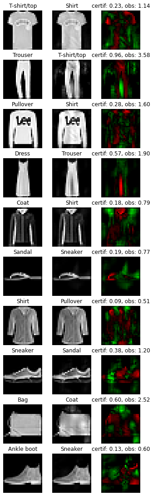

Demo 4: HKR multiclass and fooling
----------------------------------

|Open In Colab|

This notebook will show how to train a lispchitz network in a multiclass
setup. The HKR is extended to multiclass using a one-vs all setup. It
will go through the process of designing and training the network. It
will also show how to create robustness certificates from the output of
the network. Finally these certificates will be checked by attacking the
network.

installation
~~~~~~~~~~~~

First, we install the required libraries. ``Foolbox`` will allow to
perform adversarial attacks on the trained network.

.. |Open In Colab| image:: https://colab.research.google.com/assets/colab-badge.svg
   :target: https://colab.research.google.com/github/deel-ai/deel-lip/blob/master/doc/notebooks/demo4.ipynb

.. code:: ipython3

    # pip install deel-lip foolbox -qqq

.. code:: ipython3

    from deel.lip.layers import (
        SpectralDense,
        SpectralConv2D,
        ScaledL2NormPooling2D,
        ScaledAveragePooling2D,
        FrobeniusDense,
    )
    from deel.lip.model import Sequential
    from deel.lip.activations import GroupSort, FullSort
    from deel.lip.losses import MulticlassHKR, MulticlassKR
    from deel.lip.callbacks import CondenseCallback
    from tensorflow.keras.layers import Input, Flatten
    from tensorflow.keras.optimizers import Adam
    from tensorflow.keras.datasets import mnist, fashion_mnist, cifar10
    from tensorflow.keras.utils import to_categorical
    from tensorflow.keras.preprocessing.image import ImageDataGenerator
    import numpy as np

.. parsed-literal::

    2021-09-09 15:23:54.246047: I tensorflow/stream_executor/platform/default/dso_loader.cc:49] Successfully opened dynamic library libcudart.so.11.0

For this example, the dataset ``fashion_mnist`` will be used. In order
to keep things simple, no data augmentation will be performed.

.. code:: ipython3

    # load data
    (x_train, y_train_ord), (x_test, y_test_ord) = fashion_mnist.load_data()
    # standardize and reshape the data
    x_train = np.expand_dims(x_train, -1) / 255
    x_test = np.expand_dims(x_test, -1) / 255
    # one hot encode the labels
    y_train = to_categorical(y_train_ord)
    y_test = to_categorical(y_test_ord)

Let’s build the network.

the architecture
~~~~~~~~~~~~~~~~

The original one vs all setup would require 10 different networks ( 1
per class ), however, in practice we use a network with a common body
and 10 1-lipschitz heads. Experiments have shown that this setup don’t
affect the network performance. In order to ease the creation of such
network, ``FrobeniusDense`` layer has a parameter for this: whenr
``disjoint_neurons=True`` it act as the stacking of 10 single neurons
head. Note that, altough each head is a 1-lipschitz function the overall
network is not 1-lipschitz (Concatenation is not 1-lipschitz). We will
see later how this affects the certficate creation.

the loss
~~~~~~~~

The multiclass loss can be found in ``HKR_multiclass_loss``. The loss
has two params: ``alpha`` and ``min_margin``. Decreasing ``alpha`` and
increasing ``min_margin`` improve robustness (at the cost of accuracy).
note also in the case of lipschitz networks, more robustness require
more parameters. For more information see `our
paper <https://arxiv.org/abs/2006.06520>`__.

In this setup choosing ``alpha=100``, ``min_margin=.25`` provide a good
robustness without hurting the accuracy too much.

Finally the ``KR_multiclass_loss()`` indicate the robustness of the
network ( proxy of the average certificate )

.. code:: ipython3

    # Sequential (resp Model) from deel.model has the same properties as any lipschitz model.
    # It act only as a container, with features specific to lipschitz
    # functions (condensation, vanilla_exportation...)
    model = Sequential(
        [
            Input(shape=x_train.shape[1:]),
            # Lipschitz layers preserve the API of their superclass ( here Conv2D )
            # an optional param is available: k_coef_lip which control the lipschitz
            # constant of the layer
            SpectralConv2D(
                filters=16,
                kernel_size=(3, 3),
                activation=GroupSort(2),
                use_bias=True,
                kernel_initializer="orthogonal",
            ),
            # usual pooling layer are implemented (avg, max...), but new layers are also available
          ScaledL2NormPooling2D(pool_size=(2, 2), data_format="channels_last"),
            SpectralConv2D(
                filters=32,
                kernel_size=(3, 3),
                activation=GroupSort(2),
                use_bias=True,
                kernel_initializer="orthogonal",
            ),
          ScaledL2NormPooling2D(pool_size=(2, 2), data_format="channels_last"),
            # our layers are fully interoperable with existing keras layers
            Flatten(),
            SpectralDense(
                64,
                activation=GroupSort(2),
                use_bias=True,
                kernel_initializer="orthogonal",
            ),
            FrobeniusDense(
                y_train.shape[-1], activation=None, use_bias=False, kernel_initializer="orthogonal"
            ),
        ],
        # similary model has a parameter to set the lipschitz constant
        # to set automatically the constant of each layer
        k_coef_lip=1.0,
        name="hkr_model",
    )
    
    # HKR (Hinge-Krantorovich-Rubinstein) optimize robustness along with accuracy
    model.compile(
        # decreasing alpha and increasing min_margin improve robustness (at the cost of accuracy)
        # note also in the case of lipschitz networks, more robustness require more parameters.
        loss=MulticlassHKR(alpha=100, min_margin=.25),
        optimizer=Adam(1e-4),
        metrics=["accuracy", MulticlassKR()],
    )
    
    model.summary()

.. parsed-literal::

    2021-09-09 15:23:56.513089: I tensorflow/compiler/jit/xla_cpu_device.cc:41] Not creating XLA devices, tf_xla_enable_xla_devices not set
    2021-09-09 15:23:56.513588: I tensorflow/stream_executor/platform/default/dso_loader.cc:49] Successfully opened dynamic library libcuda.so.1
    2021-09-09 15:23:56.546765: I tensorflow/stream_executor/cuda/cuda_gpu_executor.cc:941] successful NUMA node read from SysFS had negative value (-1), but there must be at least one NUMA node, so returning NUMA node zero
    2021-09-09 15:23:56.547011: I tensorflow/core/common_runtime/gpu/gpu_device.cc:1720] Found device 0 with properties: 
    pciBusID: 0000:01:00.0 name: GeForce RTX 2070 SUPER computeCapability: 7.5
    coreClock: 1.785GHz coreCount: 40 deviceMemorySize: 7.79GiB deviceMemoryBandwidth: 417.29GiB/s
    2021-09-09 15:23:56.547026: I tensorflow/stream_executor/platform/default/dso_loader.cc:49] Successfully opened dynamic library libcudart.so.11.0
    2021-09-09 15:23:56.548076: I tensorflow/stream_executor/platform/default/dso_loader.cc:49] Successfully opened dynamic library libcublas.so.11
    2021-09-09 15:23:56.548107: I tensorflow/stream_executor/platform/default/dso_loader.cc:49] Successfully opened dynamic library libcublasLt.so.11
    2021-09-09 15:23:56.548580: I tensorflow/stream_executor/platform/default/dso_loader.cc:49] Successfully opened dynamic library libcufft.so.10
    2021-09-09 15:23:56.548761: I tensorflow/stream_executor/platform/default/dso_loader.cc:49] Successfully opened dynamic library libcurand.so.10
    2021-09-09 15:23:56.550018: I tensorflow/stream_executor/platform/default/dso_loader.cc:49] Successfully opened dynamic library libcusolver.so.10
    2021-09-09 15:23:56.550268: I tensorflow/stream_executor/platform/default/dso_loader.cc:49] Successfully opened dynamic library libcusparse.so.11
    2021-09-09 15:23:56.550337: I tensorflow/stream_executor/platform/default/dso_loader.cc:49] Successfully opened dynamic library libcudnn.so.8
    2021-09-09 15:23:56.550407: I tensorflow/stream_executor/cuda/cuda_gpu_executor.cc:941] successful NUMA node read from SysFS had negative value (-1), but there must be at least one NUMA node, so returning NUMA node zero
    2021-09-09 15:23:56.550681: I tensorflow/stream_executor/cuda/cuda_gpu_executor.cc:941] successful NUMA node read from SysFS had negative value (-1), but there must be at least one NUMA node, so returning NUMA node zero
    2021-09-09 15:23:56.550918: I tensorflow/core/common_runtime/gpu/gpu_device.cc:1862] Adding visible gpu devices: 0
    2021-09-09 15:23:56.551346: I tensorflow/compiler/jit/xla_gpu_device.cc:99] Not creating XLA devices, tf_xla_enable_xla_devices not set
    2021-09-09 15:23:56.551425: I tensorflow/stream_executor/cuda/cuda_gpu_executor.cc:941] successful NUMA node read from SysFS had negative value (-1), but there must be at least one NUMA node, so returning NUMA node zero
    2021-09-09 15:23:56.551647: I tensorflow/core/common_runtime/gpu/gpu_device.cc:1720] Found device 0 with properties: 
    pciBusID: 0000:01:00.0 name: GeForce RTX 2070 SUPER computeCapability: 7.5
    coreClock: 1.785GHz coreCount: 40 deviceMemorySize: 7.79GiB deviceMemoryBandwidth: 417.29GiB/s
    2021-09-09 15:23:56.551658: I tensorflow/stream_executor/platform/default/dso_loader.cc:49] Successfully opened dynamic library libcudart.so.11.0
    2021-09-09 15:23:56.551668: I tensorflow/stream_executor/platform/default/dso_loader.cc:49] Successfully opened dynamic library libcublas.so.11
    2021-09-09 15:23:56.551675: I tensorflow/stream_executor/platform/default/dso_loader.cc:49] Successfully opened dynamic library libcublasLt.so.11
    2021-09-09 15:23:56.551683: I tensorflow/stream_executor/platform/default/dso_loader.cc:49] Successfully opened dynamic library libcufft.so.10
    2021-09-09 15:23:56.551690: I tensorflow/stream_executor/platform/default/dso_loader.cc:49] Successfully opened dynamic library libcurand.so.10
    2021-09-09 15:23:56.551698: I tensorflow/stream_executor/platform/default/dso_loader.cc:49] Successfully opened dynamic library libcusolver.so.10
    2021-09-09 15:23:56.551705: I tensorflow/stream_executor/platform/default/dso_loader.cc:49] Successfully opened dynamic library libcusparse.so.11
    2021-09-09 15:23:56.551713: I tensorflow/stream_executor/platform/default/dso_loader.cc:49] Successfully opened dynamic library libcudnn.so.8
    2021-09-09 15:23:56.551743: I tensorflow/stream_executor/cuda/cuda_gpu_executor.cc:941] successful NUMA node read from SysFS had negative value (-1), but there must be at least one NUMA node, so returning NUMA node zero
    2021-09-09 15:23:56.551978: I tensorflow/stream_executor/cuda/cuda_gpu_executor.cc:941] successful NUMA node read from SysFS had negative value (-1), but there must be at least one NUMA node, so returning NUMA node zero
    2021-09-09 15:23:56.552189: I tensorflow/core/common_runtime/gpu/gpu_device.cc:1862] Adding visible gpu devices: 0
    2021-09-09 15:23:56.552208: I tensorflow/stream_executor/platform/default/dso_loader.cc:49] Successfully opened dynamic library libcudart.so.11.0
    2021-09-09 15:23:57.006551: I tensorflow/core/common_runtime/gpu/gpu_device.cc:1261] Device interconnect StreamExecutor with strength 1 edge matrix:
    2021-09-09 15:23:57.006572: I tensorflow/core/common_runtime/gpu/gpu_device.cc:1267]      0 
    2021-09-09 15:23:57.006577: I tensorflow/core/common_runtime/gpu/gpu_device.cc:1280] 0:   N 
    2021-09-09 15:23:57.006710: I tensorflow/stream_executor/cuda/cuda_gpu_executor.cc:941] successful NUMA node read from SysFS had negative value (-1), but there must be at least one NUMA node, so returning NUMA node zero
    2021-09-09 15:23:57.006959: I tensorflow/stream_executor/cuda/cuda_gpu_executor.cc:941] successful NUMA node read from SysFS had negative value (-1), but there must be at least one NUMA node, so returning NUMA node zero
    2021-09-09 15:23:57.007177: I tensorflow/stream_executor/cuda/cuda_gpu_executor.cc:941] successful NUMA node read from SysFS had negative value (-1), but there must be at least one NUMA node, so returning NUMA node zero
    2021-09-09 15:23:57.007384: I tensorflow/core/common_runtime/gpu/gpu_device.cc:1406] Created TensorFlow device (/job:localhost/replica:0/task:0/device:GPU:0 with 7250 MB memory) -> physical GPU (device: 0, name: GeForce RTX 2070 SUPER, pci bus id: 0000:01:00.0, compute capability: 7.5)

.. parsed-literal::

    Model: "hkr_model"
    _________________________________________________________________
    Layer (type)                 Output Shape              Param #   
    =================================================================
    spectral_conv2d (SpectralCon (None, 28, 28, 16)        321       
    _________________________________________________________________
    scaled_l2norm_pooling2d (Sca (None, 14, 14, 16)        0         
    _________________________________________________________________
    spectral_conv2d_1 (SpectralC (None, 14, 14, 32)        9281      
    _________________________________________________________________
    scaled_l2norm_pooling2d_1 (S (None, 7, 7, 32)          0         
    _________________________________________________________________
    flatten (Flatten)            (None, 1568)              0         
    _________________________________________________________________
    spectral_dense (SpectralDens (None, 64)                200833    
    _________________________________________________________________
    frobenius_dense (FrobeniusDe (None, 10)                1280      
    =================================================================
    Total params: 211,715
    Trainable params: 105,856
    Non-trainable params: 105,859
    _________________________________________________________________

.. parsed-literal::

    /home/thibaut.boissin/projects/repo_github/deel-lip/deel/lip/model.py:56: UserWarning: Sequential model contains a layer wich is not a Lipschitz layer: flatten
      layer.name

notes about constraint enforcement
~~~~~~~~~~~~~~~~~~~~~~~~~~~~~~~~~~

There are currently 3 way to enforce a constraint in a network: 1.
regularization 2. weight reparametrization 3. weight projection

The first one don’t provide the required garanties, this is why
``deel-lip`` focuses on the later two. Weight reparametrization is done
directly in the layers (parameter ``niter_bjorck``) this trick allow to
perform arbitrary gradient updates without breaking the constraint.
However this is done in the graph, increasing ressources consumption.
The last method project the weights between each batch, ensuring the
constraint at an more affordable computational cost. It can be done in
``deel-lip`` using the ``CondenseCallback``. The main problem with this
method is a reduced efficiency of each update.

As a rule of thumb, when reparametrization is used alone, setting
``niter_bjorck`` to at least 15 is advised. However when combined with
weight projection, this setting can be lowered greatly.

.. code:: ipython3

    # fit the model
    model.fit(
        x_train,
        y_train,
        batch_size=4096,
        epochs=100,
        validation_data=(x_test, y_test),
        shuffle=True,
        verbose=1,
    )

.. parsed-literal::

    2021-09-09 15:23:57.884782: I tensorflow/compiler/mlir/mlir_graph_optimization_pass.cc:116] None of the MLIR optimization passes are enabled (registered 2)
    2021-09-09 15:23:57.904825: I tensorflow/core/platform/profile_utils/cpu_utils.cc:112] CPU Frequency: 3600000000 Hz

.. parsed-literal::

    Epoch 1/100

.. parsed-literal::

    2021-09-09 15:23:59.845878: I tensorflow/stream_executor/platform/default/dso_loader.cc:49] Successfully opened dynamic library libcublas.so.11
    2021-09-09 15:24:00.073154: I tensorflow/stream_executor/platform/default/dso_loader.cc:49] Successfully opened dynamic library libcublasLt.so.11
    2021-09-09 15:24:00.085078: I tensorflow/stream_executor/platform/default/dso_loader.cc:49] Successfully opened dynamic library libcudnn.so.8

.. parsed-literal::

    15/15 [==============================] - 5s 122ms/step - loss: 39.1980 - accuracy: 0.1978 - MulticlassKR: 0.0696 - val_loss: 27.9635 - val_accuracy: 0.4333 - val_MulticlassKR: 0.2131
    Epoch 2/100
    15/15 [==============================] - 1s 80ms/step - loss: 24.6199 - accuracy: 0.5132 - MulticlassKR: 0.2621 - val_loss: 19.2440 - val_accuracy: 0.5799 - val_MulticlassKR: 0.3644
    Epoch 3/100
    15/15 [==============================] - 1s 80ms/step - loss: 17.6495 - accuracy: 0.6024 - MulticlassKR: 0.4085 - val_loss: 15.3187 - val_accuracy: 0.6053 - val_MulticlassKR: 0.4932
    Epoch 4/100
    15/15 [==============================] - 1s 80ms/step - loss: 14.4405 - accuracy: 0.6281 - MulticlassKR: 0.5255 - val_loss: 13.4606 - val_accuracy: 0.6310 - val_MulticlassKR: 0.5746
    Epoch 5/100
    15/15 [==============================] - 1s 80ms/step - loss: 12.8692 - accuracy: 0.6524 - MulticlassKR: 0.5970 - val_loss: 12.2739 - val_accuracy: 0.6726 - val_MulticlassKR: 0.6353
    Epoch 6/100
    15/15 [==============================] - 1s 80ms/step - loss: 11.8301 - accuracy: 0.6904 - MulticlassKR: 0.6541 - val_loss: 11.4644 - val_accuracy: 0.6902 - val_MulticlassKR: 0.6832
    Epoch 7/100
    15/15 [==============================] - 1s 80ms/step - loss: 11.0723 - accuracy: 0.7139 - MulticlassKR: 0.6963 - val_loss: 10.9075 - val_accuracy: 0.7059 - val_MulticlassKR: 0.7175
    Epoch 8/100
    15/15 [==============================] - 1s 80ms/step - loss: 10.5191 - accuracy: 0.7273 - MulticlassKR: 0.7315 - val_loss: 10.4545 - val_accuracy: 0.7131 - val_MulticlassKR: 0.7519
    Epoch 9/100
    15/15 [==============================] - 1s 80ms/step - loss: 10.1356 - accuracy: 0.7285 - MulticlassKR: 0.7638 - val_loss: 10.1174 - val_accuracy: 0.7267 - val_MulticlassKR: 0.7819
    Epoch 10/100
    15/15 [==============================] - 1s 80ms/step - loss: 9.8334 - accuracy: 0.7364 - MulticlassKR: 0.7928 - val_loss: 9.7973 - val_accuracy: 0.7290 - val_MulticlassKR: 0.8084
    Epoch 11/100
    15/15 [==============================] - 1s 80ms/step - loss: 9.4521 - accuracy: 0.7439 - MulticlassKR: 0.8200 - val_loss: 9.5241 - val_accuracy: 0.7374 - val_MulticlassKR: 0.8316
    Epoch 12/100
    15/15 [==============================] - 1s 80ms/step - loss: 9.3002 - accuracy: 0.7440 - MulticlassKR: 0.8408 - val_loss: 9.2828 - val_accuracy: 0.7418 - val_MulticlassKR: 0.8562
    Epoch 13/100
    15/15 [==============================] - 1s 80ms/step - loss: 8.9698 - accuracy: 0.7490 - MulticlassKR: 0.8663 - val_loss: 9.0458 - val_accuracy: 0.7437 - val_MulticlassKR: 0.8799
    Epoch 14/100
    15/15 [==============================] - 1s 81ms/step - loss: 8.7180 - accuracy: 0.7550 - MulticlassKR: 0.8897 - val_loss: 8.8594 - val_accuracy: 0.7425 - val_MulticlassKR: 0.9006
    Epoch 15/100
    15/15 [==============================] - 1s 80ms/step - loss: 8.5727 - accuracy: 0.7532 - MulticlassKR: 0.9091 - val_loss: 8.6463 - val_accuracy: 0.7503 - val_MulticlassKR: 0.9226
    Epoch 16/100
    15/15 [==============================] - 1s 81ms/step - loss: 8.3025 - accuracy: 0.7582 - MulticlassKR: 0.9316 - val_loss: 8.4805 - val_accuracy: 0.7526 - val_MulticlassKR: 0.9404
    Epoch 17/100
    15/15 [==============================] - 1s 80ms/step - loss: 8.1680 - accuracy: 0.7661 - MulticlassKR: 0.9498 - val_loss: 8.3038 - val_accuracy: 0.7531 - val_MulticlassKR: 0.9568
    Epoch 18/100
    15/15 [==============================] - 1s 80ms/step - loss: 7.8900 - accuracy: 0.7666 - MulticlassKR: 0.9673 - val_loss: 8.1444 - val_accuracy: 0.7539 - val_MulticlassKR: 0.9752
    Epoch 19/100
    15/15 [==============================] - 1s 80ms/step - loss: 7.7125 - accuracy: 0.7701 - MulticlassKR: 0.9861 - val_loss: 8.0073 - val_accuracy: 0.7519 - val_MulticlassKR: 0.9961
    Epoch 20/100
    15/15 [==============================] - 1s 82ms/step - loss: 7.6346 - accuracy: 0.7705 - MulticlassKR: 1.0042 - val_loss: 7.8422 - val_accuracy: 0.7686 - val_MulticlassKR: 1.0116
    Epoch 21/100
    15/15 [==============================] - 1s 80ms/step - loss: 7.3864 - accuracy: 0.7789 - MulticlassKR: 1.0214 - val_loss: 7.7221 - val_accuracy: 0.7660 - val_MulticlassKR: 1.0287
    Epoch 22/100
    15/15 [==============================] - 1s 81ms/step - loss: 7.3328 - accuracy: 0.7789 - MulticlassKR: 1.0367 - val_loss: 7.5913 - val_accuracy: 0.7705 - val_MulticlassKR: 1.0487
    Epoch 23/100
    15/15 [==============================] - 1s 80ms/step - loss: 7.1376 - accuracy: 0.7830 - MulticlassKR: 1.0591 - val_loss: 7.4604 - val_accuracy: 0.7779 - val_MulticlassKR: 1.0618
    Epoch 24/100
    15/15 [==============================] - 1s 81ms/step - loss: 7.1185 - accuracy: 0.7847 - MulticlassKR: 1.0719 - val_loss: 7.3675 - val_accuracy: 0.7734 - val_MulticlassKR: 1.0780
    Epoch 25/100
    15/15 [==============================] - 1s 80ms/step - loss: 6.9846 - accuracy: 0.7899 - MulticlassKR: 1.0879 - val_loss: 7.2500 - val_accuracy: 0.7778 - val_MulticlassKR: 1.0941
    Epoch 26/100
    15/15 [==============================] - 1s 80ms/step - loss: 6.8701 - accuracy: 0.7897 - MulticlassKR: 1.1024 - val_loss: 7.1813 - val_accuracy: 0.7765 - val_MulticlassKR: 1.1133
    Epoch 27/100
    15/15 [==============================] - 1s 81ms/step - loss: 6.7242 - accuracy: 0.7937 - MulticlassKR: 1.1218 - val_loss: 7.0798 - val_accuracy: 0.7793 - val_MulticlassKR: 1.1259
    Epoch 28/100
    15/15 [==============================] - 1s 80ms/step - loss: 6.6596 - accuracy: 0.7935 - MulticlassKR: 1.1366 - val_loss: 6.9680 - val_accuracy: 0.7824 - val_MulticlassKR: 1.1438
    Epoch 29/100
    15/15 [==============================] - 1s 80ms/step - loss: 6.5917 - accuracy: 0.7961 - MulticlassKR: 1.1527 - val_loss: 6.8959 - val_accuracy: 0.7856 - val_MulticlassKR: 1.1557
    Epoch 30/100
    15/15 [==============================] - 1s 80ms/step - loss: 6.4942 - accuracy: 0.7997 - MulticlassKR: 1.1641 - val_loss: 6.8149 - val_accuracy: 0.7871 - val_MulticlassKR: 1.1710
    Epoch 31/100
    15/15 [==============================] - 1s 80ms/step - loss: 6.3914 - accuracy: 0.8001 - MulticlassKR: 1.1840 - val_loss: 6.7261 - val_accuracy: 0.7895 - val_MulticlassKR: 1.1879
    Epoch 32/100
    15/15 [==============================] - 1s 80ms/step - loss: 6.3011 - accuracy: 0.8027 - MulticlassKR: 1.1963 - val_loss: 6.6700 - val_accuracy: 0.7895 - val_MulticlassKR: 1.2034
    Epoch 33/100
    15/15 [==============================] - 1s 80ms/step - loss: 6.2331 - accuracy: 0.8044 - MulticlassKR: 1.2143 - val_loss: 6.5813 - val_accuracy: 0.7947 - val_MulticlassKR: 1.2163
    Epoch 34/100
    15/15 [==============================] - 1s 80ms/step - loss: 6.2195 - accuracy: 0.8054 - MulticlassKR: 1.2278 - val_loss: 6.5227 - val_accuracy: 0.7988 - val_MulticlassKR: 1.2278
    Epoch 35/100
    15/15 [==============================] - 1s 80ms/step - loss: 6.1537 - accuracy: 0.8067 - MulticlassKR: 1.2368 - val_loss: 6.4530 - val_accuracy: 0.7993 - val_MulticlassKR: 1.2438
    Epoch 36/100
    15/15 [==============================] - 1s 80ms/step - loss: 6.0333 - accuracy: 0.8084 - MulticlassKR: 1.2552 - val_loss: 6.3854 - val_accuracy: 0.8001 - val_MulticlassKR: 1.2583
    Epoch 37/100
    15/15 [==============================] - 1s 80ms/step - loss: 6.0244 - accuracy: 0.8095 - MulticlassKR: 1.2657 - val_loss: 6.3288 - val_accuracy: 0.8027 - val_MulticlassKR: 1.2720
    Epoch 38/100
    15/15 [==============================] - 1s 80ms/step - loss: 5.9371 - accuracy: 0.8120 - MulticlassKR: 1.2816 - val_loss: 6.2673 - val_accuracy: 0.8043 - val_MulticlassKR: 1.2860
    Epoch 39/100
    15/15 [==============================] - 1s 80ms/step - loss: 5.8368 - accuracy: 0.8152 - MulticlassKR: 1.2955 - val_loss: 6.2108 - val_accuracy: 0.8040 - val_MulticlassKR: 1.3003
    Epoch 40/100
    15/15 [==============================] - 1s 80ms/step - loss: 5.8105 - accuracy: 0.8121 - MulticlassKR: 1.3105 - val_loss: 6.1553 - val_accuracy: 0.8066 - val_MulticlassKR: 1.3136
    Epoch 41/100
    15/15 [==============================] - 1s 80ms/step - loss: 5.7592 - accuracy: 0.8161 - MulticlassKR: 1.3237 - val_loss: 6.1118 - val_accuracy: 0.8065 - val_MulticlassKR: 1.3281
    Epoch 42/100
    15/15 [==============================] - 1s 80ms/step - loss: 5.7048 - accuracy: 0.8153 - MulticlassKR: 1.3377 - val_loss: 6.1198 - val_accuracy: 0.8050 - val_MulticlassKR: 1.3402
    Epoch 43/100
    15/15 [==============================] - 1s 80ms/step - loss: 5.6486 - accuracy: 0.8169 - MulticlassKR: 1.3522 - val_loss: 6.0392 - val_accuracy: 0.8088 - val_MulticlassKR: 1.3495
    Epoch 44/100
    15/15 [==============================] - 1s 81ms/step - loss: 5.6033 - accuracy: 0.8174 - MulticlassKR: 1.3636 - val_loss: 5.9718 - val_accuracy: 0.8063 - val_MulticlassKR: 1.3680
    Epoch 45/100
    15/15 [==============================] - 1s 80ms/step - loss: 5.5901 - accuracy: 0.8195 - MulticlassKR: 1.3762 - val_loss: 5.9189 - val_accuracy: 0.8111 - val_MulticlassKR: 1.3761
    Epoch 46/100
    15/15 [==============================] - 1s 80ms/step - loss: 5.5301 - accuracy: 0.8210 - MulticlassKR: 1.3898 - val_loss: 5.8990 - val_accuracy: 0.8092 - val_MulticlassKR: 1.3881
    Epoch 47/100
    15/15 [==============================] - 1s 80ms/step - loss: 5.5151 - accuracy: 0.8208 - MulticlassKR: 1.3952 - val_loss: 5.8144 - val_accuracy: 0.8131 - val_MulticlassKR: 1.4015
    Epoch 48/100
    15/15 [==============================] - 1s 80ms/step - loss: 5.4303 - accuracy: 0.8225 - MulticlassKR: 1.4106 - val_loss: 5.8048 - val_accuracy: 0.8125 - val_MulticlassKR: 1.4126
    Epoch 49/100
    15/15 [==============================] - 1s 81ms/step - loss: 5.3855 - accuracy: 0.8238 - MulticlassKR: 1.4215 - val_loss: 5.7342 - val_accuracy: 0.8126 - val_MulticlassKR: 1.4261
    Epoch 50/100
    15/15 [==============================] - 1s 81ms/step - loss: 5.3562 - accuracy: 0.8240 - MulticlassKR: 1.4338 - val_loss: 5.7158 - val_accuracy: 0.8144 - val_MulticlassKR: 1.4337
    Epoch 51/100
    15/15 [==============================] - 1s 80ms/step - loss: 5.3135 - accuracy: 0.8245 - MulticlassKR: 1.4464 - val_loss: 5.6677 - val_accuracy: 0.8144 - val_MulticlassKR: 1.4457
    Epoch 52/100
    15/15 [==============================] - 1s 80ms/step - loss: 5.2805 - accuracy: 0.8256 - MulticlassKR: 1.4520 - val_loss: 5.6259 - val_accuracy: 0.8169 - val_MulticlassKR: 1.4605
    Epoch 53/100
    15/15 [==============================] - 1s 80ms/step - loss: 5.2739 - accuracy: 0.8252 - MulticlassKR: 1.4680 - val_loss: 5.5821 - val_accuracy: 0.8158 - val_MulticlassKR: 1.4677
    Epoch 54/100
    15/15 [==============================] - 1s 80ms/step - loss: 5.2184 - accuracy: 0.8271 - MulticlassKR: 1.4746 - val_loss: 5.5683 - val_accuracy: 0.8167 - val_MulticlassKR: 1.4786
    Epoch 55/100
    15/15 [==============================] - 1s 80ms/step - loss: 5.2022 - accuracy: 0.8221 - MulticlassKR: 1.4908 - val_loss: 5.5331 - val_accuracy: 0.8174 - val_MulticlassKR: 1.4887
    Epoch 56/100
    15/15 [==============================] - 1s 80ms/step - loss: 5.1353 - accuracy: 0.8272 - MulticlassKR: 1.5026 - val_loss: 5.4929 - val_accuracy: 0.8169 - val_MulticlassKR: 1.5027
    Epoch 57/100
    15/15 [==============================] - 1s 81ms/step - loss: 5.0135 - accuracy: 0.8306 - MulticlassKR: 1.5123 - val_loss: 5.4555 - val_accuracy: 0.8172 - val_MulticlassKR: 1.5137
    Epoch 58/100
    15/15 [==============================] - 1s 80ms/step - loss: 5.0075 - accuracy: 0.8312 - MulticlassKR: 1.5234 - val_loss: 5.4184 - val_accuracy: 0.8203 - val_MulticlassKR: 1.5227
    Epoch 59/100
    15/15 [==============================] - 1s 81ms/step - loss: 4.9462 - accuracy: 0.8322 - MulticlassKR: 1.5349 - val_loss: 5.4142 - val_accuracy: 0.8153 - val_MulticlassKR: 1.5350
    Epoch 60/100
    15/15 [==============================] - 1s 80ms/step - loss: 5.0240 - accuracy: 0.8301 - MulticlassKR: 1.5387 - val_loss: 5.3523 - val_accuracy: 0.8215 - val_MulticlassKR: 1.5435
    Epoch 61/100
    15/15 [==============================] - 1s 80ms/step - loss: 5.0011 - accuracy: 0.8297 - MulticlassKR: 1.5521 - val_loss: 5.3138 - val_accuracy: 0.8222 - val_MulticlassKR: 1.5525
    Epoch 62/100
    15/15 [==============================] - 1s 80ms/step - loss: 4.9619 - accuracy: 0.8341 - MulticlassKR: 1.5624 - val_loss: 5.3004 - val_accuracy: 0.8204 - val_MulticlassKR: 1.5608
    Epoch 63/100
    15/15 [==============================] - 1s 80ms/step - loss: 4.8721 - accuracy: 0.8339 - MulticlassKR: 1.5654 - val_loss: 5.2834 - val_accuracy: 0.8210 - val_MulticlassKR: 1.5755
    Epoch 64/100
    15/15 [==============================] - 1s 80ms/step - loss: 4.8733 - accuracy: 0.8285 - MulticlassKR: 1.5845 - val_loss: 5.2610 - val_accuracy: 0.8227 - val_MulticlassKR: 1.5822
    Epoch 65/100
    15/15 [==============================] - 1s 80ms/step - loss: 4.8200 - accuracy: 0.8337 - MulticlassKR: 1.5916 - val_loss: 5.2251 - val_accuracy: 0.8242 - val_MulticlassKR: 1.5879
    Epoch 66/100
    15/15 [==============================] - 1s 80ms/step - loss: 4.8683 - accuracy: 0.8327 - MulticlassKR: 1.5991 - val_loss: 5.1835 - val_accuracy: 0.8239 - val_MulticlassKR: 1.6015
    Epoch 67/100
    15/15 [==============================] - 1s 80ms/step - loss: 4.7378 - accuracy: 0.8316 - MulticlassKR: 1.6143 - val_loss: 5.1520 - val_accuracy: 0.8250 - val_MulticlassKR: 1.6108
    Epoch 68/100
    15/15 [==============================] - 1s 80ms/step - loss: 4.7909 - accuracy: 0.8358 - MulticlassKR: 1.6208 - val_loss: 5.1399 - val_accuracy: 0.8244 - val_MulticlassKR: 1.6198
    Epoch 69/100
    15/15 [==============================] - 1s 80ms/step - loss: 4.7028 - accuracy: 0.8361 - MulticlassKR: 1.6289 - val_loss: 5.1110 - val_accuracy: 0.8259 - val_MulticlassKR: 1.6279
    Epoch 70/100
    15/15 [==============================] - 1s 80ms/step - loss: 4.7550 - accuracy: 0.8329 - MulticlassKR: 1.6345 - val_loss: 5.0870 - val_accuracy: 0.8254 - val_MulticlassKR: 1.6371
    Epoch 71/100
    15/15 [==============================] - 1s 80ms/step - loss: 4.7727 - accuracy: 0.8365 - MulticlassKR: 1.6418 - val_loss: 5.0472 - val_accuracy: 0.8271 - val_MulticlassKR: 1.6463
    Epoch 72/100
    15/15 [==============================] - 1s 81ms/step - loss: 4.6440 - accuracy: 0.8385 - MulticlassKR: 1.6552 - val_loss: 5.0187 - val_accuracy: 0.8259 - val_MulticlassKR: 1.6526
    Epoch 73/100
    15/15 [==============================] - 1s 80ms/step - loss: 4.6614 - accuracy: 0.8379 - MulticlassKR: 1.6612 - val_loss: 5.0198 - val_accuracy: 0.8276 - val_MulticlassKR: 1.6636
    Epoch 74/100
    15/15 [==============================] - 1s 80ms/step - loss: 4.6213 - accuracy: 0.8384 - MulticlassKR: 1.6710 - val_loss: 4.9736 - val_accuracy: 0.8304 - val_MulticlassKR: 1.6691
    Epoch 75/100
    15/15 [==============================] - 1s 80ms/step - loss: 4.5920 - accuracy: 0.8382 - MulticlassKR: 1.6763 - val_loss: 4.9604 - val_accuracy: 0.8282 - val_MulticlassKR: 1.6774
    Epoch 76/100
    15/15 [==============================] - 1s 80ms/step - loss: 4.5519 - accuracy: 0.8388 - MulticlassKR: 1.6882 - val_loss: 4.9267 - val_accuracy: 0.8316 - val_MulticlassKR: 1.6850
    Epoch 77/100
    15/15 [==============================] - 1s 80ms/step - loss: 4.5838 - accuracy: 0.8395 - MulticlassKR: 1.6937 - val_loss: 4.9075 - val_accuracy: 0.8330 - val_MulticlassKR: 1.6961
    Epoch 78/100
    15/15 [==============================] - 1s 81ms/step - loss: 4.4766 - accuracy: 0.8410 - MulticlassKR: 1.7044 - val_loss: 4.8950 - val_accuracy: 0.8311 - val_MulticlassKR: 1.6990
    Epoch 79/100
    15/15 [==============================] - 1s 80ms/step - loss: 4.5261 - accuracy: 0.8391 - MulticlassKR: 1.7108 - val_loss: 4.8688 - val_accuracy: 0.8319 - val_MulticlassKR: 1.7111
    Epoch 80/100
    15/15 [==============================] - 1s 81ms/step - loss: 4.4511 - accuracy: 0.8431 - MulticlassKR: 1.7205 - val_loss: 4.8572 - val_accuracy: 0.8314 - val_MulticlassKR: 1.7183
    Epoch 81/100
    15/15 [==============================] - 1s 80ms/step - loss: 4.4914 - accuracy: 0.8416 - MulticlassKR: 1.7240 - val_loss: 4.8231 - val_accuracy: 0.8325 - val_MulticlassKR: 1.7255
    Epoch 82/100
    15/15 [==============================] - 1s 80ms/step - loss: 4.4594 - accuracy: 0.8406 - MulticlassKR: 1.7336 - val_loss: 4.8671 - val_accuracy: 0.8278 - val_MulticlassKR: 1.7342
    Epoch 83/100
    15/15 [==============================] - 1s 80ms/step - loss: 4.4123 - accuracy: 0.8412 - MulticlassKR: 1.7466 - val_loss: 4.7951 - val_accuracy: 0.8331 - val_MulticlassKR: 1.7415
    Epoch 84/100
    15/15 [==============================] - 1s 80ms/step - loss: 4.3057 - accuracy: 0.8441 - MulticlassKR: 1.7506 - val_loss: 4.7815 - val_accuracy: 0.8322 - val_MulticlassKR: 1.7477
    Epoch 85/100
    15/15 [==============================] - 1s 80ms/step - loss: 4.3868 - accuracy: 0.8438 - MulticlassKR: 1.7535 - val_loss: 4.7763 - val_accuracy: 0.8329 - val_MulticlassKR: 1.7540
    Epoch 86/100
    15/15 [==============================] - 1s 81ms/step - loss: 4.3815 - accuracy: 0.8422 - MulticlassKR: 1.7612 - val_loss: 4.7423 - val_accuracy: 0.8354 - val_MulticlassKR: 1.7597
    Epoch 87/100
    15/15 [==============================] - 1s 80ms/step - loss: 4.3078 - accuracy: 0.8458 - MulticlassKR: 1.7692 - val_loss: 4.7037 - val_accuracy: 0.8369 - val_MulticlassKR: 1.7659
    Epoch 88/100
    15/15 [==============================] - 1s 80ms/step - loss: 4.3330 - accuracy: 0.8445 - MulticlassKR: 1.7725 - val_loss: 4.6838 - val_accuracy: 0.8362 - val_MulticlassKR: 1.7722
    Epoch 89/100
    15/15 [==============================] - 1s 80ms/step - loss: 4.2461 - accuracy: 0.8473 - MulticlassKR: 1.7818 - val_loss: 4.6907 - val_accuracy: 0.8377 - val_MulticlassKR: 1.7787
    Epoch 90/100
    15/15 [==============================] - 1s 80ms/step - loss: 4.2975 - accuracy: 0.8443 - MulticlassKR: 1.7860 - val_loss: 4.6683 - val_accuracy: 0.8389 - val_MulticlassKR: 1.7841
    Epoch 91/100
    15/15 [==============================] - 1s 80ms/step - loss: 4.2759 - accuracy: 0.8440 - MulticlassKR: 1.7970 - val_loss: 4.6498 - val_accuracy: 0.8362 - val_MulticlassKR: 1.7905
    Epoch 92/100
    15/15 [==============================] - 1s 80ms/step - loss: 4.2226 - accuracy: 0.8450 - MulticlassKR: 1.8044 - val_loss: 4.6115 - val_accuracy: 0.8366 - val_MulticlassKR: 1.8014
    Epoch 93/100
    15/15 [==============================] - 1s 80ms/step - loss: 4.1851 - accuracy: 0.8469 - MulticlassKR: 1.8099 - val_loss: 4.5928 - val_accuracy: 0.8372 - val_MulticlassKR: 1.8064
    Epoch 94/100
    15/15 [==============================] - 1s 80ms/step - loss: 4.2466 - accuracy: 0.8462 - MulticlassKR: 1.8117 - val_loss: 4.5803 - val_accuracy: 0.8369 - val_MulticlassKR: 1.8112
    Epoch 95/100
    15/15 [==============================] - 1s 81ms/step - loss: 4.1717 - accuracy: 0.8472 - MulticlassKR: 1.8230 - val_loss: 4.5755 - val_accuracy: 0.8354 - val_MulticlassKR: 1.8204
    Epoch 96/100
    15/15 [==============================] - 1s 80ms/step - loss: 4.1737 - accuracy: 0.8458 - MulticlassKR: 1.8266 - val_loss: 4.5771 - val_accuracy: 0.8379 - val_MulticlassKR: 1.8216
    Epoch 97/100
    15/15 [==============================] - 1s 80ms/step - loss: 4.1255 - accuracy: 0.8478 - MulticlassKR: 1.8370 - val_loss: 4.5456 - val_accuracy: 0.8397 - val_MulticlassKR: 1.8282
    Epoch 98/100
    15/15 [==============================] - 1s 80ms/step - loss: 4.0964 - accuracy: 0.8479 - MulticlassKR: 1.8409 - val_loss: 4.5388 - val_accuracy: 0.8367 - val_MulticlassKR: 1.8389
    Epoch 99/100
    15/15 [==============================] - 1s 80ms/step - loss: 4.1505 - accuracy: 0.8456 - MulticlassKR: 1.8443 - val_loss: 4.5409 - val_accuracy: 0.8367 - val_MulticlassKR: 1.8409
    Epoch 100/100
    15/15 [==============================] - 1s 80ms/step - loss: 4.1035 - accuracy: 0.8469 - MulticlassKR: 1.8526 - val_loss: 4.5051 - val_accuracy: 0.8387 - val_MulticlassKR: 1.8466

.. parsed-literal::

    <tensorflow.python.keras.callbacks.History at 0x7fec84096390>

model exportation
~~~~~~~~~~~~~~~~~

Once training is finished, the model can be optimized for inference by
using the ``vanilla_export()`` method.

.. code:: ipython3

    # once training is finished you can convert
    # SpectralDense layers into Dense layers and SpectralConv2D into Conv2D
    # which optimize performance for inference
    vanilla_model = model.vanilla_export()

certificates generation and adversarial attacks
~~~~~~~~~~~~~~~~~~~~~~~~~~~~~~~~~~~~~~~~~~~~~~~

.. code:: ipython3

    import foolbox as fb
    from tensorflow import convert_to_tensor
    import matplotlib.pyplot as plt
    import tensorflow as tf

.. parsed-literal::

    Matplotlib created a temporary config/cache directory at /tmp/matplotlib-6irxwacj because the default path (/home/thibaut.boissin/.config/matplotlib) is not a writable directory; it is highly recommended to set the MPLCONFIGDIR environment variable to a writable directory, in particular to speed up the import of Matplotlib and to better support multiprocessing.

.. code:: ipython3

    # we will test it on 10 samples one of each class
    nb_adv = 10
    
    hkr_fmodel = fb.TensorFlowModel(vanilla_model, bounds=(0., 1.), device="/GPU:0")

In order to test the robustness of the model, the first correctly
classified element of each class are selected.

.. code:: ipython3

    # strategy: first
    # we select a sample from each class.
    images_list = []
    labels_list = []
    # select only a few element from the test set
    selected=np.random.choice(len(y_test_ord), 500)
    sub_y_test_ord = y_test_ord[:300]
    sub_x_test = x_test[:300]
    # drop misclassified elements
    misclassified_mask = tf.equal(tf.argmax(vanilla_model.predict(sub_x_test), axis=-1), sub_y_test_ord)
    sub_x_test = sub_x_test[misclassified_mask]
    sub_y_test_ord = sub_y_test_ord[misclassified_mask]
    # now we will build a list with input image for each element of the matrix
    for i in range(10):
      # select the first element of the ith label
      label_mask = [sub_y_test_ord==i]
      x = sub_x_test[label_mask][0]
      y = sub_y_test_ord[label_mask][0]
      # convert it to tensor for use with foolbox
      images = convert_to_tensor(x.astype("float32"), dtype="float32")
      labels = convert_to_tensor(y, dtype="int64")
      # repeat the input 10 times, one per misclassification target
      images_list.append(images)
      labels_list.append(labels)
    images = convert_to_tensor(images_list)
    labels = convert_to_tensor(labels_list)

.. parsed-literal::

    /home/thibaut.boissin/envs/deel-lip_github/lib/python3.7/site-packages/ipykernel_launcher.py:17: FutureWarning: Using a non-tuple sequence for multidimensional indexing is deprecated; use `arr[tuple(seq)]` instead of `arr[seq]`. In the future this will be interpreted as an array index, `arr[np.array(seq)]`, which will result either in an error or a different result.
    /home/thibaut.boissin/envs/deel-lip_github/lib/python3.7/site-packages/ipykernel_launcher.py:18: FutureWarning: Using a non-tuple sequence for multidimensional indexing is deprecated; use `arr[tuple(seq)]` instead of `arr[seq]`. In the future this will be interpreted as an array index, `arr[np.array(seq)]`, which will result either in an error or a different result.

In order to build a certficate, we take for each sample the top 2 output
and apply this formula:

.. math::  \epsilon \geq \frac{\text{top}_1 - \text{top}_2}{2} 

Where epsilon is the robustness radius for the considered sample.

.. code:: ipython3

    values, classes = tf.math.top_k(hkr_fmodel(images), k=2)
    certificates = (values[:, 0] - values[:, 1]) / 2
    certificates

.. parsed-literal::

    <tf.Tensor: shape=(10,), dtype=float32, numpy=
    array([0.2283156 , 0.96209514, 0.27557668, 0.566778  , 0.1825619 ,
           0.19050844, 0.08764243, 0.3844621 , 0.5962895 , 0.13158661],
          dtype=float32)>

now we will attack the model to check if the certificates are respected.
In this setup ``L2CarliniWagnerAttack`` is used but in practice as these
kind of networks are gradient norm preserving, other attacks gives very
similar results.

.. code:: ipython3

    attack = fb.attacks.L2CarliniWagnerAttack(binary_search_steps=6, steps=8000)
    imgs, advs, success = attack(hkr_fmodel, images, labels, epsilons=None)
    dist_to_adv = np.sqrt(np.sum(np.square(images - advs), axis=(1,2,3)))
    dist_to_adv

.. parsed-literal::

    array([1.1371366 , 3.5836186 , 1.5971001 , 1.896952  , 0.7880295 ,
           0.7716466 , 0.50510913, 1.2022731 , 2.5170467 , 0.5953121 ],
          dtype=float32)

As we can see the certificate are respected.

.. code:: ipython3

    tf.assert_less(certificates, dist_to_adv)

Finally we can take a visual look at the obtained examples. We first
start with utility functions for display.

.. code:: ipython3

    class_mapping = {
      0: "T-shirt/top",
      1: "Trouser",
      2: "Pullover",
      3: "Dress",
      4: "Coat",
      5: "Sandal",
      6: "Shirt",
      7: "Sneaker",
      8: "Bag",
      9: "Ankle boot",
    }

.. code:: ipython3

    def adversarial_viz(model, images, advs, class_mapping):
      """
      This functions shows for each sample: 
      - the original image
      - the adversarial image
      - the difference map
      - the certificate and the observed distance to adversarial 
      """
      scale = 1.5
      kwargs={}
      nb_imgs = images.shape[0]
      # compute certificates
      values, classes = tf.math.top_k(model(images), k=2)
      certificates = (values[:, 0] - values[:, 1]) / 2
      # compute difference distance to adversarial
      dist_to_adv = np.sqrt(np.sum(np.square(images - advs), axis=(1,2,3)))
      # find classes labels for imgs and advs
      orig_classes = [class_mapping[i] for i in tf.argmax(model(images), axis=-1).numpy()]
      advs_classes = [class_mapping[i] for i in tf.argmax(model(advs), axis=-1).numpy()]
      # compute differences maps
      if images.shape[-1] != 3:
        diff_pos = np.clip(advs - images, 0, 1.)
        diff_neg = np.clip(images - advs, 0, 1.)
        diff_map = np.concatenate([diff_neg, diff_pos, np.zeros_like(diff_neg)], axis=-1)
      else:
        diff_map = np.abs(advs - images)
      # expands image to be displayed
      if images.shape[-1] != 3:
        images = np.repeat(images, 3, -1)
      if advs.shape[-1] != 3:
        advs = np.repeat(advs, 3, -1)
      # create plot
      figsize = (3 * scale, nb_imgs * scale)
      fig, axes = plt.subplots(
        ncols=3,
        nrows=nb_imgs,
        figsize=figsize,
        squeeze=False,
        constrained_layout=True,
        **kwargs,
      )
      for i in range(nb_imgs):
        ax = axes[i][0]
        ax.set_title(orig_classes[i])
        ax.set_xticks([])
        ax.set_yticks([])
        ax.axis("off")
        ax.imshow(images[i])
        ax = axes[i][1]
        ax.set_title(advs_classes[i])
        ax.set_xticks([])
        ax.set_yticks([])
        ax.axis("off")
        ax.imshow(advs[i])
        ax = axes[i][2]
        ax.set_title(f"certif: {certificates[i]:.2f}, obs: {dist_to_adv[i]:.2f}")
        ax.set_xticks([])
        ax.set_yticks([])
        ax.axis("off")
        ax.imshow(diff_map[i]/diff_map[i].max())

When looking at the adversarial examples we can see that the network has
interresting properties:

predictability
^^^^^^^^^^^^^^

by looking at the certificates, we can predict if the adversarial
example will be close of not #### disparity among classes As we can see,
the attacks are very efficent on similar classes (eg. T-shirt/top, and
Shirt ). This denote that all classes are not made equal regarding
robustness. #### explainability The network is more explainable: attacks
can be used as counterfactuals. We can tell that removing the
inscription on a T-shirt turns it into a shirt makes sense. Non robust
examples reveals that the network rely on textures rather on shapes to
make it’s decision.

.. code:: ipython3

    adversarial_viz(hkr_fmodel, images, advs, class_mapping)

