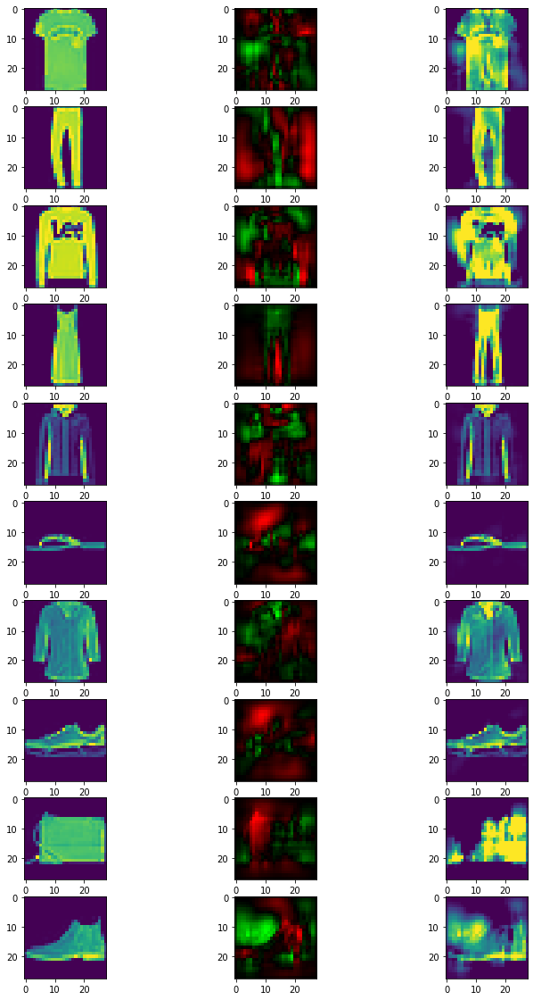

.. code:: ipython3

    ## Demo 4: HKR multiclass and fooling
    
    
    This notebook will show how to train a lispchitz network in a multiclass setup.
    The HKR is extended to multiclass using a one-vs all setup,with and adatation to learn the margin automatically. 
    It will go through the process of designing and training the network. It will also show how to create robustness certificates from the output of the network. Finally these
    certificates will be checked by attacking the network. 
    
    ### installation
    
    First, we install the required libraries. `Foolbox` will allow to perform adversarial attacks on the trained network.

.. code:: ipython3

    pip install deel-lip foolbox -qqq

.. code:: ipython3

    from deel.lip.layers import (
        SpectralDense,
        SpectralConv2D,
        ScaledL2NormPooling2D,
        ScaledAveragePooling2D,
        FrobeniusDense,
    )
    from deel.lip.model import LossVariableSequential
    from deel.lip.activations import GroupSort2, FullSort
    from deel.lip.losses import MulticlassHKRauto, MulticlassKR
    from deel.lip.callbacks import LossParamLog
    from tensorflow.keras.layers import Input, Flatten
    from tensorflow.keras.optimizers import Adam
    from tensorflow.keras.datasets import mnist, fashion_mnist, cifar10
    from tensorflow.keras.utils import to_categorical
    from tensorflow.keras.preprocessing.image import ImageDataGenerator
    from tensorflow.keras.optimizers.schedules import ExponentialDecay
    from tensorflow.keras.callbacks import Callback
    import tensorflow as tf
    from tensorflow.keras import backend as K
    import numpy as np

For this example, the dataset ``fashion_mnist`` will be used. In order
to keep things simple, no data augmentation will be performed.

.. code:: ipython3

    # load data
    (x_train, y_train_ord), (x_test, y_test_ord) = fashion_mnist.load_data()
    # standardize and reshape the data
    x_train = np.expand_dims(x_train, -1) / 255
    x_test = np.expand_dims(x_test, -1) / 255
    # one hot encode the labels
    y_train = to_categorical(y_train_ord)
    y_test = to_categorical(y_test_ord)

Let’s build the network.

the architecture
~~~~~~~~~~~~~~~~

The architectur is a VGG-like architecture with several convolutions
(SpectralConv2D) and pooling (ScaledL2NormPooling2D). The last layer is
a\ ``FrobeniusDense`` layer with ``disjoint_neurons=True`` which acts as
the stacking of 10 single neurons head. Note that, altough each head is
a 1-lipschitz function the overall network is not 1-lipschitz
(Concatenation is not 1-lipschitz).

the loss
~~~~~~~~

The multiclass loss with auto margin is used ``HKRauto``. The loss has
four params: ``alpha`` and ``min_margin`` and ``max_margin``,
``alpha_margin``, and ``soft_hinge_tau``. Parameters ``min_margin`` and
``max_margin`` indicates the bounds for each margin, which will be
initialized at ``min_margin``. The ``soft_hinge_tau`` parameter enable
to enhance the optimization by applying a softmax with temperature in
the hinge term. The ``alpha_margin`` is a regulation paramters that
encodes the proportion of samples outside the margin (0.1 inforce that
90% of samples to be outside the margin). The ``alpha`` parameters
encodes the importance of the hinge loss within.

In this setup choosing ``alpha=50``, ``min_margin=.05``,
``min_margin=10.``, ``soft_hinge_tau=20.``, will enable to provide
accuracy/robustness by modifying only the ``alpha_margin`` parameter.
Note that this loss requires a particular train_step function provided
in ``LossVariableSequential`` class.

Finally the ``KR_multiclass_loss()`` indicate the robustness of the
network ( proxy of the average certificate )

.. code:: ipython3

    
    nb_classes = y_train.shape[-1]
    alpha = 20
    min_margin = 0.25
    max_margin = 10.
    soft_hinge_tau = 20.
    
    alpha_margin = 0.05

.. code:: ipython3

    # Sequential (resp Model) from deel.model has the same properties as any lipschitz model.
    # It act only as a container, with features specific to lipschitz
    # functions (condensation, vanilla_exportation...)
    factor_size = 2
    
    model = LossVariableSequential(
        [
            Input(shape=x_train.shape[1:]),
            # Lipschitz layers preserve the API of their superclass ( here Conv2D )
            # an optional param is available: k_coef_lip which control the lipschitz
            # constant of the layer
            SpectralConv2D(
                filters=16*factor_size,
                kernel_size=(3, 3)
            ),
            GroupSort2(),
            SpectralConv2D(
                filters=16*factor_size,
                kernel_size=(3, 3)
            ),
            GroupSort2(),
            # usual pooling layer are implemented (avg, max...), but new layers are also available
            ScaledL2NormPooling2D(pool_size=(2, 2)),
            SpectralConv2D(
                filters=32*factor_size,
                kernel_size=(3, 3)
            ),
            GroupSort2(),
            SpectralConv2D(
                filters=32*factor_size,
                kernel_size=(3, 3)
            ),
            GroupSort2(),
            ScaledL2NormPooling2D(pool_size=(2, 2)),
            # our layers are fully interoperable with existing keras layers
            Flatten(),
            SpectralDense(
                64*factor_size
            ),
            GroupSort2(),
            FrobeniusDense(
              nb_classes, activation=None, use_bias=False
            ),
        ],
        # similary model has a parameter to set the lipschitz constant
        # to set automatically the constant of each layer
        k_coef_lip=1.0,
        name="hkr_model",
    )
    
    
    def  learningRateScheduler(lr_start=0.01, lr_end=0.0001, nb_epochs=100):
        lr_decay = (lr_end / lr_start) ** (1.0 / (nb_epochs))
        return tf.keras.callbacks.LearningRateScheduler(
        lambda epoch: lr_start * lr_decay**(epoch)
        )
    
    # MulticlassHKRauto (Hinge-Krantorovich-Rubinstein) optimize tradeoof between robustness and accuracy.
    model.compile(
        # decreasing alpha and increasing min_margin improve robustness (at the cost of accuracy)
        # note also in the case of lipschitz networks, more robustness require more parameters.
        loss=MulticlassHKRauto(  
            alpha = alpha,
            min_margin = min_margin,
            max_margin = max_margin,
            soft_hinge_tau = soft_hinge_tau,
            alpha_margin = alpha_margin
        ),
        optimizer=Adam(learning_rate=1e-3),
        metrics=["accuracy", MulticlassKR()]
    )
    
    model.summary()

.. parsed-literal::

    2022-10-24 17:58:01.006775: I tensorflow/stream_executor/cuda/cuda_gpu_executor.cc:936] successful NUMA node read from SysFS had negative value (-1), but there must be at least one NUMA node, so returning NUMA node zero
    2022-10-24 17:58:01.028550: I tensorflow/stream_executor/cuda/cuda_gpu_executor.cc:936] successful NUMA node read from SysFS had negative value (-1), but there must be at least one NUMA node, so returning NUMA node zero
    2022-10-24 17:58:01.028831: I tensorflow/stream_executor/cuda/cuda_gpu_executor.cc:936] successful NUMA node read from SysFS had negative value (-1), but there must be at least one NUMA node, so returning NUMA node zero
    2022-10-24 17:58:01.029607: I tensorflow/core/platform/cpu_feature_guard.cc:151] This TensorFlow binary is optimized with oneAPI Deep Neural Network Library (oneDNN) to use the following CPU instructions in performance-critical operations:  SSE4.1 SSE4.2 AVX AVX2 FMA
    To enable them in other operations, rebuild TensorFlow with the appropriate compiler flags.
    2022-10-24 17:58:01.030680: I tensorflow/stream_executor/cuda/cuda_gpu_executor.cc:936] successful NUMA node read from SysFS had negative value (-1), but there must be at least one NUMA node, so returning NUMA node zero
    2022-10-24 17:58:01.030955: I tensorflow/stream_executor/cuda/cuda_gpu_executor.cc:936] successful NUMA node read from SysFS had negative value (-1), but there must be at least one NUMA node, so returning NUMA node zero
    2022-10-24 17:58:01.031203: I tensorflow/stream_executor/cuda/cuda_gpu_executor.cc:936] successful NUMA node read from SysFS had negative value (-1), but there must be at least one NUMA node, so returning NUMA node zero
    2022-10-24 17:58:01.369358: I tensorflow/stream_executor/cuda/cuda_gpu_executor.cc:936] successful NUMA node read from SysFS had negative value (-1), but there must be at least one NUMA node, so returning NUMA node zero
    2022-10-24 17:58:01.369642: I tensorflow/stream_executor/cuda/cuda_gpu_executor.cc:936] successful NUMA node read from SysFS had negative value (-1), but there must be at least one NUMA node, so returning NUMA node zero
    2022-10-24 17:58:01.369877: I tensorflow/stream_executor/cuda/cuda_gpu_executor.cc:936] successful NUMA node read from SysFS had negative value (-1), but there must be at least one NUMA node, so returning NUMA node zero
    2022-10-24 17:58:01.370098: I tensorflow/core/common_runtime/gpu/gpu_device.cc:1525] Created device /job:localhost/replica:0/task:0/device:GPU:0 with 8066 MB memory:  -> device: 0, name: NVIDIA GeForce RTX 3080, pci bus id: 0000:01:00.0, compute capability: 8.6
    2022-10-24 17:58:01.955752: I tensorflow/stream_executor/cuda/cuda_blas.cc:1786] TensorFloat-32 will be used for the matrix multiplication. This will only be logged once.

.. parsed-literal::

    Model: "hkr_model"
    _________________________________________________________________
     Layer (type)                Output Shape              Param #   
    =================================================================
     spectral_conv2d (SpectralCo  (None, 28, 28, 32)       641       
     nv2D)                                                           
                                                                     
     group_sort2 (GroupSort2)    (None, 28, 28, 32)        0         
                                                                     
     spectral_conv2d_1 (Spectral  (None, 28, 28, 32)       18497     
     Conv2D)                                                         
                                                                     
     group_sort2_1 (GroupSort2)  (None, 28, 28, 32)        0         
                                                                     
     scaled_l2_norm_pooling2d (S  (None, 14, 14, 32)       0         
     caledL2NormPooling2D)                                           
                                                                     
     spectral_conv2d_2 (Spectral  (None, 14, 14, 64)       36993     
     Conv2D)                                                         
                                                                     
     group_sort2_2 (GroupSort2)  (None, 14, 14, 64)        0         
                                                                     
     spectral_conv2d_3 (Spectral  (None, 14, 14, 64)       73857     
     Conv2D)                                                         
                                                                     
     group_sort2_3 (GroupSort2)  (None, 14, 14, 64)        0         
                                                                     
     scaled_l2_norm_pooling2d_1   (None, 7, 7, 64)         0         
     (ScaledL2NormPooling2D)                                         
                                                                     
     flatten (Flatten)           (None, 3136)              0         
                                                                     
     spectral_dense (SpectralDen  (None, 128)              803073    
     se)                                                             
                                                                     
     group_sort2_4 (GroupSort2)  (None, 128)               0         
                                                                     
     frobenius_dense (FrobeniusD  (None, 10)               2560      
     ense)                                                           
                                                                     
    =================================================================
    Total params: 935,621
    Trainable params: 467,808
    Non-trainable params: 467,813
    _________________________________________________________________

Fit the model
~~~~~~~~~~~~~

A callback class is provided to log the hinge margin parameters every 4
epochs.

.. code:: ipython3

    nb_epochs = 40
    callbck_log = LossParamLog("hinge_margins",rate=4)
    lr_schedule = learningRateScheduler(lr_start=1e-3,lr_end=1e-6, nb_epochs=nb_epochs)
    # fit the model
    model.fit(
        x_train,
        y_train,
        batch_size=256,
        epochs=nb_epochs,
        validation_data=(x_test, y_test),
        shuffle=True,
        verbose=1,
        callbacks = [callbck_log,lr_schedule]
    )

.. parsed-literal::

    Epoch 1/40

.. parsed-literal::

    2022-10-24 17:58:05.959138: I tensorflow/stream_executor/cuda/cuda_dnn.cc:368] Loaded cuDNN version 8201

.. parsed-literal::

    235/235 [==============================] - ETA: 0s - loss: 1.2691 - accuracy: 0.7732 - MulticlassKR: 1.2494
     MulticlassHKRauto hinge_margins [0.25 0.25 0.25 ... 0.25 0.25 0.25]
    235/235 [==============================] - 12s 34ms/step - loss: 1.2691 - accuracy: 0.7732 - MulticlassKR: 1.2494 - val_loss: 0.1837 - val_accuracy: 0.8256 - val_MulticlassKR: 2.2321 - lr: 0.0010
    Epoch 2/40
    235/235 [==============================] - 7s 31ms/step - loss: -0.3300 - accuracy: 0.8350 - MulticlassKR: 2.5784 - val_loss: -0.6888 - val_accuracy: 0.8470 - val_MulticlassKR: 2.7894 - lr: 8.4140e-04
    Epoch 3/40
    235/235 [==============================] - 7s 31ms/step - loss: -0.8826 - accuracy: 0.8497 - MulticlassKR: 2.9346 - val_loss: -0.9386 - val_accuracy: 0.8447 - val_MulticlassKR: 3.0208 - lr: 7.0795e-04
    Epoch 4/40
    235/235 [==============================] - 7s 31ms/step - loss: -1.1890 - accuracy: 0.8605 - MulticlassKR: 3.1096 - val_loss: -1.1546 - val_accuracy: 0.8548 - val_MulticlassKR: 3.1021 - lr: 5.9566e-04
    Epoch 5/40
    235/235 [==============================] - ETA: 0s - loss: -1.3605 - accuracy: 0.8658 - MulticlassKR: 3.2104
     MulticlassHKRauto hinge_margins [0.25 0.25 0.25 ... 0.25 0.25074771 0.25]
    235/235 [==============================] - 7s 31ms/step - loss: -1.3605 - accuracy: 0.8658 - MulticlassKR: 3.2104 - val_loss: -1.3582 - val_accuracy: 0.8613 - val_MulticlassKR: 3.2464 - lr: 5.0119e-04
    Epoch 6/40
    235/235 [==============================] - 7s 31ms/step - loss: -1.5106 - accuracy: 0.8709 - MulticlassKR: 3.2949 - val_loss: -1.4346 - val_accuracy: 0.8623 - val_MulticlassKR: 3.3411 - lr: 4.2170e-04
    Epoch 7/40
    235/235 [==============================] - 7s 30ms/step - loss: -1.6069 - accuracy: 0.8730 - MulticlassKR: 3.3437 - val_loss: -1.4465 - val_accuracy: 0.8612 - val_MulticlassKR: 3.3655 - lr: 3.5481e-04
    Epoch 8/40
    235/235 [==============================] - 7s 31ms/step - loss: -1.6955 - accuracy: 0.8758 - MulticlassKR: 3.3946 - val_loss: -1.4848 - val_accuracy: 0.8606 - val_MulticlassKR: 3.4036 - lr: 2.9854e-04
    Epoch 9/40
    235/235 [==============================] - ETA: 0s - loss: -1.7397 - accuracy: 0.8763 - MulticlassKR: 3.4318
     MulticlassHKRauto hinge_margins [0.25 0.250005245 0.25 ... 0.25 0.25 0.25]
    235/235 [==============================] - 7s 30ms/step - loss: -1.7397 - accuracy: 0.8763 - MulticlassKR: 3.4318 - val_loss: -1.5745 - val_accuracy: 0.8638 - val_MulticlassKR: 3.4343 - lr: 2.5119e-04
    Epoch 10/40
    235/235 [==============================] - 7s 30ms/step - loss: -1.8090 - accuracy: 0.8791 - MulticlassKR: 3.4587 - val_loss: -1.6000 - val_accuracy: 0.8648 - val_MulticlassKR: 3.4461 - lr: 2.1135e-04
    Epoch 11/40
    235/235 [==============================] - 7s 30ms/step - loss: -1.8420 - accuracy: 0.8807 - MulticlassKR: 3.4710 - val_loss: -1.6691 - val_accuracy: 0.8664 - val_MulticlassKR: 3.4737 - lr: 1.7783e-04
    Epoch 12/40
    235/235 [==============================] - 7s 30ms/step - loss: -1.8807 - accuracy: 0.8810 - MulticlassKR: 3.4954 - val_loss: -1.7369 - val_accuracy: 0.8727 - val_MulticlassKR: 3.4896 - lr: 1.4962e-04
    Epoch 13/40
    235/235 [==============================] - ETA: 0s - loss: -1.9108 - accuracy: 0.8819 - MulticlassKR: 3.5156
     MulticlassHKRauto hinge_margins [0.25 0.25 0.25 ... 0.25 0.250397 0.25]
    235/235 [==============================] - 7s 30ms/step - loss: -1.9108 - accuracy: 0.8819 - MulticlassKR: 3.5156 - val_loss: -1.7342 - val_accuracy: 0.8695 - val_MulticlassKR: 3.4914 - lr: 1.2589e-04
    Epoch 14/40
    235/235 [==============================] - 7s 30ms/step - loss: -1.9358 - accuracy: 0.8830 - MulticlassKR: 3.5247 - val_loss: -1.7794 - val_accuracy: 0.8723 - val_MulticlassKR: 3.5078 - lr: 1.0593e-04
    Epoch 15/40
    235/235 [==============================] - 7s 30ms/step - loss: -1.9593 - accuracy: 0.8834 - MulticlassKR: 3.5336 - val_loss: -1.7904 - val_accuracy: 0.8725 - val_MulticlassKR: 3.5261 - lr: 8.9125e-05
    Epoch 16/40
    235/235 [==============================] - 7s 30ms/step - loss: -1.9714 - accuracy: 0.8840 - MulticlassKR: 3.5456 - val_loss: -1.7647 - val_accuracy: 0.8722 - val_MulticlassKR: 3.5296 - lr: 7.4989e-05
    Epoch 17/40
    235/235 [==============================] - ETA: 0s - loss: -1.9910 - accuracy: 0.8845 - MulticlassKR: 3.5502
     MulticlassHKRauto hinge_margins [0.25 0.25 0.25 ... 0.25 0.250086039 0.25]
    235/235 [==============================] - 7s 30ms/step - loss: -1.9910 - accuracy: 0.8845 - MulticlassKR: 3.5502 - val_loss: -1.8222 - val_accuracy: 0.8743 - val_MulticlassKR: 3.5453 - lr: 6.3096e-05
    Epoch 18/40
    235/235 [==============================] - 7s 30ms/step - loss: -1.9993 - accuracy: 0.8855 - MulticlassKR: 3.5614 - val_loss: -1.8262 - val_accuracy: 0.8744 - val_MulticlassKR: 3.5410 - lr: 5.3088e-05
    Epoch 19/40
    235/235 [==============================] - 7s 30ms/step - loss: -2.0132 - accuracy: 0.8858 - MulticlassKR: 3.5604 - val_loss: -1.8297 - val_accuracy: 0.8748 - val_MulticlassKR: 3.5493 - lr: 4.4668e-05
    Epoch 20/40
    235/235 [==============================] - 7s 30ms/step - loss: -2.0195 - accuracy: 0.8856 - MulticlassKR: 3.5678 - val_loss: -1.8489 - val_accuracy: 0.8757 - val_MulticlassKR: 3.5448 - lr: 3.7584e-05
    Epoch 21/40
    235/235 [==============================] - ETA: 0s - loss: -2.0319 - accuracy: 0.8857 - MulticlassKR: 3.5707
     MulticlassHKRauto hinge_margins [0.25 0.25 0.25 ... 0.25 0.25013116 0.25]
    235/235 [==============================] - 7s 30ms/step - loss: -2.0319 - accuracy: 0.8857 - MulticlassKR: 3.5707 - val_loss: -1.8552 - val_accuracy: 0.8757 - val_MulticlassKR: 3.5455 - lr: 3.1623e-05
    Epoch 22/40
    235/235 [==============================] - 7s 30ms/step - loss: -2.0365 - accuracy: 0.8863 - MulticlassKR: 3.5704 - val_loss: -1.8624 - val_accuracy: 0.8753 - val_MulticlassKR: 3.5485 - lr: 2.6607e-05
    Epoch 23/40
    235/235 [==============================] - 7s 30ms/step - loss: -2.0420 - accuracy: 0.8863 - MulticlassKR: 3.5736 - val_loss: -1.8562 - val_accuracy: 0.8744 - val_MulticlassKR: 3.5548 - lr: 2.2387e-05
    Epoch 24/40
    235/235 [==============================] - 7s 30ms/step - loss: -2.0455 - accuracy: 0.8870 - MulticlassKR: 3.5782 - val_loss: -1.8603 - val_accuracy: 0.8744 - val_MulticlassKR: 3.5550 - lr: 1.8836e-05
    Epoch 25/40
    235/235 [==============================] - ETA: 0s - loss: -2.0513 - accuracy: 0.8865 - MulticlassKR: 3.5779
     MulticlassHKRauto hinge_margins [0.25 0.250037491 0.25 ... 0.25 0.25012365 0.25]
    235/235 [==============================] - 7s 30ms/step - loss: -2.0513 - accuracy: 0.8865 - MulticlassKR: 3.5779 - val_loss: -1.8652 - val_accuracy: 0.8756 - val_MulticlassKR: 3.5574 - lr: 1.5849e-05
    Epoch 26/40
    235/235 [==============================] - 7s 30ms/step - loss: -2.0552 - accuracy: 0.8871 - MulticlassKR: 3.5802 - val_loss: -1.8679 - val_accuracy: 0.8754 - val_MulticlassKR: 3.5604 - lr: 1.3335e-05
    Epoch 27/40
    235/235 [==============================] - 7s 30ms/step - loss: -2.0575 - accuracy: 0.8873 - MulticlassKR: 3.5811 - val_loss: -1.8697 - val_accuracy: 0.8761 - val_MulticlassKR: 3.5607 - lr: 1.1220e-05
    Epoch 28/40
    235/235 [==============================] - 7s 30ms/step - loss: -2.0602 - accuracy: 0.8870 - MulticlassKR: 3.5813 - val_loss: -1.8720 - val_accuracy: 0.8740 - val_MulticlassKR: 3.5630 - lr: 9.4406e-06
    Epoch 29/40
    235/235 [==============================] - ETA: 0s - loss: -2.0624 - accuracy: 0.8871 - MulticlassKR: 3.5833
     MulticlassHKRauto hinge_margins [0.25 0.25 0.25 ... 0.25 0.250046581 0.25]
    235/235 [==============================] - 7s 30ms/step - loss: -2.0624 - accuracy: 0.8871 - MulticlassKR: 3.5833 - val_loss: -1.8738 - val_accuracy: 0.8753 - val_MulticlassKR: 3.5625 - lr: 7.9433e-06
    Epoch 30/40
    235/235 [==============================] - 7s 30ms/step - loss: -2.0649 - accuracy: 0.8873 - MulticlassKR: 3.5841 - val_loss: -1.8802 - val_accuracy: 0.8758 - val_MulticlassKR: 3.5684 - lr: 6.6834e-06
    Epoch 31/40
    235/235 [==============================] - 7s 30ms/step - loss: -2.0659 - accuracy: 0.8879 - MulticlassKR: 3.5843 - val_loss: -1.8824 - val_accuracy: 0.8757 - val_MulticlassKR: 3.5650 - lr: 5.6234e-06
    Epoch 32/40
    235/235 [==============================] - 7s 30ms/step - loss: -2.0671 - accuracy: 0.8874 - MulticlassKR: 3.5860 - val_loss: -1.8805 - val_accuracy: 0.8755 - val_MulticlassKR: 3.5673 - lr: 4.7315e-06
    Epoch 33/40
    235/235 [==============================] - ETA: 0s - loss: -2.0675 - accuracy: 0.8878 - MulticlassKR: 3.5858
     MulticlassHKRauto hinge_margins [0.25 0.25 0.25 ... 0.25 0.25006038 0.25]
    235/235 [==============================] - 7s 30ms/step - loss: -2.0675 - accuracy: 0.8878 - MulticlassKR: 3.5858 - val_loss: -1.8836 - val_accuracy: 0.8757 - val_MulticlassKR: 3.5670 - lr: 3.9811e-06
    Epoch 34/40
    235/235 [==============================] - 7s 30ms/step - loss: -2.0688 - accuracy: 0.8874 - MulticlassKR: 3.5848 - val_loss: -1.8835 - val_accuracy: 0.8762 - val_MulticlassKR: 3.5667 - lr: 3.3497e-06
    Epoch 35/40
    235/235 [==============================] - 7s 30ms/step - loss: -2.0703 - accuracy: 0.8872 - MulticlassKR: 3.5861 - val_loss: -1.8837 - val_accuracy: 0.8754 - val_MulticlassKR: 3.5674 - lr: 2.8184e-06
    Epoch 36/40
    235/235 [==============================] - 7s 30ms/step - loss: -2.0710 - accuracy: 0.8875 - MulticlassKR: 3.5877 - val_loss: -1.8837 - val_accuracy: 0.8760 - val_MulticlassKR: 3.5679 - lr: 2.3714e-06
    Epoch 37/40
    235/235 [==============================] - ETA: 0s - loss: -2.0717 - accuracy: 0.8881 - MulticlassKR: 3.5872
     MulticlassHKRauto hinge_margins [0.25 0.250002682 0.25 ... 0.25 0.250059843 0.25]
    235/235 [==============================] - 7s 30ms/step - loss: -2.0717 - accuracy: 0.8881 - MulticlassKR: 3.5872 - val_loss: -1.8840 - val_accuracy: 0.8761 - val_MulticlassKR: 3.5685 - lr: 1.9953e-06
    Epoch 38/40
    235/235 [==============================] - 7s 30ms/step - loss: -2.0717 - accuracy: 0.8878 - MulticlassKR: 3.5870 - val_loss: -1.8848 - val_accuracy: 0.8760 - val_MulticlassKR: 3.5678 - lr: 1.6788e-06
    Epoch 39/40
    235/235 [==============================] - 7s 30ms/step - loss: -2.0723 - accuracy: 0.8878 - MulticlassKR: 3.5865 - val_loss: -1.8847 - val_accuracy: 0.8757 - val_MulticlassKR: 3.5687 - lr: 1.4125e-06
    Epoch 40/40
    235/235 [==============================] - 7s 30ms/step - loss: -2.0730 - accuracy: 0.8877 - MulticlassKR: 3.5871 - val_loss: -1.8849 - val_accuracy: 0.8759 - val_MulticlassKR: 3.5690 - lr: 1.1885e-06

.. parsed-literal::

    <keras.callbacks.History at 0x7fed0cb19750>

model exportation
~~~~~~~~~~~~~~~~~

Once training is finished, the model can be optimized for inference by
using the ``vanilla_export()`` method.

.. code:: ipython3

    # once training is finished you can convert
    # SpectralDense layers into Dense layers and SpectralConv2D into Conv2D
    # which optimize performance for inference
    vanilla_model = model.vanilla_export()

certificates generation and adversarial attacks
~~~~~~~~~~~~~~~~~~~~~~~~~~~~~~~~~~~~~~~~~~~~~~~

.. code:: ipython3

    from tensorflow import convert_to_tensor
    import matplotlib.pyplot as plt
    import tensorflow as tf

In order to test the robustness of the model, the first correctly
classified element of each class are selected.

.. code:: ipython3

    # we will test it on 10 samples one of each class
    nb_adv = 10

.. code:: ipython3

    # strategy: first
    # we select a sample from each class.
    images_list = []
    labels_list = []
    # select only a few element from the test set
    selected=np.random.choice(len(y_test_ord), 500)
    sub_y_test_ord = y_test_ord[:300]
    sub_x_test = x_test[:300]
    # drop misclassified elements
    misclassified_mask = tf.equal(tf.argmax(vanilla_model.predict(sub_x_test), axis=-1), sub_y_test_ord)
    sub_x_test = sub_x_test[misclassified_mask]
    sub_y_test_ord = sub_y_test_ord[misclassified_mask]
    # now we will build a list with input image for each element of the matrix
    for i in range(10):
      # select the first element of the ith label
      label_mask = [sub_y_test_ord==i]
      x = sub_x_test[label_mask][0]
      y = sub_y_test_ord[label_mask][0]
      # convert it to tensor for use with foolbox
      images = convert_to_tensor(x.astype("float32"), dtype="float32")
      labels = convert_to_tensor(y, dtype="int64")
      # repeat the input 10 times, one per misclassification target
      images_list.append(images)
      labels_list.append(labels)
    images = convert_to_tensor(images_list)
    labels = convert_to_tensor(labels_list)

.. parsed-literal::

    /tmp/ipykernel_1850542/3919653519.py:17: FutureWarning: Using a non-tuple sequence for multidimensional indexing is deprecated; use `arr[tuple(seq)]` instead of `arr[seq]`. In the future this will be interpreted as an array index, `arr[np.array(seq)]`, which will result either in an error or a different result.
      x = sub_x_test[label_mask][0]
    /tmp/ipykernel_1850542/3919653519.py:18: FutureWarning: Using a non-tuple sequence for multidimensional indexing is deprecated; use `arr[tuple(seq)]` instead of `arr[seq]`. In the future this will be interpreted as an array index, `arr[np.array(seq)]`, which will result either in an error or a different result.
      y = sub_y_test_ord[label_mask][0]

In order to build a certficate, we take for each sample the top 2 output
and apply this formula:

.. math::  \epsilon \geq \frac{\text{top}_1 - \text{top}_2}{2} 

Where epsilon is the robustness radius for the considered sample.

.. code:: ipython3

    values, classes = tf.math.top_k(vanilla_model(images), k=2)
    certificates = (values[:, 0] - values[:, 1]) / 2
    certificates

.. parsed-literal::

    <tf.Tensor: shape=(10,), dtype=float32, numpy=
    array([0.21762636, 1.7615569 , 0.45161152, 0.60865617, 0.20336755,
           0.12459429, 0.13375193, 0.38713965, 1.5338554 , 0.12755418],
          dtype=float32)>

Built in explainability
~~~~~~~~~~~~~~~~~~~~~~~

Acording to paper “When adversarial attacks become interpretable
counterfactual explanations”, Serrurier et al., the gradient according
to :math:`x` (Saliency map) provides a countefactual explanation (the
direction to the boundary, and also to the transportation map (according
to the optimal transport)

.. math:: \nabla_x(f_i(x))

Can either look at the true label gradient: why A?

.. math:: \nabla_x(f_{lbl}(x))

or at a targetted label: why not B?

.. math:: \nabla_x(f_{tgt}(x))

.. code:: ipython3

    def compute_and_display_gradient(model, xt, yt,display=True, targetted = None):
        if display:
            nb_col = 3
            nb_lig = len(xt)
            f, axarr = plt.subplots(nb_lig,nb_col,figsize=(12,nb_lig*2) )
        if targetted is not None:
            targetted = np.asarray(targetted)
        for index, (x, y) in enumerate(zip(xt,yt)):
            x_norm =x
            xv = tf.Variable(np.expand_dims(x,axis=0))
            lbl = y.numpy() # get class number from one hot encoding
            if targetted is not None:
                lbl = targetted[lbl]
                #np.asarray([2,3,0,1,6,7,4,5,9,8])[lbl]
            with tf.GradientTape() as g:
                g.watch(xv)
                #print(model(xv).shape)
                y_pred = model(xv)[0,lbl]
                #loss_v = loss(yt, y_pred)
            grad_x = g.gradient(y_pred, xv).numpy()
            #print(grad_x.shape)
            grad_x = grad_x.reshape(x.shape)
            pred_v = y_pred
            #print("pred: ", tf.argmax(y_pred,axis=-1).numpy())
            print("pred_v: ", pred_v.numpy())
    
            if display:
                axarr[index][0].imshow(x_norm.numpy())
            grad_mean = tf.reduce_sum(grad_x,axis=-1,keepdims=True)
            grad_mean = grad_mean/tf.norm(grad_mean)
            #print(np.min(grad_mean.numpy()),np.max(grad_mean.numpy()))
            grad_color = tf.zeros(grad_x.shape[:-1] + (3,)).numpy()
            #print(grad_color.shape)
            #print(grad_x[:,:,1].shape)
            grad_color[:,:,0] = tf.nn.relu(-grad_mean[:,:,0]).numpy()
            grad_color[:,:,1] = tf.nn.relu(grad_mean[:,:,0]).numpy()
            grad_color = grad_color/np.max(grad_color)
            #print(np.min(grad_color),np.max(grad_color))
            if display:
                axarr[index][1].imshow(grad_color)
            delta_x = -pred_v*grad_x/tf.norm(grad_x)
            if display:
                x_d = (x_norm+10.0*delta_x).numpy()
                x_d = np.clip(x_d,0.0,1.0)
                axarr[index][2].imshow(x_d)

.. code:: ipython3

    compute_and_display_gradient(vanilla_model, images, labels, targetted = [2,3,0,1,6,7,4,5,9,8])

.. parsed-literal::

    pred_v:  -0.5711404
    pred_v:  -0.6143806
    pred_v:  -1.1301204
    pred_v:  -0.9491976
    pred_v:  -0.09390068
    pred_v:  -0.095042646
    pred_v:  -0.37181047
    pred_v:  -0.30083305
    pred_v:  -2.3162303
    pred_v:  -0.9592315

adversarial attacks
~~~~~~~~~~~~~~~~~~~

.. code:: ipython3

    import foolbox as fb

.. code:: ipython3

    
    hkr_fmodel = fb.TensorFlowModel(vanilla_model, bounds=(0., 1.), device="/GPU:0")

now we will attack the model to check if the certificates are respected.
In this setup ``L2CarliniWagnerAttack`` is used but in practice as these
kind of networks are gradient norm preserving, other attacks gives very
similar results.

.. code:: ipython3

    attack = fb.attacks.L2CarliniWagnerAttack(binary_search_steps=6, steps=8000)
    imgs, advs, success = attack(hkr_fmodel, images, labels, epsilons=None)
    dist_to_adv = np.sqrt(np.sum(np.square(images - advs), axis=(1,2,3)))
    dist_to_adv

As we can see the certificate are respected.

.. code:: ipython3

    tf.assert_less(certificates, dist_to_adv)

Finally we can take a visual look at the obtained examples. We first
start with utility functions for display.

.. code:: ipython3

    class_mapping = {
      0: "T-shirt/top",
      1: "Trouser",
      2: "Pullover",
      3: "Dress",
      4: "Coat",
      5: "Sandal",
      6: "Shirt",
      7: "Sneaker",
      8: "Bag",
      9: "Ankle boot",
    }

.. code:: ipython3

    def adversarial_viz(model, images, advs, class_mapping):
      """
      This functions shows for each sample: 
      - the original image
      - the adversarial image
      - the difference map
      - the certificate and the observed distance to adversarial 
      """
      scale = 1.5
      kwargs={}
      nb_imgs = images.shape[0]
      # compute certificates
      values, classes = tf.math.top_k(model(images), k=2)
      certificates = (values[:, 0] - values[:, 1]) / 2
      # compute difference distance to adversarial
      dist_to_adv = np.sqrt(np.sum(np.square(images - advs), axis=(1,2,3)))
      # find classes labels for imgs and advs
      orig_classes = [class_mapping[i] for i in tf.argmax(model(images), axis=-1).numpy()]
      advs_classes = [class_mapping[i] for i in tf.argmax(model(advs), axis=-1).numpy()]
      # compute differences maps
      if images.shape[-1] != 3:
        diff_pos = np.clip(advs - images, 0, 1.)
        diff_neg = np.clip(images - advs, 0, 1.)
        diff_map = np.concatenate([diff_neg, diff_pos, np.zeros_like(diff_neg)], axis=-1)
      else:
        diff_map = np.abs(advs - images)
      # expands image to be displayed
      if images.shape[-1] != 3:
        images = np.repeat(images, 3, -1)
      if advs.shape[-1] != 3:
        advs = np.repeat(advs, 3, -1)
      # create plot
      figsize = (3 * scale, nb_imgs * scale)
      fig, axes = plt.subplots(
        ncols=3,
        nrows=nb_imgs,
        figsize=figsize,
        squeeze=False,
        constrained_layout=True,
        **kwargs,
      )
      for i in range(nb_imgs):
        ax = axes[i][0]
        ax.set_title(orig_classes[i])
        ax.set_xticks([])
        ax.set_yticks([])
        ax.axis("off")
        ax.imshow(images[i])
        ax = axes[i][1]
        ax.set_title(advs_classes[i])
        ax.set_xticks([])
        ax.set_yticks([])
        ax.axis("off")
        ax.imshow(advs[i])
        ax = axes[i][2]
        ax.set_title(f"certif: {certificates[i]:.2f}, obs: {dist_to_adv[i]:.2f}")
        ax.set_xticks([])
        ax.set_yticks([])
        ax.axis("off")
        ax.imshow(diff_map[i]/diff_map[i].max())

When looking at the adversarial examples we can see that the network has
interresting properties:

predictability
^^^^^^^^^^^^^^

by looking at the certificates, we can predict if the adversarial
example will be close of not #### disparity among classes As we can see,
the attacks are very efficent on similar classes (eg. T-shirt/top, and
Shirt ). This denote that all classes are not made equal regarding
robustness. #### explainability The network is more explainable: attacks
can be used as counterfactuals. We can tell that removing the
inscription on a T-shirt turns it into a shirt makes sense. Non robust
examples reveals that the network rely on textures rather on shapes to
make it’s decision.

.. code:: ipython3

    adversarial_viz(hkr_fmodel, images, advs, class_mapping)
