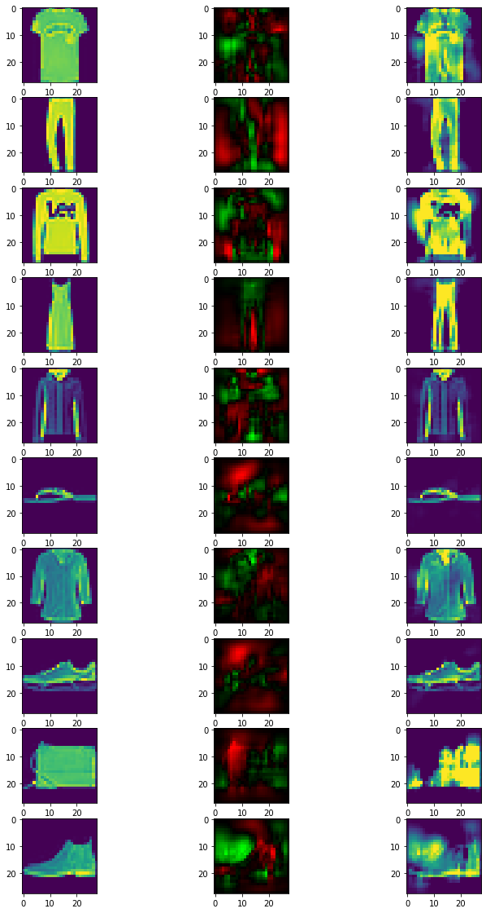

.. code:: ipython3

    ## Demo 4: HKR multiclass and fooling
    
    
    This notebook will show how to train a lispchitz network in a multiclass setup.
    The HKR is extended to multiclass using a one-vs all setup,with and adatation to learn the margin automatically. 
    
    It will go through the process of designing and training the network. It will also show how to create robustness certificates from the output of the network. Finally these
    certificates will be checked by attacking the network. 
    
    ### installation
    
    First, we install the required libraries. `Foolbox` will allow to perform adversarial attacks on the trained network.

.. code:: ipython3

    pip install deel-lip foolbox -qqq

.. code:: ipython3

    from deel.lip.layers import (
        SpectralDense,
        SpectralConv2D,
        ScaledL2NormPooling2D,
        ScaledAveragePooling2D,
        ScaledGlobalAveragePooling2D ,
        FrobeniusDense,
    )
    from deel.lip.model import LossVariableModel
    from deel.lip.activations import GroupSort2, FullSort
    from deel.lip.losses import MulticlassHKRauto, MulticlassKR
    from deel.lip.callbacks import LossParamLog
    from tensorflow.keras.layers import Input, Flatten
    from tensorflow.keras.optimizers import Adam
    from tensorflow.keras.datasets import mnist, fashion_mnist, cifar10
    from tensorflow.keras.utils import to_categorical
    from tensorflow.keras.preprocessing.image import ImageDataGenerator
    from tensorflow.keras.optimizers.schedules import ExponentialDecay
    from tensorflow.keras.callbacks import Callback
    import tensorflow as tf
    from tensorflow.keras import backend as K
    import numpy as np
    
    import tensorflow_datasets as tfds
    import tensorflow_addons as tfa
    from tensorflow_addons import image as contrib_image

.. parsed-literal::

    /data/home/franck.mamalet/.conda/envs/deel-tf2.8/lib/python3.10/site-packages/tqdm/auto.py:22: TqdmWarning: IProgress not found. Please update jupyter and ipywidgets. See https://ipywidgets.readthedocs.io/en/stable/user_install.html
      from .autonotebook import tqdm as notebook_tqdm

For this example, the dataset ``cifar10`` will be used.

.. code:: ipython3

    batch_size = 128
    
    # load data
    (ds_train, ds_test), info = tfds.load(
            "cifar10",
            split=["train", "test"],
            shuffle_files=True,
            as_supervised=True,
            with_info=True,
    )
    
    def augment_x(x,y):
        max_rotation = 15.0
        max_pixels = 0.1*32
        rot = np.pi * max_rotation / 180.0
        random_angles = tf.random.uniform(shape=(), minval=-rot, maxval=rot)
        x = tfa.image.rotate(
                x, random_angles, interpolation="nearest", fill_mode="nearest"
        )
        
        pixels = tf.random.uniform(shape=(), minval=-max_pixels, maxval=max_pixels)
        x = contrib_image.translate(
            #x, tf.concat([-pixels, tf.zeros(pixels.shape)],axis=-1), fill_mode="nearest", fill_value=0.0
            x, [-pixels, 0], fill_mode="nearest", fill_value=0.0
        )
        pixels = tf.random.uniform(shape=(), minval=-max_pixels, maxval=max_pixels)
        x = contrib_image.translate(
            #x, tf.concat([tf.zeros(pixels.shape),-pixels],axis=-1), fill_mode="nearest", fill_value=0.0
            x, [0,-pixels], fill_mode="nearest", fill_value=0.0
        )
        x = tf.image.random_flip_left_right(x)
        x = tf.image.random_contrast(x, 0.8, 1.2)
        return x, y
    def label_onehot(nb_classes):
        print(nb_classes)
        def label_onehot_y(x,label):
            print(x.shape)
            print(label.shape)
            print(tf.one_hot(label, nb_classes).shape)
            return x,tf.one_hot(label, nb_classes)
        return label_onehot_y
    
    ds_train = (
            ds_train.map(label_onehot(info.features["label"].num_classes), num_parallel_calls=tf.data.AUTOTUNE) #.map(preparation_x_fct, num_parallel_calls=tf.data.AUTOTUNE)
            .shuffle(
                min(batch_size * 50, max(100, ds_train.cardinality())),
                reshuffle_each_iteration=True,
            )
            .map(augment_x, num_parallel_calls=tf.data.AUTOTUNE)
            .batch(batch_size,drop_remainder=True)
            .prefetch(tf.data.AUTOTUNE)
    )
    
    
    ds_test = (
        ds_test.map(label_onehot(info.features["label"].num_classes), num_parallel_calls=tf.data.AUTOTUNE)
            .batch(batch_size)
            .prefetch(tf.data.AUTOTUNE)
    )

.. parsed-literal::

    2022-10-24 21:07:59.898206: I tensorflow/stream_executor/cuda/cuda_gpu_executor.cc:936] successful NUMA node read from SysFS had negative value (-1), but there must be at least one NUMA node, so returning NUMA node zero
    2022-10-24 21:07:59.919422: I tensorflow/stream_executor/cuda/cuda_gpu_executor.cc:936] successful NUMA node read from SysFS had negative value (-1), but there must be at least one NUMA node, so returning NUMA node zero
    2022-10-24 21:07:59.919703: I tensorflow/stream_executor/cuda/cuda_gpu_executor.cc:936] successful NUMA node read from SysFS had negative value (-1), but there must be at least one NUMA node, so returning NUMA node zero
    2022-10-24 21:07:59.920293: I tensorflow/core/platform/cpu_feature_guard.cc:151] This TensorFlow binary is optimized with oneAPI Deep Neural Network Library (oneDNN) to use the following CPU instructions in performance-critical operations:  SSE4.1 SSE4.2 AVX AVX2 FMA
    To enable them in other operations, rebuild TensorFlow with the appropriate compiler flags.
    2022-10-24 21:07:59.920933: I tensorflow/stream_executor/cuda/cuda_gpu_executor.cc:936] successful NUMA node read from SysFS had negative value (-1), but there must be at least one NUMA node, so returning NUMA node zero
    2022-10-24 21:07:59.921227: I tensorflow/stream_executor/cuda/cuda_gpu_executor.cc:936] successful NUMA node read from SysFS had negative value (-1), but there must be at least one NUMA node, so returning NUMA node zero
    2022-10-24 21:07:59.921476: I tensorflow/stream_executor/cuda/cuda_gpu_executor.cc:936] successful NUMA node read from SysFS had negative value (-1), but there must be at least one NUMA node, so returning NUMA node zero
    2022-10-24 21:08:00.262465: I tensorflow/stream_executor/cuda/cuda_gpu_executor.cc:936] successful NUMA node read from SysFS had negative value (-1), but there must be at least one NUMA node, so returning NUMA node zero
    2022-10-24 21:08:00.262747: I tensorflow/stream_executor/cuda/cuda_gpu_executor.cc:936] successful NUMA node read from SysFS had negative value (-1), but there must be at least one NUMA node, so returning NUMA node zero
    2022-10-24 21:08:00.262984: I tensorflow/stream_executor/cuda/cuda_gpu_executor.cc:936] successful NUMA node read from SysFS had negative value (-1), but there must be at least one NUMA node, so returning NUMA node zero
    2022-10-24 21:08:00.263207: I tensorflow/core/common_runtime/gpu/gpu_device.cc:1525] Created device /job:localhost/replica:0/task:0/device:GPU:0 with 8066 MB memory:  -> device: 0, name: NVIDIA GeForce RTX 3080, pci bus id: 0000:01:00.0, compute capability: 8.6

.. parsed-literal::

    10
    (32, 32, 3)
    ()
    (10,)
    10
    (32, 32, 3)
    ()
    (10,)

Let’s build the network.

the architecture
~~~~~~~~~~~~~~~~

The architectur is a VGG-like architecture with several convolutions
(SpectralConv2D) and pooling (ScaledL2NormPooling2D). The last layer is
a\ ``FrobeniusDense`` layer with ``disjoint_neurons=True`` which acts as
the stacking of 10 single neurons head. Note that, altough each head is
a 1-lipschitz function the overall network is not 1-lipschitz
(Concatenation is not 1-lipschitz).

the loss
~~~~~~~~

The multiclass loss with auto margin is used ``HKRauto``. The loss has
four params: ``alpha`` and ``min_margin`` and ``max_margin``,
``alpha_margin``, and ``soft_hinge_tau``. Parameters ``min_margin`` and
``max_margin`` indicates the bounds for each margin, which will be
initialized at ``min_margin``. The ``soft_hinge_tau`` parameter enable
to enhance the optimization by applying a softmax with temperature in
the hinge term. The ``alpha_margin`` is a regulation paramters that
encodes the proportion of samples outside the margin (0.1 inforce that
90% of samples to be outside the margin). The ``alpha`` parameters
encodes the importance of the hinge loss within.

In this setup choosing ``alpha=50``, ``min_margin=.05``,
``min_margin=10.``, ``soft_hinge_tau=20.``, will enable to provide
accuracy/robustness by modifying only the ``alpha_margin`` parameter.
Note that this loss requires a particular train_step function provided
in ``LossVariableSequential`` class.

Finally the ``KR_multiclass_loss()`` indicate the robustness of the
network ( proxy of the average certificate )

.. code:: ipython3

    
    nb_classes = info.features["label"].num_classes
    alpha = 500
    min_margin = 0.01
    max_margin = 10.
    soft_hinge_tau = 20.
    
    alpha_margin = 0.1

.. code:: ipython3

    # Sequential (resp Model) from deel.model has the same properties as any lipschitz model.
    # It act only as a container, with features specific to lipschitz
    # functions (condensation, vanilla_exportation...)
    factor_size = 2
    
    
    conv_sizes = (
            (128, 128, 128, 128),
            (256, 256, 256, 256),
            (512, 512, 512),
    )
    dense_sizes = []
    
    CONV = SpectralConv2D
    DENSE = SpectralDense
    LAST_DENSE = FrobeniusDense
    ACT = GroupSort2
    POOL = ScaledAveragePooling2D #ScaledL2NormPooling2D
    KERNEL_INIT = "orthogonal"
    GAP = ScaledGlobalAveragePooling2D 
    
    model_input = x = tf.keras.Input(info.features["image"].shape)
    conv_kwargs = dict(
            kernel_size=3,
            padding="same",
            activation=None,
            kernel_initializer=KERNEL_INIT,
    )
    for i, block in enumerate(conv_sizes):
        for filters in block:
            x = CONV(filters, **conv_kwargs)(x)
            x = ACT()(x)
        if i < len(conv_sizes) - 1:
            x = POOL()(x)
        print(x.shape)
    x = GAP()(x)
    for units in dense_sizes:
        x = DENSE(units, activation=None, kernel_initializer=KERNEL_INIT)(x)
        x = ACT()(x)
        
    model_output = LAST_DENSE(nb_classes)(x)
    
    model = LossVariableModel(inputs = model_input, outputs = model_output, optim_margin = True)
    
    
    def  learningRateScheduler(lr_start=0.01, lr_end=0.0001, nb_epochs=100):
        lr_decay = (lr_end / lr_start) ** (1.0 / (nb_epochs))
        return tf.keras.callbacks.LearningRateScheduler(
        lambda epoch: lr_start * lr_decay**(epoch)
        )
    
    # MulticlassHKRauto (Hinge-Krantorovich-Rubinstein) optimize tradeoof between robustness and accuracy.
    model.compile(
        # decreasing alpha and increasing min_margin improve robustness (at the cost of accuracy)
        # note also in the case of lipschitz networks, more robustness require more parameters.
        loss=MulticlassHKRauto(  
            alpha = alpha,
            min_margin = min_margin,
            max_margin = max_margin,
            soft_hinge_tau = soft_hinge_tau,
            alpha_margin = alpha_margin
        ),
        optimizer=Adam(learning_rate=1e-3),
        metrics=["accuracy", MulticlassKR()]
    )
    
    model.summary()

.. parsed-literal::

    (None, 16, 16, 128)
    (None, 8, 8, 256)
    (None, 8, 8, 512)
    Model: "loss_variable_model"
    _________________________________________________________________
     Layer (type)                Output Shape              Param #   
    =================================================================
     input_1 (InputLayer)        [(None, 32, 32, 3)]       0         
                                                                     
     spectral_conv2d (SpectralCo  (None, 32, 32, 128)      7169      
     nv2D)                                                           
                                                                     
     group_sort2 (GroupSort2)    (None, 32, 32, 128)       0         
                                                                     
     spectral_conv2d_1 (Spectral  (None, 32, 32, 128)      295169    
     Conv2D)                                                         
                                                                     
     group_sort2_1 (GroupSort2)  (None, 32, 32, 128)       0         
                                                                     
     spectral_conv2d_2 (Spectral  (None, 32, 32, 128)      295169    
     Conv2D)                                                         
                                                                     
     group_sort2_2 (GroupSort2)  (None, 32, 32, 128)       0         
                                                                     
     spectral_conv2d_3 (Spectral  (None, 32, 32, 128)      295169    
     Conv2D)                                                         
                                                                     
     group_sort2_3 (GroupSort2)  (None, 32, 32, 128)       0         
                                                                     
     scaled_average_pooling2d (S  (None, 16, 16, 128)      0         
     caledAveragePooling2D)                                          
                                                                     
     spectral_conv2d_4 (Spectral  (None, 16, 16, 256)      590337    
     Conv2D)                                                         
                                                                     
     group_sort2_4 (GroupSort2)  (None, 16, 16, 256)       0         
                                                                     
     spectral_conv2d_5 (Spectral  (None, 16, 16, 256)      1180161   
     Conv2D)                                                         
                                                                     
     group_sort2_5 (GroupSort2)  (None, 16, 16, 256)       0         
                                                                     
     spectral_conv2d_6 (Spectral  (None, 16, 16, 256)      1180161   
     Conv2D)                                                         
                                                                     
     group_sort2_6 (GroupSort2)  (None, 16, 16, 256)       0         
                                                                     
     spectral_conv2d_7 (Spectral  (None, 16, 16, 256)      1180161   
     Conv2D)                                                         
                                                                     
     group_sort2_7 (GroupSort2)  (None, 16, 16, 256)       0         
                                                                     
     scaled_average_pooling2d_1   (None, 8, 8, 256)        0         
     (ScaledAveragePooling2D)                                        
                                                                     
     spectral_conv2d_8 (Spectral  (None, 8, 8, 512)        2360321   
     Conv2D)                                                         
                                                                     
     group_sort2_8 (GroupSort2)  (None, 8, 8, 512)         0         
                                                                     
     spectral_conv2d_9 (Spectral  (None, 8, 8, 512)        4719617   
     Conv2D)                                                         
                                                                     
     group_sort2_9 (GroupSort2)  (None, 8, 8, 512)         0         
                                                                     
     spectral_conv2d_10 (Spectra  (None, 8, 8, 512)        4719617   
     lConv2D)                                                        
                                                                     
     group_sort2_10 (GroupSort2)  (None, 8, 8, 512)        0         
                                                                     
     scaled_global_average_pooli  (None, 512)              0         
     ng2d (ScaledGlobalAveragePo                                     
     oling2D)                                                        
                                                                     
     frobenius_dense (FrobeniusD  (None, 10)               10250     
     ense)                                                           
                                                                     
    =================================================================
    Total params: 16,833,301
    Trainable params: 8,416,650
    Non-trainable params: 8,416,651
    _________________________________________________________________

.. parsed-literal::

    2022-10-24 21:08:03.759634: I tensorflow/stream_executor/cuda/cuda_blas.cc:1786] TensorFloat-32 will be used for the matrix multiplication. This will only be logged once.

Fit the model
~~~~~~~~~~~~~

A callback class is provided to log the hinge margin parameters every 4
epochs.

.. code:: ipython3

    nb_epochs = 200
    callbck_log = LossParamLog("hinge_margins",rate=4)
    lr_schedule = learningRateScheduler(lr_start=1e-1,lr_end=1e-5, nb_epochs=nb_epochs)
    # fit the model
    model.fit(
        ds_train,
        epochs=nb_epochs,
        validation_data=ds_test,
        shuffle=True,
        verbose=1,
        callbacks = [callbck_log,lr_schedule]
    )

.. parsed-literal::

    Epoch 1/50

.. parsed-literal::

    2022-10-24 21:08:10.212020: I tensorflow/stream_executor/cuda/cuda_dnn.cc:368] Loaded cuDNN version 8201

.. parsed-literal::

    390/390 [==============================] - ETA: 0s - loss: 18137.8066 - accuracy: 0.1333 - MulticlassKR: 1.4283
     MulticlassHKRauto hinge_margins [0.01 0.01 0.01 ... 0.01 0.01 0.01]
    390/390 [==============================] - 129s 312ms/step - loss: 18137.8066 - accuracy: 0.1333 - MulticlassKR: 1.4283 - val_loss: 3492.2756 - val_accuracy: 0.1704 - val_MulticlassKR: 1.6983 - lr: 0.1000
    Epoch 2/50
    390/390 [==============================] - 121s 311ms/step - loss: 794.0790 - accuracy: 0.2259 - MulticlassKR: 0.6248 - val_loss: 357.7351 - val_accuracy: 0.3057 - val_MulticlassKR: 0.5644 - lr: 0.0832
    Epoch 3/50
    390/390 [==============================] - 122s 312ms/step - loss: 238.0731 - accuracy: 0.3084 - MulticlassKR: 0.4204 - val_loss: 177.5703 - val_accuracy: 0.4127 - val_MulticlassKR: 0.4663 - lr: 0.0692
    Epoch 4/50
    390/390 [==============================] - 122s 312ms/step - loss: 180.1684 - accuracy: 0.3493 - MulticlassKR: 0.3905 - val_loss: 104.9828 - val_accuracy: 0.4355 - val_MulticlassKR: 0.4025 - lr: 0.0575
    Epoch 5/50
    390/390 [==============================] - ETA: 0s - loss: 134.0847 - accuracy: 0.3804 - MulticlassKR: 0.3527
     MulticlassHKRauto hinge_margins [0.01 0.01 0.01 ... 0.01 0.01 0.01]
    390/390 [==============================] - 122s 312ms/step - loss: 134.0847 - accuracy: 0.3804 - MulticlassKR: 0.3527 - val_loss: 104.0569 - val_accuracy: 0.4288 - val_MulticlassKR: 0.3623 - lr: 0.0479
    Epoch 6/50
    390/390 [==============================] - 122s 312ms/step - loss: 102.3412 - accuracy: 0.4146 - MulticlassKR: 0.3184 - val_loss: 108.7985 - val_accuracy: 0.4920 - val_MulticlassKR: 0.3445 - lr: 0.0398
    Epoch 7/50
    390/390 [==============================] - 122s 312ms/step - loss: 86.2828 - accuracy: 0.4280 - MulticlassKR: 0.2869 - val_loss: 97.6999 - val_accuracy: 0.4197 - val_MulticlassKR: 0.3333 - lr: 0.0331
    Epoch 8/50
    390/390 [==============================] - 122s 312ms/step - loss: 74.1654 - accuracy: 0.4488 - MulticlassKR: 0.2708 - val_loss: 47.0487 - val_accuracy: 0.5295 - val_MulticlassKR: 0.2947 - lr: 0.0275
    Epoch 9/50
    390/390 [==============================] - ETA: 0s - loss: 56.3413 - accuracy: 0.4744 - MulticlassKR: 0.2371
     MulticlassHKRauto hinge_margins [0.01 0.01 0.01 ... 0.01 0.01 0.01]
    390/390 [==============================] - 122s 312ms/step - loss: 56.3413 - accuracy: 0.4744 - MulticlassKR: 0.2371 - val_loss: 39.5421 - val_accuracy: 0.5257 - val_MulticlassKR: 0.2353 - lr: 0.0229
    Epoch 10/50
    390/390 [==============================] - 122s 312ms/step - loss: 44.2385 - accuracy: 0.4906 - MulticlassKR: 0.2050 - val_loss: 30.9667 - val_accuracy: 0.5631 - val_MulticlassKR: 0.2080 - lr: 0.0191
    Epoch 11/50
    390/390 [==============================] - 122s 312ms/step - loss: 42.6687 - accuracy: 0.4914 - MulticlassKR: 0.1954 - val_loss: 43.7507 - val_accuracy: 0.4853 - val_MulticlassKR: 0.2092 - lr: 0.0158
    Epoch 12/50
    390/390 [==============================] - 122s 312ms/step - loss: 31.7158 - accuracy: 0.5185 - MulticlassKR: 0.1706 - val_loss: 23.6415 - val_accuracy: 0.5671 - val_MulticlassKR: 0.1800 - lr: 0.0132
    Epoch 13/50
    390/390 [==============================] - ETA: 0s - loss: 27.6705 - accuracy: 0.5268 - MulticlassKR: 0.1545
     MulticlassHKRauto hinge_margins [0.01 0.01 0.01 ... 0.01 0.01 0.01]
    390/390 [==============================] - 122s 312ms/step - loss: 27.6705 - accuracy: 0.5268 - MulticlassKR: 0.1545 - val_loss: 28.1786 - val_accuracy: 0.5526 - val_MulticlassKR: 0.1790 - lr: 0.0110
    Epoch 14/50
    390/390 [==============================] - 122s 312ms/step - loss: 25.0833 - accuracy: 0.5287 - MulticlassKR: 0.1422 - val_loss: 18.8912 - val_accuracy: 0.5660 - val_MulticlassKR: 0.1501 - lr: 0.0091
    Epoch 15/50
    390/390 [==============================] - 122s 312ms/step - loss: 17.3162 - accuracy: 0.5579 - MulticlassKR: 0.1230 - val_loss: 22.6808 - val_accuracy: 0.5109 - val_MulticlassKR: 0.1388 - lr: 0.0076
    Epoch 16/50
    390/390 [==============================] - 122s 312ms/step - loss: 14.9188 - accuracy: 0.5631 - MulticlassKR: 0.1106 - val_loss: 13.7324 - val_accuracy: 0.5885 - val_MulticlassKR: 0.1153 - lr: 0.0063
    Epoch 17/50
    390/390 [==============================] - ETA: 0s - loss: 13.5283 - accuracy: 0.5706 - MulticlassKR: 0.1030
     MulticlassHKRauto hinge_margins [0.01 0.01 0.01 ... 0.01 0.01 0.01]
    390/390 [==============================] - 122s 312ms/step - loss: 13.5283 - accuracy: 0.5706 - MulticlassKR: 0.1030 - val_loss: 12.0951 - val_accuracy: 0.5948 - val_MulticlassKR: 0.1053 - lr: 0.0052
    Epoch 18/50
    390/390 [==============================] - 122s 312ms/step - loss: 10.4586 - accuracy: 0.5934 - MulticlassKR: 0.0925 - val_loss: 10.7565 - val_accuracy: 0.5928 - val_MulticlassKR: 0.0961 - lr: 0.0044
    Epoch 19/50
    390/390 [==============================] - 122s 312ms/step - loss: 9.3176 - accuracy: 0.5910 - MulticlassKR: 0.0851 - val_loss: 8.7992 - val_accuracy: 0.5956 - val_MulticlassKR: 0.0889 - lr: 0.0036
    Epoch 20/50
    390/390 [==============================] - 122s 312ms/step - loss: 8.4253 - accuracy: 0.6020 - MulticlassKR: 0.0814 - val_loss: 6.7696 - val_accuracy: 0.6342 - val_MulticlassKR: 0.0825 - lr: 0.0030
    Epoch 21/50
    390/390 [==============================] - ETA: 0s - loss: 7.1897 - accuracy: 0.6077 - MulticlassKR: 0.0755
     MulticlassHKRauto hinge_margins [0.01 0.01 0.01 ... 0.01 0.01 0.01]
    390/390 [==============================] - 122s 312ms/step - loss: 7.1897 - accuracy: 0.6077 - MulticlassKR: 0.0755 - val_loss: 8.3983 - val_accuracy: 0.5932 - val_MulticlassKR: 0.0802 - lr: 0.0025
    Epoch 22/50
    390/390 [==============================] - 122s 312ms/step - loss: 6.6298 - accuracy: 0.6150 - MulticlassKR: 0.0720 - val_loss: 7.1527 - val_accuracy: 0.6013 - val_MulticlassKR: 0.0727 - lr: 0.0021
    Epoch 23/50
    390/390 [==============================] - 122s 312ms/step - loss: 6.2294 - accuracy: 0.6164 - MulticlassKR: 0.0689 - val_loss: 6.1849 - val_accuracy: 0.6199 - val_MulticlassKR: 0.0705 - lr: 0.0017
    Epoch 24/50
    390/390 [==============================] - 122s 312ms/step - loss: 5.7660 - accuracy: 0.6240 - MulticlassKR: 0.0671 - val_loss: 5.5310 - val_accuracy: 0.6430 - val_MulticlassKR: 0.0715 - lr: 0.0014
    Epoch 25/50
    390/390 [==============================] - ETA: 0s - loss: 5.0630 - accuracy: 0.6364 - MulticlassKR: 0.0643
     MulticlassHKRauto hinge_margins [0.01 0.01 0.01 ... 0.01 0.01 0.01]
    390/390 [==============================] - 122s 312ms/step - loss: 5.0630 - accuracy: 0.6364 - MulticlassKR: 0.0643 - val_loss: 4.7589 - val_accuracy: 0.6482 - val_MulticlassKR: 0.0647 - lr: 0.0012
    Epoch 26/50
    390/390 [==============================] - 122s 312ms/step - loss: 4.9791 - accuracy: 0.6334 - MulticlassKR: 0.0625 - val_loss: 5.3158 - val_accuracy: 0.6296 - val_MulticlassKR: 0.0667 - lr: 0.0010
    Epoch 27/50
    390/390 [==============================] - 122s 312ms/step - loss: 4.5512 - accuracy: 0.6433 - MulticlassKR: 0.0603 - val_loss: 4.8982 - val_accuracy: 0.6250 - val_MulticlassKR: 0.0607 - lr: 8.3176e-04
    Epoch 28/50
    390/390 [==============================] - 122s 312ms/step - loss: 4.2190 - accuracy: 0.6455 - MulticlassKR: 0.0583 - val_loss: 4.4577 - val_accuracy: 0.6373 - val_MulticlassKR: 0.0601 - lr: 6.9183e-04
    Epoch 29/50
    390/390 [==============================] - ETA: 0s - loss: 3.9043 - accuracy: 0.6543 - MulticlassKR: 0.0571
     MulticlassHKRauto hinge_margins [0.01 0.01 0.01 ... 0.01 0.01 0.01]
    390/390 [==============================] - 122s 312ms/step - loss: 3.9043 - accuracy: 0.6543 - MulticlassKR: 0.0571 - val_loss: 3.8964 - val_accuracy: 0.6505 - val_MulticlassKR: 0.0573 - lr: 5.7544e-04
    Epoch 30/50
    390/390 [==============================] - 122s 312ms/step - loss: 3.6448 - accuracy: 0.6576 - MulticlassKR: 0.0554 - val_loss: 4.2548 - val_accuracy: 0.6452 - val_MulticlassKR: 0.0568 - lr: 4.7863e-04
    Epoch 31/50
    390/390 [==============================] - 122s 312ms/step - loss: 3.5766 - accuracy: 0.6595 - MulticlassKR: 0.0542 - val_loss: 3.8548 - val_accuracy: 0.6497 - val_MulticlassKR: 0.0567 - lr: 3.9811e-04
    Epoch 32/50
    390/390 [==============================] - 122s 312ms/step - loss: 3.3210 - accuracy: 0.6675 - MulticlassKR: 0.0531 - val_loss: 3.4596 - val_accuracy: 0.6614 - val_MulticlassKR: 0.0546 - lr: 3.3113e-04
    Epoch 33/50
    390/390 [==============================] - ETA: 0s - loss: 3.1059 - accuracy: 0.6737 - MulticlassKR: 0.0518
     MulticlassHKRauto hinge_margins [0.01 0.01 0.01 ... 0.01 0.01 0.01]
    390/390 [==============================] - 122s 312ms/step - loss: 3.1059 - accuracy: 0.6737 - MulticlassKR: 0.0518 - val_loss: 3.3089 - val_accuracy: 0.6659 - val_MulticlassKR: 0.0530 - lr: 2.7542e-04
    Epoch 34/50
    390/390 [==============================] - 122s 312ms/step - loss: 2.9602 - accuracy: 0.6764 - MulticlassKR: 0.0509 - val_loss: 3.5767 - val_accuracy: 0.6475 - val_MulticlassKR: 0.0512 - lr: 2.2909e-04
    Epoch 35/50
    390/390 [==============================] - 122s 312ms/step - loss: 2.7974 - accuracy: 0.6790 - MulticlassKR: 0.0495 - val_loss: 3.7055 - val_accuracy: 0.6575 - val_MulticlassKR: 0.0514 - lr: 1.9055e-04
    Epoch 36/50
    390/390 [==============================] - 122s 312ms/step - loss: 2.5916 - accuracy: 0.6885 - MulticlassKR: 0.0488 - val_loss: 3.1037 - val_accuracy: 0.6728 - val_MulticlassKR: 0.0497 - lr: 1.5849e-04
    Epoch 37/50
    390/390 [==============================] - ETA: 0s - loss: 2.4429 - accuracy: 0.6954 - MulticlassKR: 0.0476
     MulticlassHKRauto hinge_margins [0.01 0.01 0.01 ... 0.01 0.01 0.01]
    390/390 [==============================] - 122s 312ms/step - loss: 2.4429 - accuracy: 0.6954 - MulticlassKR: 0.0476 - val_loss: 3.2707 - val_accuracy: 0.6533 - val_MulticlassKR: 0.0492 - lr: 1.3183e-04
    Epoch 38/50
    390/390 [==============================] - 122s 312ms/step - loss: 2.3773 - accuracy: 0.6948 - MulticlassKR: 0.0467 - val_loss: 2.8334 - val_accuracy: 0.6667 - val_MulticlassKR: 0.0474 - lr: 1.0965e-04
    Epoch 39/50
    390/390 [==============================] - 122s 312ms/step - loss: 2.2610 - accuracy: 0.6978 - MulticlassKR: 0.0461 - val_loss: 2.7423 - val_accuracy: 0.6757 - val_MulticlassKR: 0.0477 - lr: 9.1201e-05
    Epoch 40/50
    390/390 [==============================] - 122s 312ms/step - loss: 2.1317 - accuracy: 0.7056 - MulticlassKR: 0.0454 - val_loss: 2.7771 - val_accuracy: 0.6666 - val_MulticlassKR: 0.0458 - lr: 7.5858e-05
    Epoch 41/50
    390/390 [==============================] - ETA: 0s - loss: 2.0776 - accuracy: 0.7094 - MulticlassKR: 0.0449
     MulticlassHKRauto hinge_margins [0.01 0.01 0.01 ... 0.01 0.01 0.01]
    390/390 [==============================] - 122s 312ms/step - loss: 2.0776 - accuracy: 0.7094 - MulticlassKR: 0.0449 - val_loss: 2.6864 - val_accuracy: 0.6757 - val_MulticlassKR: 0.0463 - lr: 6.3096e-05
    Epoch 42/50
    390/390 [==============================] - 122s 312ms/step - loss: 1.9825 - accuracy: 0.7122 - MulticlassKR: 0.0442 - val_loss: 2.6110 - val_accuracy: 0.6881 - val_MulticlassKR: 0.0453 - lr: 5.2481e-05
    Epoch 43/50
    390/390 [==============================] - 122s 312ms/step - loss: 1.9542 - accuracy: 0.7129 - MulticlassKR: 0.0438 - val_loss: 2.5502 - val_accuracy: 0.6801 - val_MulticlassKR: 0.0450 - lr: 4.3652e-05
    Epoch 44/50
    390/390 [==============================] - 122s 312ms/step - loss: 1.8648 - accuracy: 0.7182 - MulticlassKR: 0.0433 - val_loss: 2.6439 - val_accuracy: 0.6743 - val_MulticlassKR: 0.0445 - lr: 3.6308e-05
    Epoch 45/50
    390/390 [==============================] - ETA: 0s - loss: 1.8160 - accuracy: 0.7188 - MulticlassKR: 0.0433
     MulticlassHKRauto hinge_margins [0.01 0.01 0.01 ... 0.01 0.01 0.01]
    390/390 [==============================] - 122s 312ms/step - loss: 1.8160 - accuracy: 0.7188 - MulticlassKR: 0.0433 - val_loss: 2.4075 - val_accuracy: 0.6877 - val_MulticlassKR: 0.0448 - lr: 3.0200e-05
    Epoch 46/50
    390/390 [==============================] - 122s 312ms/step - loss: 1.7643 - accuracy: 0.7249 - MulticlassKR: 0.0429 - val_loss: 2.4118 - val_accuracy: 0.6870 - val_MulticlassKR: 0.0439 - lr: 2.5119e-05
    Epoch 47/50
    390/390 [==============================] - 122s 312ms/step - loss: 1.7303 - accuracy: 0.7258 - MulticlassKR: 0.0423 - val_loss: 2.4561 - val_accuracy: 0.6799 - val_MulticlassKR: 0.0436 - lr: 2.0893e-05
    Epoch 48/50
    390/390 [==============================] - 122s 312ms/step - loss: 1.6984 - accuracy: 0.7280 - MulticlassKR: 0.0422 - val_loss: 2.3590 - val_accuracy: 0.6883 - val_MulticlassKR: 0.0432 - lr: 1.7378e-05
    Epoch 49/50
    390/390 [==============================] - ETA: 0s - loss: 1.6751 - accuracy: 0.7259 - MulticlassKR: 0.0420
     MulticlassHKRauto hinge_margins [0.01 0.01 0.01 ... 0.01 0.01 0.01]
    390/390 [==============================] - 122s 312ms/step - loss: 1.6751 - accuracy: 0.7259 - MulticlassKR: 0.0420 - val_loss: 2.2981 - val_accuracy: 0.6910 - val_MulticlassKR: 0.0430 - lr: 1.4454e-05
    Epoch 50/50
    390/390 [==============================] - 122s 312ms/step - loss: 1.6527 - accuracy: 0.7311 - MulticlassKR: 0.0419 - val_loss: 2.2904 - val_accuracy: 0.6916 - val_MulticlassKR: 0.0426 - lr: 1.2023e-05

.. parsed-literal::

    <keras.callbacks.History at 0x7fea128cf970>

model exportation
~~~~~~~~~~~~~~~~~

Once training is finished, the model can be optimized for inference by
using the ``vanilla_export()`` method.

.. code:: ipython3

    # once training is finished you can convert
    # SpectralDense layers into Dense layers and SpectralConv2D into Conv2D
    # which optimize performance for inference
    vanilla_model = model.vanilla_export()

certificates generation and adversarial attacks
~~~~~~~~~~~~~~~~~~~~~~~~~~~~~~~~~~~~~~~~~~~~~~~

.. code:: ipython3

    from tensorflow import convert_to_tensor
    import matplotlib.pyplot as plt
    import tensorflow as tf

In order to test the robustness of the model, the first correctly
classified element of each class are selected.

.. code:: ipython3

    # we will test it on 10 samples one of each class
    nb_adv = 10

.. code:: ipython3

    # strategy: first
    # we select a sample from each class.
    images_list = []
    labels_list = []
    # select only a few element from the test set
    selected=np.random.choice(len(y_test_ord), 500)
    sub_y_test_ord = y_test_ord[:300]
    sub_x_test = x_test[:300]
    # drop misclassified elements
    misclassified_mask = tf.equal(tf.argmax(vanilla_model.predict(sub_x_test), axis=-1), sub_y_test_ord)
    sub_x_test = sub_x_test[misclassified_mask]
    sub_y_test_ord = sub_y_test_ord[misclassified_mask]
    # now we will build a list with input image for each element of the matrix
    for i in range(10):
      # select the first element of the ith label
      label_mask = [sub_y_test_ord==i]
      x = sub_x_test[label_mask][0]
      y = sub_y_test_ord[label_mask][0]
      # convert it to tensor for use with foolbox
      images = convert_to_tensor(x.astype("float32"), dtype="float32")
      labels = convert_to_tensor(y, dtype="int64")
      # repeat the input 10 times, one per misclassification target
      images_list.append(images)
      labels_list.append(labels)
    images = convert_to_tensor(images_list)
    labels = convert_to_tensor(labels_list)

.. parsed-literal::

    /tmp/ipykernel_1850542/3919653519.py:17: FutureWarning: Using a non-tuple sequence for multidimensional indexing is deprecated; use `arr[tuple(seq)]` instead of `arr[seq]`. In the future this will be interpreted as an array index, `arr[np.array(seq)]`, which will result either in an error or a different result.
      x = sub_x_test[label_mask][0]
    /tmp/ipykernel_1850542/3919653519.py:18: FutureWarning: Using a non-tuple sequence for multidimensional indexing is deprecated; use `arr[tuple(seq)]` instead of `arr[seq]`. In the future this will be interpreted as an array index, `arr[np.array(seq)]`, which will result either in an error or a different result.
      y = sub_y_test_ord[label_mask][0]

In order to build a certficate, we take for each sample the top 2 output
and apply this formula:

.. math::  \epsilon \geq \frac{\text{top}_1 - \text{top}_2}{2} 

Where epsilon is the robustness radius for the considered sample.

.. code:: ipython3

    values, classes = tf.math.top_k(vanilla_model(images), k=2)
    certificates = (values[:, 0] - values[:, 1]) / 2
    certificates

.. parsed-literal::

    <tf.Tensor: shape=(10,), dtype=float32, numpy=
    array([0.21762636, 1.7615569 , 0.45161152, 0.60865617, 0.20336755,
           0.12459429, 0.13375193, 0.38713965, 1.5338554 , 0.12755418],
          dtype=float32)>

Built in explainability
~~~~~~~~~~~~~~~~~~~~~~~

Acording to paper “When adversarial attacks become interpretable
counterfactual explanations”, Serrurier et al., the gradient according
to :math:`x` (Saliency map) provides a countefactual explanation (the
direction to the boundary, and also to the transportation map (according
to the optimal transport)

.. math:: \nabla_x(f_i(x))

Can either look at the true label gradient: why A?

.. math:: \nabla_x(f_{lbl}(x))

or at a targetted label: why not B?

.. math:: \nabla_x(f_{tgt}(x))

.. code:: ipython3

    def compute_and_display_gradient(model, xt, yt,display=True, targetted = None):
        if display:
            nb_col = 3
            nb_lig = len(xt)
            f, axarr = plt.subplots(nb_lig,nb_col,figsize=(12,nb_lig*2) )
        if targetted is not None:
            targetted = np.asarray(targetted)
        for index, (x, y) in enumerate(zip(xt,yt)):
            x_norm =x
            xv = tf.Variable(np.expand_dims(x,axis=0))
            lbl = y.numpy() # get class number from one hot encoding
            if targetted is not None:
                lbl = targetted[lbl]
                #np.asarray([2,3,0,1,6,7,4,5,9,8])[lbl]
            with tf.GradientTape() as g:
                g.watch(xv)
                #print(model(xv).shape)
                y_pred = model(xv)[0,lbl]
                #loss_v = loss(yt, y_pred)
            grad_x = g.gradient(y_pred, xv).numpy()
            #print(grad_x.shape)
            grad_x = grad_x.reshape(x.shape)
            pred_v = y_pred
            #print("pred: ", tf.argmax(y_pred,axis=-1).numpy())
            print("pred_v: ", pred_v.numpy())
    
            if display:
                axarr[index][0].imshow(x_norm.numpy())
            grad_mean = tf.reduce_sum(grad_x,axis=-1,keepdims=True)
            grad_mean = grad_mean/tf.norm(grad_mean)
            #print(np.min(grad_mean.numpy()),np.max(grad_mean.numpy()))
            grad_color = tf.zeros(grad_x.shape[:-1] + (3,)).numpy()
            #print(grad_color.shape)
            #print(grad_x[:,:,1].shape)
            grad_color[:,:,0] = tf.nn.relu(-grad_mean[:,:,0]).numpy()
            grad_color[:,:,1] = tf.nn.relu(grad_mean[:,:,0]).numpy()
            grad_color = grad_color/np.max(grad_color)
            #print(np.min(grad_color),np.max(grad_color))
            if display:
                axarr[index][1].imshow(grad_color)
            delta_x = -pred_v*grad_x/tf.norm(grad_x)
            if display:
                x_d = (x_norm+10.0*delta_x).numpy()
                x_d = np.clip(x_d,0.0,1.0)
                axarr[index][2].imshow(x_d)

.. code:: ipython3

    compute_and_display_gradient(vanilla_model, images, labels, targetted = [2,3,0,1,6,7,4,5,9,8])

.. parsed-literal::

    pred_v:  -0.5711404
    pred_v:  -0.6143806
    pred_v:  -1.1301204
    pred_v:  -0.9491976
    pred_v:  -0.09390068
    pred_v:  -0.095042646
    pred_v:  -0.37181047
    pred_v:  -0.30083305
    pred_v:  -2.3162303
    pred_v:  -0.9592315

adversarial attacks
~~~~~~~~~~~~~~~~~~~

.. code:: ipython3

    import foolbox as fb

.. code:: ipython3

    
    hkr_fmodel = fb.TensorFlowModel(vanilla_model, bounds=(0., 1.), device="/GPU:0")

now we will attack the model to check if the certificates are respected.
In this setup ``L2CarliniWagnerAttack`` is used but in practice as these
kind of networks are gradient norm preserving, other attacks gives very
similar results.

.. code:: ipython3

    attack = fb.attacks.L2CarliniWagnerAttack(binary_search_steps=6, steps=8000)
    imgs, advs, success = attack(hkr_fmodel, images, labels, epsilons=None)
    dist_to_adv = np.sqrt(np.sum(np.square(images - advs), axis=(1,2,3)))
    dist_to_adv

As we can see the certificate are respected.

.. code:: ipython3

    tf.assert_less(certificates, dist_to_adv)

Finally we can take a visual look at the obtained examples. We first
start with utility functions for display.

.. code:: ipython3

    class_mapping = {
      0: "T-shirt/top",
      1: "Trouser",
      2: "Pullover",
      3: "Dress",
      4: "Coat",
      5: "Sandal",
      6: "Shirt",
      7: "Sneaker",
      8: "Bag",
      9: "Ankle boot",
    }

.. code:: ipython3

    def adversarial_viz(model, images, advs, class_mapping):
      """
      This functions shows for each sample: 
      - the original image
      - the adversarial image
      - the difference map
      - the certificate and the observed distance to adversarial 
      """
      scale = 1.5
      kwargs={}
      nb_imgs = images.shape[0]
      # compute certificates
      values, classes = tf.math.top_k(model(images), k=2)
      certificates = (values[:, 0] - values[:, 1]) / 2
      # compute difference distance to adversarial
      dist_to_adv = np.sqrt(np.sum(np.square(images - advs), axis=(1,2,3)))
      # find classes labels for imgs and advs
      orig_classes = [class_mapping[i] for i in tf.argmax(model(images), axis=-1).numpy()]
      advs_classes = [class_mapping[i] for i in tf.argmax(model(advs), axis=-1).numpy()]
      # compute differences maps
      if images.shape[-1] != 3:
        diff_pos = np.clip(advs - images, 0, 1.)
        diff_neg = np.clip(images - advs, 0, 1.)
        diff_map = np.concatenate([diff_neg, diff_pos, np.zeros_like(diff_neg)], axis=-1)
      else:
        diff_map = np.abs(advs - images)
      # expands image to be displayed
      if images.shape[-1] != 3:
        images = np.repeat(images, 3, -1)
      if advs.shape[-1] != 3:
        advs = np.repeat(advs, 3, -1)
      # create plot
      figsize = (3 * scale, nb_imgs * scale)
      fig, axes = plt.subplots(
        ncols=3,
        nrows=nb_imgs,
        figsize=figsize,
        squeeze=False,
        constrained_layout=True,
        **kwargs,
      )
      for i in range(nb_imgs):
        ax = axes[i][0]
        ax.set_title(orig_classes[i])
        ax.set_xticks([])
        ax.set_yticks([])
        ax.axis("off")
        ax.imshow(images[i])
        ax = axes[i][1]
        ax.set_title(advs_classes[i])
        ax.set_xticks([])
        ax.set_yticks([])
        ax.axis("off")
        ax.imshow(advs[i])
        ax = axes[i][2]
        ax.set_title(f"certif: {certificates[i]:.2f}, obs: {dist_to_adv[i]:.2f}")
        ax.set_xticks([])
        ax.set_yticks([])
        ax.axis("off")
        ax.imshow(diff_map[i]/diff_map[i].max())

When looking at the adversarial examples we can see that the network has
interresting properties:

predictability
^^^^^^^^^^^^^^

by looking at the certificates, we can predict if the adversarial
example will be close of not #### disparity among classes As we can see,
the attacks are very efficent on similar classes (eg. T-shirt/top, and
Shirt ). This denote that all classes are not made equal regarding
robustness. #### explainability The network is more explainable: attacks
can be used as counterfactuals. We can tell that removing the
inscription on a T-shirt turns it into a shirt makes sense. Non robust
examples reveals that the network rely on textures rather on shapes to
make it’s decision.

.. code:: ipython3

    adversarial_viz(hkr_fmodel, images, advs, class_mapping)
