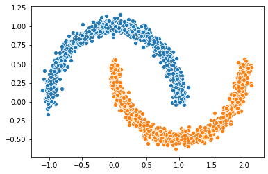
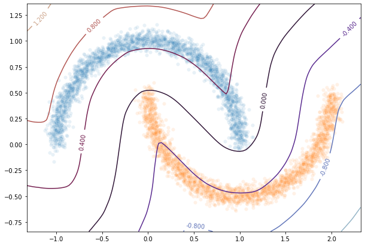

Demo 2: HKR Classifier on toy dataset
=============================

In this demo notebook we will show how to build a robust classifier
based on the regularized version of the Kantorovitch-Rubinstein duality.
We will perform this on the ``two moons`` synthetic dataset.

.. code:: ipython3

    from datetime import datetime
    import os
    import numpy as np
    import math
    
    from sklearn.datasets import make_moons, make_circles  # the synthetic dataset
    
    import matplotlib.pyplot as plt 
    import seaborn as sns
    
    from wasserstein_utils.otp_utils import otp_generator  # keras generator of the synthetic dataset
    
    # in order to build our classifier we will use element from tensorflow along with
    # layers from deel-lip
    import tensorflow as tf
    from tensorflow.keras import backend as K
    from tensorflow.keras.layers import ReLU, Input
    from tensorflow.keras.optimizers import Adam
    from tensorflow.keras.callbacks import ReduceLROnPlateau
    from tensorflow.keras.metrics import binary_accuracy
    
    from deel.lip.model import Model  # use of deel.lip is not mandatory but offers the vanilla_export feature
    from deel.lip.layers import SpectralConv2D, SpectralDense, FrobeniusDense
    from deel.lip.activations import MaxMin, GroupSort, FullSort, GroupSort2
    from deel.lip.utils import load_model  # wrapper that avoid manually specifying custom_objects field
    from deel.lip.losses import HKR_loss, KR_loss, hinge_margin_loss  # custom losses for HKR robust classif
    from deel.lip.normalizers import DEFAULT_NITER_BJORCK, DEFAULT_NITER_SPECTRAL
    
    from model_samples.model_samples import get_lipMLP  # helper to quickly build an HKR classifier

Parameters
----------

Let’s first construct our two moons dataset

.. code:: ipython3

    circle_or_moons = 1  # 0 for circle , 1 for moons
    n_samples=5000  # number of sample in the dataset
    noise=0.05  # amount of noise to add in the data. Tested with 0.14 for circles 0.05 for two moons
    factor=0.4  # scale factor between the inner and the outer circle

.. code:: ipython3

    if circle_or_moons == 0:
        X,Y=make_circles(n_samples=n_samples,noise=noise,factor=factor)
    else:
        X,Y=make_moons(n_samples=n_samples,noise=noise)
    
    # When working with the HKR-classifier, using labels {-1, 1} instead of {0, 1} is advised.
    # This will be explained further on 
    Y[Y==1]=-1
    Y[Y==0]=1

.. code:: ipython3

    X1=X[Y==1]
    X2=X[Y==-1]
    sns.scatterplot(X1[:1000,0],X1[:1000,1])
    sns.scatterplot(X2[:1000,0],X2[:1000,1])

.. parsed-literal::

    <matplotlib.axes._subplots.AxesSubplot at 0x2c40c220208>

Relation with optimal transport
-------------------------------

In this setup we can solve the optimal transport problem between the
distribution of ``X[Y==1]`` and ``X[Y==-1]``. This usually require to
match each element of the first distribution with an element of the
second distribution such that this minimize a global cost. In our setup
this cost is the $ l_1 $ distance, which will allow us to make use of
the KR dual formulation. The overall cost is then the :math:`W_1`
distance.

However the :math:`W_1` distance is known to be untractable in general.

KR dual formulation
-------------------

In our setup, the KR dual formulation is stated as following:

.. math::  W_1(\mu, \nu) = \sup_{f \in Lip_1(\Omega)} \underset{\textbf{x} \sim \mu}{\mathbb{E}} \left[f(\textbf{x} )\right] -\underset{\textbf{x}  \sim \nu}{\mathbb{E}} \left[f(\textbf{x} )\right] 

This state the problem as an optimization problem over the 1-lipschitz
functions. Therefore k-Lipschitz networks allows us to solve this
maximization problem.

Hinge-KR classification
-----------------------

When dealing with :math:`W_1` one may note that many functions maximize
the maximization problem described above. Also we want this function to
be meaningfull in terms of classification. To do so, we want f to be
centered in 0, which can be done without altering the inital problem. By
doing so we can use the obtained function for binary classification, by
looking at the sign of :math:`f`.

In order to enforce this, we will add a Hinge term to the loss. It has
been shown that this new problem is still a optimal transport problem
and that this problem admit a meaningfull optimal solution.

HKR-Classifier
~~~~~~~~~~~~~~

Now we will show how to build a binary classifier based on the
regularized version of the KR dual problem.

In order to ensure the 1-Lipschitz constraint ``deel-lip`` uses spectral
normalization. These layers also can also use Bjork orthonormalization
to ensure that the gradient of the layer is 1 almost everywhere.
Experiment shows that the optimal solution lie in this sub-class of
functions.

.. code:: ipython3

    batch_size=256
    steps_per_epoch=40480
    epoch=10
    hidden_layers_size = [256,128,64]  # stucture of the network
    niter_spectral = DEFAULT_NITER_SPECTRAL
    niter_bjorck = DEFAULT_NITER_BJORCK
    activation = FullSort  # other lipschitz activation are ReLU, MaxMin, GroupSort2, GroupSort
    min_margin= 0.29  # minimum margin to enforce between the values of f for each class

.. code:: ipython3

    # build data generator
    gen=otp_generator(batch_size,X,Y)

Build lipschitz Model
~~~~~~~~~~~~~~~~~~~~~

Let’s build our model now.

.. code:: ipython3

    K.clear_session()
    wass=get_lipMLP(
        (2,), 
        hidden_layers_size = hidden_layers_size,
        activation=activation, 
        nb_classes = 1,
        kCoefLip=1.0, 
        niter_spectral = niter_spectral, 
        niter_bjorck = niter_bjorck
    )
    ## please note that calling the previous helper function has the exact
    ## same effect as the following code:
    # inputs = Input((2,))
    # x = SpectralDense(256, activation=FullSort(), 
    #                   niter_spectral=niter_spectral,
    #                   niter_bjorck=niter_bjorck)(inputs)
    # x = SpectralDense(128, activation=FullSort(),
    #                   niter_spectral=niter_spectral,
    #                   niter_bjorck=niter_bjorck)(x)
    # x = SpectralDense(64, activation=FullSort(),
    #                   niter_spectral=niter_spectral,
    #                   niter_bjorck=niter_bjorck)(x)
    # y = FrobeniusDense(1, activation=None)(x)
    # wass = Model(inputs=inputs, outputs=y)
    wass.summary()

.. parsed-literal::

    256
    128
    64
    Model: "model"
    _________________________________________________________________
    Layer (type)                 Output Shape              Param #   
    =================================================================
    input_1 (InputLayer)         [(None, 2)]               0         
    _________________________________________________________________
    flatten (Flatten)            (None, 2)                 0         
    _________________________________________________________________
    spectral_dense (SpectralDens (None, 256)               1025      
    _________________________________________________________________
    full_sort (FullSort)         (None, 256)               0         
    _________________________________________________________________
    spectral_dense_1 (SpectralDe (None, 128)               33025     
    _________________________________________________________________
    full_sort_1 (FullSort)       (None, 128)               0         
    _________________________________________________________________
    spectral_dense_2 (SpectralDe (None, 64)                8321      
    _________________________________________________________________
    full_sort_2 (FullSort)       (None, 64)                0         
    _________________________________________________________________
    frobenius_dense (FrobeniusDe (None, 1)                 65        
    =================================================================
    Total params: 42,436
    Trainable params: 41,985
    Non-trainable params: 451
    _________________________________________________________________
    

As we can see the network has a gradient equal to 1 almost everywhere as
all the layers respect this property.

It is good to note that the last layer is a ``FrobeniusDense`` this is
because, when we have a single output, it become equivalent to normalize
the frobenius norm and the spectral norm (as we only have a single
singular value)

.. code:: ipython3

    optimizer = Adam(lr=0.01)

.. code:: ipython3

    # as the output of our classifier is in the real range [-1, 1], binary accuracy must be redefined
    def HKR_binary_accuracy(y_true, y_pred):
        S_true= tf.dtypes.cast(tf.greater_equal(y_true[:,0], 0),dtype=tf.float32)
        S_pred= tf.dtypes.cast(tf.greater_equal(y_pred[:,0], 0),dtype=tf.float32)
        return binary_accuracy(S_true,S_pred)

.. code:: ipython3

    wass.compile(
        loss=HKR_loss(alpha=10,min_margin=min_margin),  # HKR stands for the hinge regularized KR loss
        metrics=[
            KR_loss((-1,1)),  # shows the KR term of the loss
            hinge_margin_loss(min_margin=min_margin),  # shows the hinge term of the loss
            HKR_binary_accuracy  # shows the classification accuracy
        ],
        optimizer=optimizer
    )

Learn classification on toy dataset
~~~~~~~~~~~~~~~~~~~~~~~~~~~~~~~~~~~

Now we are ready to learn the classification task on the two moons
dataset.

.. code:: ipython3

    wass.fit_generator(
        gen,
        steps_per_epoch=steps_per_epoch // batch_size, 
        epochs=epoch,
        verbose=1
    )

.. parsed-literal::

    WARNING:tensorflow:From <ipython-input-11-258ce98fe6fe>:5: Model.fit_generator (from tensorflow.python.keras.engine.training) is deprecated and will be removed in a future version.
    Instructions for updating:
    Please use Model.fit, which supports generators.
    WARNING:tensorflow:sample_weight modes were coerced from
      ...
        to  
      ['...']
    Train for 158 steps
    Epoch 1/10
    158/158 [==============================] - 5s 30ms/step - loss: -0.3610 - KR_loss_fct: -0.9315 - hinge_margin_fct: 0.0571 - HKR_binary_accuracy: 0.9176 4s - loss: 0.1094 - KR_loss_fct: -0.8685 - hinge_marg
    Epoch 2/10
    158/158 [==============================] - 2s 15ms/step - loss: -0.8084 - KR_loss_fct: -0.9796 - hinge_margin_fct: 0.0171 - HKR_binary_accuracy: 0.9890
    Epoch 3/10
    158/158 [==============================] - 2s 15ms/step - loss: -0.8202 - KR_loss_fct: -0.9858 - hinge_margin_fct: 0.0166 - HKR_binary_accuracy: 0.9895
    Epoch 4/10
    158/158 [==============================] - 2s 15ms/step - loss: -0.8313 - KR_loss_fct: -0.9949 - hinge_margin_fct: 0.0164 - HKR_binary_accuracy: 0.9894
    Epoch 5/10
    158/158 [==============================] - 3s 17ms/step - loss: -0.8239 - KR_loss_fct: -0.9818 - hinge_margin_fct: 0.0158 - HKR_binary_accuracy: 0.9903
    Epoch 6/10
    158/158 [==============================] - 3s 18ms/step - loss: -0.8229 - KR_loss_fct: -0.9896 - hinge_margin_fct: 0.0167 - HKR_binary_accuracy: 0.9891
    Epoch 7/10
    158/158 [==============================] - 3s 19ms/step - loss: -0.8361 - KR_loss_fct: -0.9911 - hinge_margin_fct: 0.0155 - HKR_binary_accuracy: 0.9908
    Epoch 8/10
    158/158 [==============================] - 3s 19ms/step - loss: -0.8333 - KR_loss_fct: -0.9941 - hinge_margin_fct: 0.0161 - HKR_binary_accuracy: 0.9899
    Epoch 9/10
    158/158 [==============================] - 3s 19ms/step - loss: -0.8315 - KR_loss_fct: -0.9945 - hinge_margin_fct: 0.0163 - HKR_binary_accuracy: 0.9895
    Epoch 10/10
    158/158 [==============================] - 3s 20ms/step - loss: -0.8438 - KR_loss_fct: -0.9913 - hinge_margin_fct: 0.0147 - HKR_binary_accuracy: 0.9925
    

.. parsed-literal::

    <tensorflow.python.keras.callbacks.History at 0x2c40d92c388>

Plot output countour line
~~~~~~~~~~~~~~~~~~~~~~~~~

As we can see the classifier get a pretty good accuracy. Let’s now take
a look at the learnt function. As we are in the 2D space, we can draw a
countour plot to visualize f.

.. code:: ipython3

    import matplotlib.pyplot as plt
    from mpl_toolkits.mplot3d import Axes3D
    from matplotlib import cm
    from matplotlib.ticker import LinearLocator, FormatStrFormatter
    batch_size=1024
    
    x = np.linspace(X[:,0].min()-0.2, X[:,0].max()+0.2, 120)
    y = np.linspace(X[:,1].min()-0.2, X[:,1].max()+0.2,120)
    xx, yy = np.meshgrid(x, y, sparse=False)
    X_pred=np.stack((xx.ravel(),yy.ravel()),axis=1)

.. code:: ipython3

    # make predictions of f
    pred=wass.predict(X_pred)
    
    Y_pred=pred
    Y_pred=Y_pred.reshape(x.shape[0],y.shape[0])

.. code:: ipython3

    #plot the results
    fig = plt.figure(figsize=(10,7))
    ax1 = fig.add_subplot(111)
    
    sns.scatterplot(X[Y==1,0],X[Y==1,1],alpha=0.1,ax=ax1)
    sns.scatterplot(X[Y==-1,0],X[Y==-1,1],alpha=0.1,ax=ax1)
    cset =ax1.contour(xx,yy,Y_pred,cmap='twilight')
    ax1.clabel(cset, inline=1, fontsize=10)

.. parsed-literal::

    <a list of 7 text.Text objects>

Transfer network to a classical MLP and compare outputs
~~~~~~~~~~~~~~~~~~~~~~~~~~~~~~~~~~~~~~~~~~~~~~~~~~~~~~~

As we saw, our networks use custom layers in order to constrain
training. However during inference layers behave exactly as regular
``Dense`` or ``Conv2d`` layers. Deel-lip has a functionnality to export
a model to it’s vanilla keras equivalent. Making it more convenient for
inference.

.. code:: ipython3

    from deel.lip.model import vanillaModel
    ## this is equivalent to test2 = wass.vanilla_export()
    test2 = vanillaModel(wass)
    test2.summary()

.. parsed-literal::

    tensor input shape (None, 2)
    tensor input shape (None, 2)
    tensor input shape (None, 2)
    tensor input shape (None, 256)
    256
    tensor input shape (None, 256)
    tensor input shape (None, 128)
    128
    tensor input shape (None, 128)
    tensor input shape (None, 64)
    64
    tensor input shape (None, 64)
    Model: "model_1"
    _________________________________________________________________
    Layer (type)                 Output Shape              Param #   
    =================================================================
    input_2 (InputLayer)         [(None, 2)]               0         
    _________________________________________________________________
    flatten (Flatten)            (None, 2)                 0         
    _________________________________________________________________
    spectral_dense (Dense)       (None, 256)               768       
    _________________________________________________________________
    full_sort (FullSort)         (None, 256)               0         
    _________________________________________________________________
    spectral_dense_1 (Dense)     (None, 128)               32896     
    _________________________________________________________________
    full_sort_1 (FullSort)       (None, 128)               0         
    _________________________________________________________________
    spectral_dense_2 (Dense)     (None, 64)                8256      
    _________________________________________________________________
    full_sort_2 (FullSort)       (None, 64)                0         
    _________________________________________________________________
    frobenius_dense (Dense)      (None, 1)                 65        
    =================================================================
    Total params: 41,985
    Trainable params: 41,985
    Non-trainable params: 0
    _________________________________________________________________
    

.. code:: ipython3

    pred_test=test2.predict(X_pred)
    Y_pred=pred_test
    Y_pred=Y_pred.reshape(x.shape[0],y.shape[0])

.. code:: ipython3

    fig = plt.figure(figsize=(10,7))
    ax1 = fig.add_subplot(111)
    #ax2 = fig.add_subplot(312)
    #ax3 = fig.add_subplot(313)
    sns.scatterplot(X[Y==1,0],X[Y==1,1],alpha=0.1,ax=ax1)
    sns.scatterplot(X[Y==-1,0],X[Y==-1,1],alpha=0.1,ax=ax1)
    cset =ax1.contour(xx,yy,Y_pred,cmap='twilight')
    ax1.clabel(cset, inline=1, fontsize=10)
    

.. parsed-literal::

    <a list of 7 text.Text objects>

.. image:: output_25_1.png

