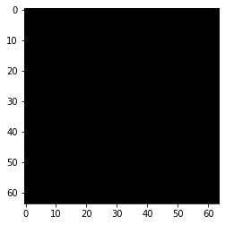
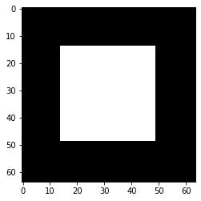
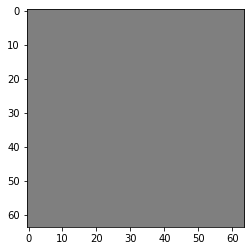
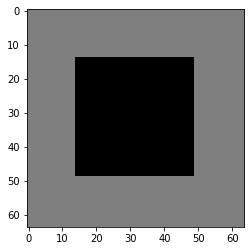
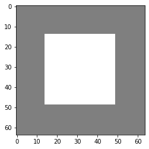

Demo 1: Wasserstein distance estimation on toy example
==============================================

In this notebook we will see how to estimate the wasserstein distance
with a Neural net by using the Kantorovich-Rubinestein dual
representation.

.. code:: ipython3

    from datetime import datetime
    import os
    import numpy as np
    import math
    
    import matplotlib.pyplot as plt 
    
    from tensorflow.keras import backend as K
    from tensorflow.keras.layers import Input, Flatten, ReLU
    from tensorflow.keras.optimizers import Adam
    
    from deel.lip.layers import SpectralConv2D, ScaledMaxPooling2D, SpectralDense, FrobeniusDense
    from deel.lip.activations import MaxMin, GroupSort, FullSort
    from deel.lip.utils import load_model
    from deel.lip.losses import KR_loss
    from deel.lip.model import Model
    
    from model_samples.model_samples import get_lipMLP

Parameters input images
-----------------------

The synthetic dataset will be composed image with black or white squares
allowing us to check if the computed wasserstein distance is correct.

.. code:: ipython3

    img_size = 64 
    frac_value = 0.3  # proportion of the center square

Generate images
---------------

.. code:: ipython3

    def generate_toy_images(shape,frac=0,v=1):
        """
        function that generate a single image.
        
        Args:
            shape: shape of the output image
            frac: proportion of the center square
            value: value assigned to the center square
        """
        img = np.zeros(shape)
        if frac==0:
            return img
        frac=frac**0.5
        #print(frac)
        l=int(shape[0]*frac)
        ldec=(shape[0]-l)//2
        #print(l)
        w=int(shape[1]*frac)
        wdec=(shape[1]-w)//2
        img[ldec:ldec+l,wdec:wdec+w,:]=v
        return img
    
    
    def binary_generator(batch_size,shape,frac=0):
        """
        generate a batch with half of black images, hald of images with a white square.
        """
        batch_x = np.zeros(((batch_size,)+(shape)), dtype=np.float16)
        batch_y=np.zeros((batch_size,1), dtype=np.float16)
        batch_x[batch_size//2:,]=generate_toy_images(shape,frac=frac,v=1)
        batch_y[batch_size//2:]=1
        while True:
            yield  batch_x, batch_y
    
    
    def ternary_generator(batch_size,shape,frac=0):
        """
        Same as binary generator, but images can have a white square of value 1, or value -1
        """
        batch_x = np.zeros(((batch_size,)+(shape)), dtype=np.float16)
        batch_y=np.zeros((batch_size,1), dtype=np.float16)
        batch_x[3*batch_size//4:,]=generate_toy_images(shape,frac=frac,v=1)
        batch_x[batch_size//2:3*batch_size//4,]=generate_toy_images(shape,frac=frac,v=-1)
        batch_y[batch_size//2:]=1
        #indexes_shuffle = np.arange(batch_size)
        while True:
            #np.random.shuffle(indexes_shuffle)
            #yield  batch_x[indexes_shuffle,], batch_y[indexes_shuffle,]
            yield  batch_x, batch_y

.. code:: ipython3

    def display_img(img):
        """
        Display an image
        """
        if img.shape[-1] == 1:
            img = np.tile(img,(3,))
        fig, ax = plt.subplots()
        
        imgplot = ax.imshow((img*255).astype(np.uint))
        

Now let’s take a look at the generated batches

.. code:: ipython3

    test=binary_generator(2,(img_size,img_size,1),frac=frac_value)
    imgs, y=next(test)
    
    display_img(imgs[0])
    display_img(imgs[1])
    print("Norm L2 "+str(np.linalg.norm(imgs[1])))
    print("Norm L2(count pixels) "+str(math.sqrt(np.size(imgs[1][imgs[1]==1]))))

.. parsed-literal::

    Norm L2 35.0
    Norm L2(count pixels) 35.0
    

.. code:: ipython3

    test=ternary_generator(4,(img_size,img_size,1),frac=frac_value)
    imgs, y=next(test)
    
    for i in range(4):
        display_img(0.5*(imgs[i]+1.0)) # we ensure that there is no negative value wehn displaying images
    
    print("Norm L2(imgs[2]-imgs[0])"+str(np.linalg.norm(imgs[2]-imgs[0])))
    print("Norm L2(imgs[2]) "+str(np.linalg.norm(imgs[2])))
    print("Norm L2(count pixels) "+str(math.sqrt(np.size(imgs[2][imgs[2]==-1]))))

.. parsed-literal::

    Norm L2(imgs[2]-imgs[0])35.0
    Norm L2(imgs[2]) 35.0
    Norm L2(count pixels) 35.0
    

.. image:: output_9_1.png

Expe parameters
---------------

Now we know the wasserstein distance between the black image and the
images with a square on it. For both binary generator and ternary
generator this distance is 35.

We will then compute this distance using a neural network.

KR dual formulation
~~~~~~~~~~~~~~~~~~~

In our setup, the KR dual formulation is stated as following:

.. math::  W_1(\mu, \nu) = \sup_{f \in Lip_1(\Omega)} \underset{\textbf{x} \sim \mu}{\mathbb{E}} \left[f(\textbf{x} )\right] -\underset{\textbf{x}  \sim \nu}{\mathbb{E}} \left[f(\textbf{x} )\right] 

This state the problem as an optimization problem over the 1-lipschitz
functions. Therefore k-Lipschitz networks allows us to solve this
maximization problem.

[1] C. Anil, J. Lucas, et R. Grosse, « Sorting out Lipschitz function
approximation », arXiv:1811.05381 [cs, stat], nov. 2018.

.. code:: ipython3

    batch_size=64
    epochs=5
    steps_per_epoch=6400

.. code:: ipython3

    generator = ternary_generator   #binary_generator, ternary_generator
    activation = FullSort #ReLU, MaxMin, GroupSort

Build lipschitz Model
~~~~~~~~~~~~~~~~~~~~~

.. code:: ipython3

    K.clear_session()
    wass=get_lipMLP((img_size,img_size,1), hidden_layers_size = [128,64,32] ,activation=activation, nb_classes = 1,kCoefLip=1.0)
    ## please note that the previous helper function has the same behavior as the following code:
    # inputs = Input((img_size, img_size, 1))
    # x = SpectralDense(128, activation=FullSort())(inputs)
    # x = SpectralDense(64, activation=FullSort())(x)
    # x = SpectralDense(32, activation=FullSort())(x)
    # y = FrobeniusDense(1, activation=None)(x)
    # wass = Model(inputs=inputs, outputs=y)
    wass.summary()

.. parsed-literal::

    128
    64
    32
    Model: "model"
    _________________________________________________________________
    Layer (type)                 Output Shape              Param #   
    =================================================================
    input_1 (InputLayer)         [(None, 64, 64, 1)]       0         
    _________________________________________________________________
    flatten (Flatten)            (None, 4096)              0         
    _________________________________________________________________
    spectral_dense (SpectralDens (None, 128)               524545    
    _________________________________________________________________
    full_sort (FullSort)         (None, 128)               0         
    _________________________________________________________________
    spectral_dense_1 (SpectralDe (None, 64)                8321      
    _________________________________________________________________
    full_sort_1 (FullSort)       (None, 64)                0         
    _________________________________________________________________
    spectral_dense_2 (SpectralDe (None, 32)                2113      
    _________________________________________________________________
    full_sort_2 (FullSort)       (None, 32)                0         
    _________________________________________________________________
    frobenius_dense (FrobeniusDe (None, 1)                 33        
    =================================================================
    Total params: 535,012
    Trainable params: 534,785
    Non-trainable params: 227
    _________________________________________________________________
    

.. code:: ipython3

    optimizer = Adam(lr=0.01)

.. code:: ipython3

    wass.compile(loss=KR_loss(), optimizer=optimizer, metrics=[KR_loss()])  

Learn on toy dataset
~~~~~~~~~~~~~~~~~~~~

.. code:: ipython3

    wass.fit_generator( generator(batch_size,(img_size,img_size,1),frac=frac_value),
                    steps_per_epoch=steps_per_epoch// batch_size,
                    epochs=epochs,verbose=1)

.. parsed-literal::

    WARNING:tensorflow:From <ipython-input-12-b25f21272064>:3: Model.fit_generator (from tensorflow.python.keras.engine.training) is deprecated and will be removed in a future version.
    Instructions for updating:
    Please use Model.fit, which supports generators.
    WARNING:tensorflow:sample_weight modes were coerced from
      ...
        to  
      ['...']
    Train for 100 steps
    Epoch 1/5
    100/100 [==============================] - 17s 166ms/step - loss: -33.9067 - KR_loss_fct: -33.9067
    Epoch 2/5
    100/100 [==============================] - 17s 172ms/step - loss: -34.9944 - KR_loss_fct: -34.99443s - loss: -34.9944 - KR
    Epoch 3/5
    100/100 [==============================] - 18s 180ms/step - loss: -34.9941 - KR_loss_fct: -34.9941
    Epoch 4/5
    100/100 [==============================] - 18s 177ms/step - loss: -34.9942 - KR_loss_fct: -34.9942
    Epoch 5/5
    100/100 [==============================] - 18s 177ms/step - loss: -34.9942 - KR_loss_fct: -34.9942
    

.. parsed-literal::

    <tensorflow.python.keras.callbacks.History at 0x14adcc6c088>

As we can see the loss converge to the value 35 which is the wasserstein
distance between the two distributions (square and non-square).
